# BEATs + synth_only 训练结果分析报告

## 目录
- [实验概况](#实验概况)
- [最终指标汇总](#最终指标汇总)
- [训练过程与选模分析](#训练过程与选模分析)
- [预测行为统计](#预测行为统计)
- [典型样本分析](#典型样本分析)
- [结论与问题归因](#结论与问题归因)
- [后续建议](#后续建议)

## 实验概况

| 项目                     | 说明                                      |
| ---------------------- | --------------------------------------- |
| 实验设置                   | BEATs + synth_only                      |
| 评估对象                   | student                                 |
| encoder_type           | beats                                   |
| BEATs freeze           | True                                    |
| shared decoder         | BiGRU + strong/weak head                |
| decoder input_proj_dim | 256                                     |
| 数据划分                   | synthetic train + synthetic validation  |
| test 是否独立              | 否，当前 test 与 synthetic validation 为同一套数据 |
| 最优 checkpoint          | epoch=27, step=23352                    |

本次实验使用冻结的 BEATs 作为 encoder，并接统一的共享 decoder（带 BiGRU 的传统 SED 头）。从配置与 checkpoint 可确认这是 `encoder_type=beats`、`freeze=True`、`synth_only=True` 的设置。

由于当前配置把 `test_folder/test_tsv` 指向 synthetic validation，所以下面的测试结果更接近“自测分数”，适合做模型行为诊断，但不能直接当作真实外部分布上的泛化结论。

## 最终指标汇总

| 指标                       | 数值     |
| ------------------------ | ------ |
| PSDS-scenario1           | 0.001  |
| PSDS-scenario2           | 0.051  |
| Intersection-based F1    | 0.432  |
| Event-based F1 (macro)   | 8.58%  |
| Event-based F1 (micro)   | 15.34% |
| Segment-based F1 (macro) | 45.74% |
| Segment-based F1 (micro) | 53.08% |

| 类别                         | GT事件数 | Pred事件数 | Event F1 | Segment F1 | 状态        |
| -------------------------- | ----- | ------- | -------- | ---------- | --------- |
| Alarm_bell_ringing         | 431   | 0       | 0.00%    | 0.00%      | 完全失效      |
| Blender                    | 266   | 13      | 0.00%    | 0.00%      | 有输出但事件级失效 |
| Cat                        | 429   | 0       | 0.00%    | 0.00%      | 完全失效      |
| Dishes                     | 1309  | 0       | 0.00%    | 0.00%      | 完全失效      |
| Dog                        | 550   | 0       | 0.00%    | 0.00%      | 完全失效      |
| Electric_shaver_toothbrush | 286   | 209     | 17.37%   | 51.24%     | 相对较强      |
| Frying                     | 377   | 440     | 37.94%   | 64.45%     | 相对较强      |
| Running_water              | 306   | 184     | 0.00%    | 32.89%     | 有输出但事件级失效 |
| Speech                     | 3927  | 4341    | 19.81%   | 73.94%     | 相对较强      |
| Vacuum_cleaner             | 251   | 367     | 10.68%   | 51.94%     | 较弱但可用     |

表现相对较强的类别主要是 `Frying, Speech, Electric_shaver_toothbrush`；明显偏弱但仍有一定输出的是 `无`；完全无预测的类别包括 `Alarm_bell_ringing, Cat, Dishes, Dog`。

这组结果最值得注意的地方是：`intersection F1` 还能到 0.432，但 `event-based F1` 和 `PSDS` 极低。这说明模型并不是完全不会报事件，而是更偏向报出“粗粒度、长持续、边界不稳”的事件片段。当评估放宽到区间交并关系时还能拿到一定分数，但一旦要求更严格的起止边界、类别完整性和跨阈值稳定性，性能就会显著下降。

## 训练过程与选模分析

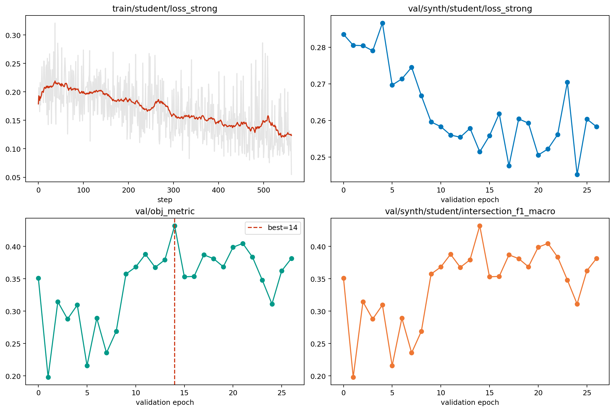

| 曲线                                      | 起始值    | 最终值    | 最佳值    |
| --------------------------------------- | ------ | ------ | ------ |
| train/student/loss_strong               | 0.1788 | 0.0549 | 0.0549 |
| val/synth/student/loss_strong           | 0.2835 | 0.2583 | 0.2452 |
| val/obj_metric                          | 0.3512 | 0.3817 | 0.4320 |
| val/synth/student/intersection_f1_macro | 0.3512 | 0.3817 | 0.4320 |
| val/synth/student/event_f1_macro        | 0.0097 | 0.0898 | 0.0989 |

训练过程本身是正常收敛的：`train/student/loss_strong` 从 0.1788 降到 0.0549，`val/synth/student/loss_strong` 虽然下降有限，但最低也达到 0.2452。

`val/obj_metric` 在 epoch=27 附近达到峰值 0.4320，与最佳 checkpoint 的保存位置一致，说明选模逻辑本身没有异常。

但在 `synth_only` 下，`val/obj_metric` 实际上等于 `val/synth/student/intersection_f1_macro`，它更强调“预测区间是否大致覆盖真值”，而不是事件起止边界和跨阈值检测质量。因此 checkpoint 虽然在 `obj_metric` 上最优，却不一定在 `event-based F1` 或 `PSDS` 上最优。

这点从验证曲线也能看出来：`intersection_f1_macro` 最高到 0.4320，但 `val/synth/student/event_f1_macro` 最佳值只有 0.0989，两者之间存在明显落差。

## 预测行为统计

| 统计项          | 数值    |
| ------------ | ----- |
| 总文件数         | 2500  |
| 有预测文件数       | 2379  |
| 空预测文件数       | 121   |
| 空预测比例        | 4.84% |
| 总真值事件数       | 8132  |
| 总预测事件数       | 5554  |
| 真值平均事件时长     | 3.38s |
| 预测平均事件时长     | 2.29s |
| 预测中 >=8s 长段数 | 558   |
| 预测中 >=9s 长段数 | 475   |

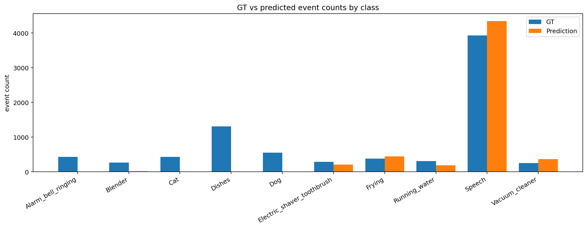

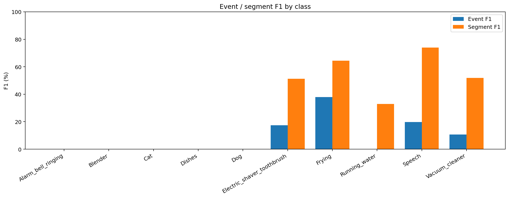

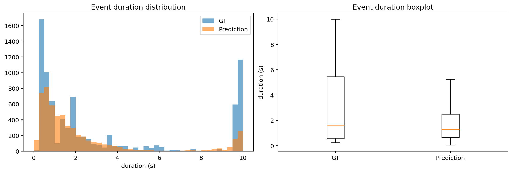

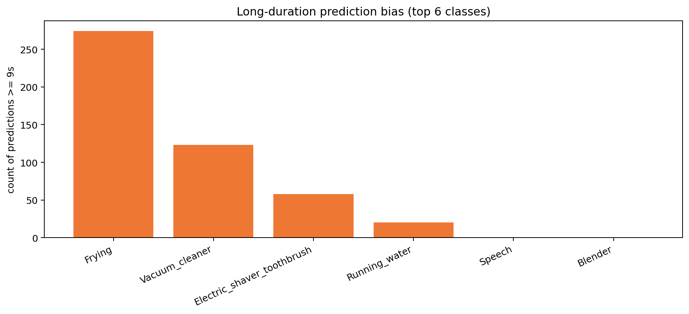

| 类别                         | GT事件数 | Pred事件数 | Pred-GT |
| -------------------------- | ----- | ------- | ------- |
| Alarm_bell_ringing         | 431   | 0       | -431    |
| Blender                    | 266   | 13      | -253    |
| Cat                        | 429   | 0       | -429    |
| Dishes                     | 1309  | 0       | -1309   |
| Dog                        | 550   | 0       | -550    |
| Electric_shaver_toothbrush | 286   | 209     | -77     |
| Frying                     | 377   | 440     | 63      |
| Running_water              | 306   | 184     | -122    |
| Speech                     | 3927  | 4341    | 414     |
| Vacuum_cleaner             | 251   | 367     | 116     |

| 类别                         | 平均预测时长 | >=9s 预测段数 |
| -------------------------- | ------ | --------- |
| Frying                     | 7.19s  | 274       |
| Vacuum_cleaner             | 4.50s  | 123       |
| Electric_shaver_toothbrush | 5.51s  | 58        |
| Running_water              | 3.24s  | 20        |
| Speech                     | 1.41s  | 0         |
| Blender                    | 1.31s  | 0         |

这次模型不是“全空”：2500 个文件里有预测的文件有 2379 个，空预测文件是 121 个，占比 4.84%。但它也绝不是健康状态，因为 10 个类别里有 4 个完全没有输出，另有 2 个几乎失效。

类别塌缩的直接证据包括：`Alarm_bell_ringing, Cat, Dishes, Dog` 的预测数为 0，`Blender, Running_water` 虽然有少量输出，但事件级 F1 仍为 0。

同时，长时段偏置也很明显：预测中 `>=9s` 的长段共有 475 个，主要集中在 `Frying`、`Vacuum_cleaner`、`Electric_shaver_toothbrush` 和部分 `Running_water`。这说明模型更容易把长持续背景事件学成大块区间，而对短事件、动物类和碎片化类明显不稳定。

因此总体判断不是“全局训练崩溃”，而是“少数类工作、部分类严重塌缩，并伴随长持续事件偏置和局部碎片化过预测”。

## 典型样本分析

### 355.wav | 检测较好 / 长持续类

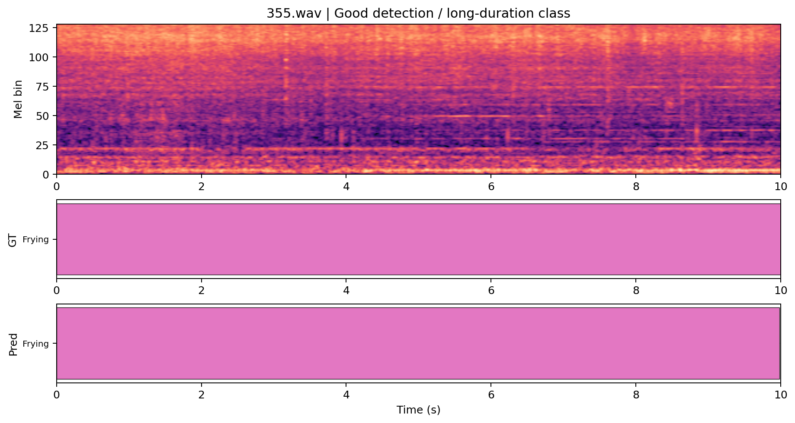

- 代表性：Frying 长持续事件几乎完整命中，适合作为正例。
- 真值事件：Frying (0.000-10.000s)
- 预测事件：Frying (0.000-9.984s)
- 简短点评：Frying 长事件几乎完整重合，说明模型对少数长持续类并非完全失效。

### 1088.wav | 空预测 / 弱类漏检

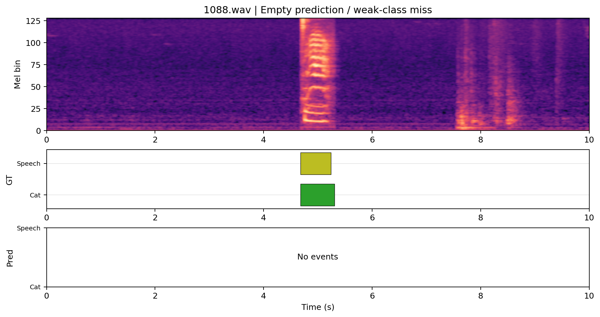

- 代表性：Cat + Speech 双事件完全漏掉，能体现空预测问题。
- 真值事件：Cat (4.682-5.308s) Speech (4.683-5.243s)
- 预测事件：无预测
- 简短点评：Cat 与短 Speech 同时漏掉，体现了弱类与短时事件在当前模型中的脆弱性。

### 234.wav | 碎片化过预测

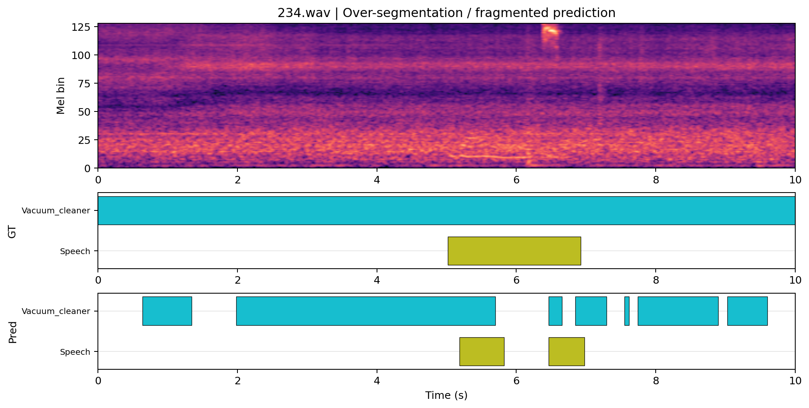

- 代表性：Vacuum_cleaner 被切成大量碎片段，是典型过预测案例。
- 真值事件：Vacuum_cleaner (0.000-10.000s) Speech (5.017-6.922s)
- 预测事件：Vacuum_cleaner (0.640-1.344s) Vacuum_cleaner (1.984-5.696s) Speech (5.184-5.824s) Vacuum_cleaner (6.464-6.656s) Speech (6.464-6.976s) Vacuum_cleaner (6.848-7.296s) Vacuum_cleaner (7.552-7.616s) Vacuum_cleaner (7.744-8.896s) Vacuum_cleaner (9.024-9.600s)
- 简短点评：Vacuum_cleaner 没有整段报满，但被切成许多小段，属于典型的碎片化过预测。

### 1312.wav | 多事件场景严重欠检

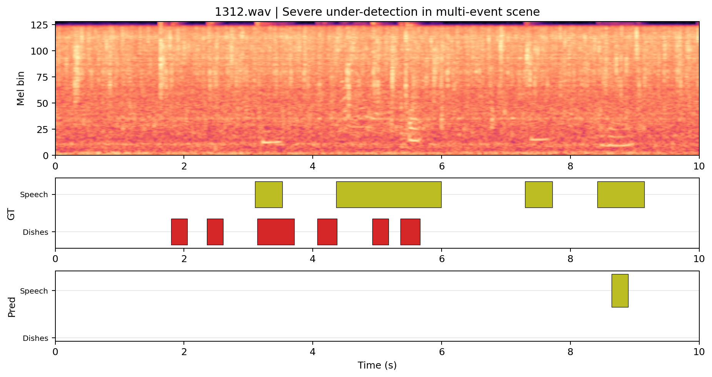

- 代表性：多段 Dishes + Speech 只报出一小段 Speech，体现多事件召回不足。
- 真值事件：Dishes (1.800-2.050s) Dishes (2.358-2.608s) Speech (3.101-3.528s) Dishes (3.142-3.710s) Dishes (4.069-4.374s) Speech (4.362-5.993s) Dishes (4.927-5.177s) Dishes (5.362-5.666s) Speech (7.296-7.723s) Speech (8.420-9.149s)
- 预测事件：Speech (8.640-8.896s)
- 简短点评：多事件场景中几乎只剩下一小段 Speech，被 Dishes 和其他 Speech 片段完全淹没。

### 1195.wav | Dog 类失效

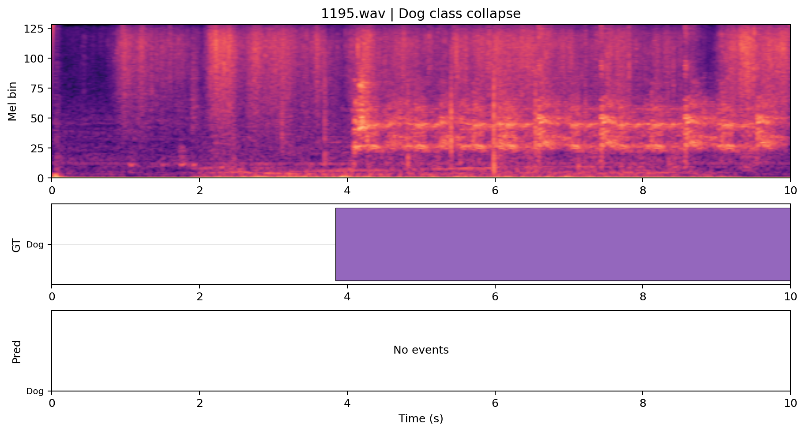

- 代表性：Dog 长事件完全无预测，直接反映类别塌缩。
- 真值事件：Dog (3.839-10.000s)
- 预测事件：无预测
- 简短点评：Dog 长事件完全不出结果，与全局统计里 Dog 预测数为 0 一致。

### 1000.wav | 长时段类边界偏移

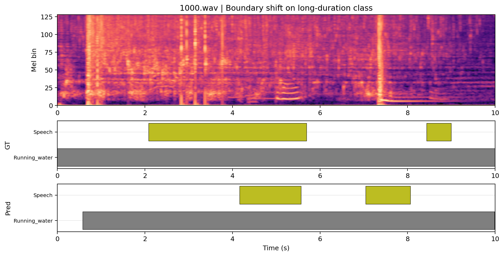

- 代表性：Running_water 视觉上接近真值，但事件边界偏差较大，适合解释 intersection 高而 event F1 低。
- 真值事件：Running_water (0.000-10.000s) Speech (2.081-5.690s) Speech (8.435-8.996s)
- 预测事件：Running_water (0.576-9.984s) Speech (4.160-5.568s) Speech (7.040-8.064s)
- 简短点评：Running_water 在视觉上接近真值，但起止边界仍明显偏移，能解释为什么区间类指标尚可而事件级指标很差。

## 结论与问题归因

这次训练不能算“彻底没学到”。训练 loss 和验证 `obj_metric` 都有明显优化，说明 frozen BEATs + shared decoder 这条链路至少学到了一部分可用模式。

但最终结果不能算正常。问题不是单纯的整体偏低，而是非常典型的“类别塌缩 + 长时段偏置”：模型主要学会了 `Speech / Frying / Electric_shaver_toothbrush / Vacuum_cleaner` 等少数类别，却几乎完全失去了 `Dog / Dishes / Alarm_bell_ringing / Cat` 等类别。

为什么 `obj_metric` 不足以代表最终 event-based 检测质量：当前 `obj_metric` 在 synth_only 下只看 `intersection_f1_macro`，它对“区间大致重合”更敏感，而对严格边界、碎片化预测、跨阈值稳定性和类别覆盖不足不够敏感。所以模型可以在 `obj_metric` 上达到 0.432，却在 event-based F1 和 PSDS 上依然很差。

从这次结果看，frozen BEATs + shared decoder 在当前设置下可能有几个局限：一是 decoder 对 BEATs 表征的适配还不够，二是类间不平衡被进一步放大，三是当前阈值和后处理更有利于长持续事件，四是 frozen encoder 对细粒度短事件与动物类的分离能力不足。

## 后续建议

1. 先把这次 BEATs 与 CRNN 的逐类 Event/Segment F1 并排比较，确认问题主要来自 encoder 表征，还是 decoder/阈值/后处理。
2. 单独搜索阈值与 median filter，优先看能否显著抬升 event-based F1 和 PSDS；这一步成本最低，也最能解释“intersection 高但 event/PSDS 低”的原因。
3. 对 `Dog / Dishes / Alarm_bell_ringing / Cat / Blender` 做采样重平衡或损失重加权，避免长持续类继续主导训练。
4. 保持统一 decoder 不变，进一步尝试 BEATs 的部分解冻或最后若干层微调，验证是不是 frozen encoder 本身限制了弱类表征。
5. 如果后续要公平比较 encoder，建议固定同一份 decoder 和选模流程，但增加一个 event-based 或混合型验证指标，避免只靠 intersection 选模型。
