# CRNN + BEATs Late Fusion Baseline 训练结果分析报告

## 目录
- [实验概况](#实验概况)
- [最终指标汇总](#最终指标汇总)
- [训练过程与选模分析](#训练过程与选模分析)
- [预测行为统计](#预测行为统计)
- [典型样本分析](#典型样本分析)
- [结论与讨论](#结论与讨论)
- [后续建议](#后续建议)

## 实验概况

| 项目               | 说明                                                                                                         |
| ---------------- | ---------------------------------------------------------------------------------------------------------- |
| 实验设置             | CRNN + BEATs late fusion baseline                                                                          |
| 评估对象             | student                                                                                                    |
| model_type       | crnn_beats_late_fusion                                                                                     |
| fusion type      | concat                                                                                                     |
| align method     | adaptive_avg                                                                                               |
| BEATs freeze     | True                                                                                                       |
| decoder temporal | BiGRU + strong/weak heads                                                                                  |
| 数据划分             | synthetic train + synthetic validation                                                                     |
| test 是否独立        | 否，当前 test 与 synthetic validation 为同一套数据                                                                    |
| best checkpoint  | epoch=34, step=21875                                                                                       |
| prediction TSV   | exp/2022_baseline/metrics_test/student/scenario1/predictions_dtc0.7_gtc0.7_cttc0.3/predictions_th_0.49.tsv |

本次实验属于 `CRNN + BEATs late fusion baseline`：一路使用 CRNN 的 CNN branch 提取时频局部特征，另一路使用冻结的 BEATs 提取 frame-level 表征；随后将 BEATs 特征先对齐到 CNN 时间长度，再做 concat 融合，经 Merge MLP 后进入共享的 BiGRU + strong/weak 分类头。

当前最终评估对象仍以 `student` 为主。由于 `test_folder/test_tsv` 仍指向 synthetic validation，所以下面的结果更偏“自测分数”，适合判断 fusion 是否跑通以及它相对 CRNN/BEATs 的变化方向，但不能直接视为真实泛化结论。

## 最终指标汇总

| 指标                       | 数值     |
| ------------------------ | ------ |
| PSDS-scenario1           | 0.306  |
| PSDS-scenario2           | 0.484  |
| Intersection-based F1    | 0.583  |
| Event-based F1 (macro)   | 41.37% |
| Event-based F1 (micro)   | 40.63% |
| Segment-based F1 (macro) | 64.00% |
| Segment-based F1 (micro) | 72.13% |

### 跨模型整体对照

| 模型                       | PSDS1 | PSDS2 | Intersection F1 | Event F1 macro | Segment F1 macro |
| ------------------------ | ----- | ----- | --------------- | -------------- | ---------------- |
| CRNN baseline            | 0.356 | 0.578 | 0.650           | 43.42%         | 71.25%           |
| Frozen BEATs baseline    | 0.001 | 0.051 | 0.432           | 8.58%          | 45.74%           |
| CRNN + BEATs late fusion | 0.306 | 0.484 | 0.583           | 41.37%         | 64.00%           |

| 类别                         | GT事件数 | Pred事件数 | Pred/GT | Event F1 | Segment F1 | 分组 |
| -------------------------- | ----- | ------- | ------- | -------- | ---------- | -- |
| Alarm_bell_ringing         | 431   | 250     | 0.58    | 21.20%   | 59.70%     | 较弱 |
| Blender                    | 266   | 302     | 1.14    | 48.70%   | 66.80%     | 中等 |
| Cat                        | 429   | 318     | 0.74    | 34.60%   | 70.60%     | 较弱 |
| Dishes                     | 1309  | 208     | 0.16    | 15.50%   | 21.70%     | 较弱 |
| Dog                        | 550   | 139     | 0.25    | 15.90%   | 33.10%     | 较弱 |
| Electric_shaver_toothbrush | 286   | 266     | 0.93    | 46.40%   | 80.70%     | 中等 |
| Frying                     | 377   | 406     | 1.08    | 67.00%   | 83.30%     | 较强 |
| Running_water              | 306   | 212     | 0.69    | 52.70%   | 71.70%     | 中等 |
| Speech                     | 3927  | 3788    | 0.96    | 44.00%   | 77.60%     | 中等 |
| Vacuum_cleaner             | 251   | 204     | 0.81    | 67.70%   | 74.80%     | 较强 |

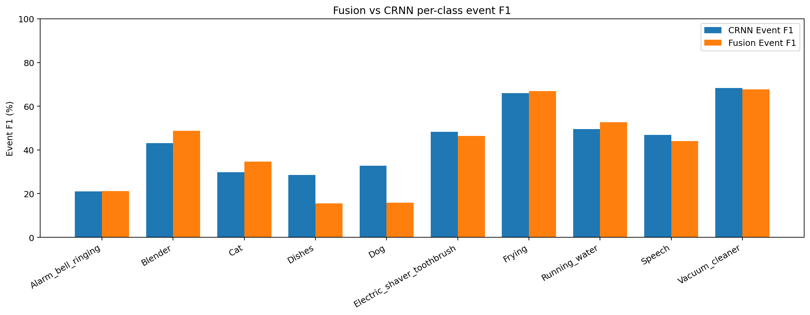

| 类别                         | Fusion Event F1 | CRNN Event F1 | 差值(Event) | Fusion Segment F1 | CRNN Segment F1 | 差值(Segment) |
| -------------------------- | --------------- | ------------- | --------- | ----------------- | --------------- | ----------- |
| Alarm_bell_ringing         | 21.20%          | 21.07%        | +0.13pp   | 59.70%            | 64.04%          | -4.34pp     |
| Blender                    | 48.70%          | 43.10%        | +5.60pp   | 66.80%            | 63.83%          | +2.97pp     |
| Cat                        | 34.60%          | 29.86%        | +4.74pp   | 70.60%            | 73.48%          | -2.88pp     |
| Dishes                     | 15.50%          | 28.57%        | -13.07pp  | 21.70%            | 50.55%          | -28.85pp    |
| Dog                        | 15.90%          | 32.69%        | -16.79pp  | 33.10%            | 59.67%          | -26.57pp    |
| Electric_shaver_toothbrush | 46.40%          | 48.35%        | -1.95pp   | 80.70%            | 84.23%          | -3.53pp     |
| Frying                     | 67.00%          | 65.94%        | +1.06pp   | 83.30%            | 83.89%          | -0.59pp     |
| Running_water              | 52.70%          | 49.47%        | +3.23pp   | 71.70%            | 71.40%          | +0.30pp     |
| Speech                     | 44.00%          | 46.86%        | -2.86pp   | 77.60%            | 80.20%          | -2.60pp     |
| Vacuum_cleaner             | 67.70%          | 68.27%        | -0.57pp   | 74.80%            | 81.20%          | -6.40pp     |

从本次 fusion 模型自身看，较强类别主要是 `Frying, Vacuum_cleaner`，中等类别主要是 `Blender, Electric_shaver_toothbrush, Running_water, Speech`，较弱类别则集中在 `Alarm_bell_ringing, Cat, Dishes, Dog`。

和单独 frozen BEATs 相比，这次 late fusion 已经明显恢复到“正常工作”的状态：PSDS、event F1、segment F1 都大幅回升，之前大面积的类别塌缩基本被解除。

但和 CRNN baseline 相比，这次还没有形成明显超越。整体上，fusion 的 `PSDS1/PSDS2` 与 `Intersection F1` 仍低于 CRNN，虽然 `Running_water`、`Blender`、`Cat` 这类类别有局部改善，但 `Dishes`、`Dog` 等弱类仍然偏弱。这正是“融合有效但收益有限”的核心证据：它不是没学到，而是还没有把 BEATs 的信息稳定转化成对复杂类别和边界更强的检测能力。

## 训练过程与选模分析

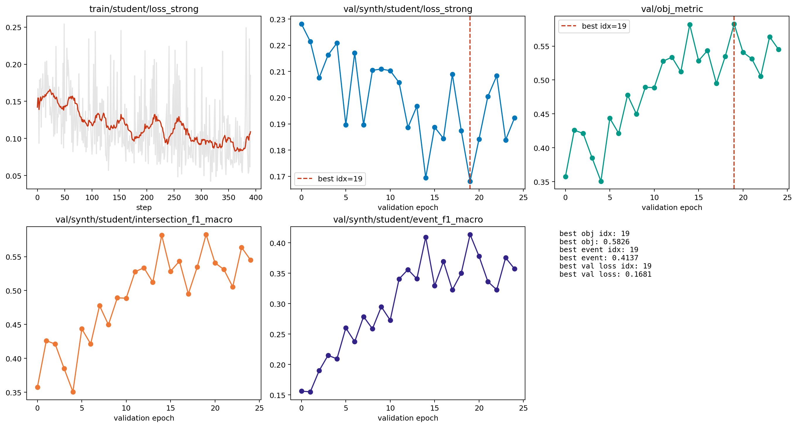

| 曲线                                      | 起始值    | 最终值    | 最佳值    |
| --------------------------------------- | ------ | ------ | ------ |
| train/student/loss_strong               | 0.1421 | 0.1851 | 0.0423 |
| val/synth/student/loss_strong           | 0.2281 | 0.1923 | 0.1681 |
| val/obj_metric                          | 0.3576 | 0.5451 | 0.5826 |
| val/synth/student/intersection_f1_macro | 0.3576 | 0.5451 | 0.5826 |
| val/synth/student/event_f1_macro        | 0.1561 | 0.3573 | 0.4137 |

训练过程整体是正常收敛的：`train/student/loss_strong` 在 step 级别存在波动，但最低达到 0.0423；`val/synth/student/loss_strong` 从 0.2281 下降到 0.1923，最低达到 0.1681。

`val/obj_metric` 在 version_20 这段续训日志中的局部索引 `19` 达到峰值 0.5826；对应的全局最佳 checkpoint 正是 `epoch=34, step=21875`。

这说明最佳 checkpoint 选在合理位置，而且真正最佳点大约出现在全局 20 轮左右之后不久。继续训练到 40 epoch 后，验证指标主要表现为平台震荡，而不是持续稳步上涨。

这里需要特别说明：在 `synth_only` 下，`val/obj_metric` 实际上等于 `val/synth/student/intersection_f1_macro`。所以它更强调“预测区间大致重合”，而不是更严格的事件边界质量。这也是为什么 best checkpoint 主要由 intersection 指标驱动，而不是 event-based F1 驱动。

不过这次并不是单看 `obj_metric`：`val/synth/student/event_f1_macro` 的最佳值 0.4137 也出现在同一轮附近，而且后面继续训练并没有明显再抬高这项指标。结合 `val loss` 一起看，这更像是正常平台期，而不是再训很久还能显著涨分的状态。

## 预测行为统计

| 统计项          | 数值    |
| ------------ | ----- |
| 总文件数         | 2500  |
| 有预测文件数       | 2430  |
| 空预测文件数       | 70    |
| 空预测比例        | 2.80% |
| 总真值事件数       | 8132  |
| 总预测事件数       | 6093  |
| 真值平均事件时长     | 3.38s |
| 预测平均事件时长     | 2.92s |
| 预测中 >=8s 长段数 | 978   |
| 预测中 >=9s 长段数 | 875   |
| 疑似碎片化过预测文件数  | 136   |

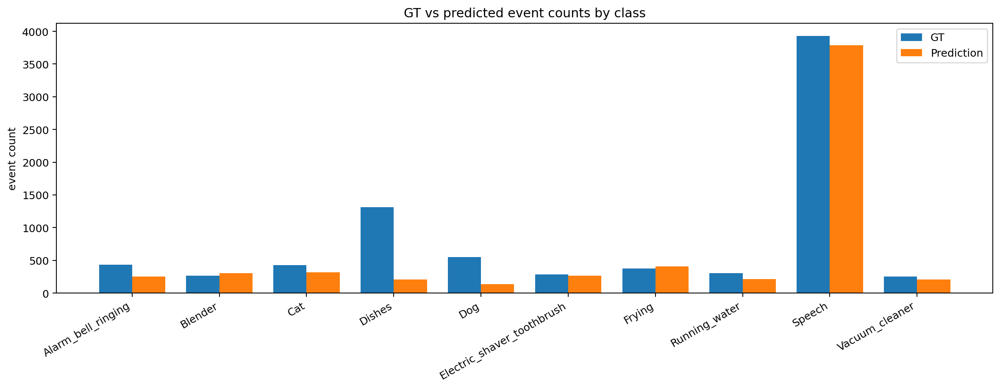

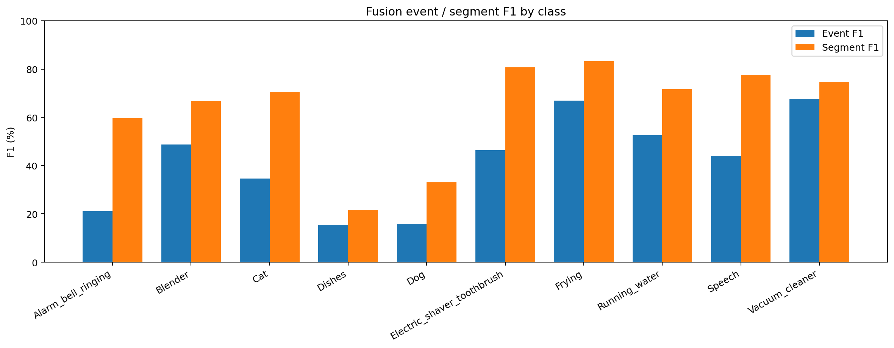

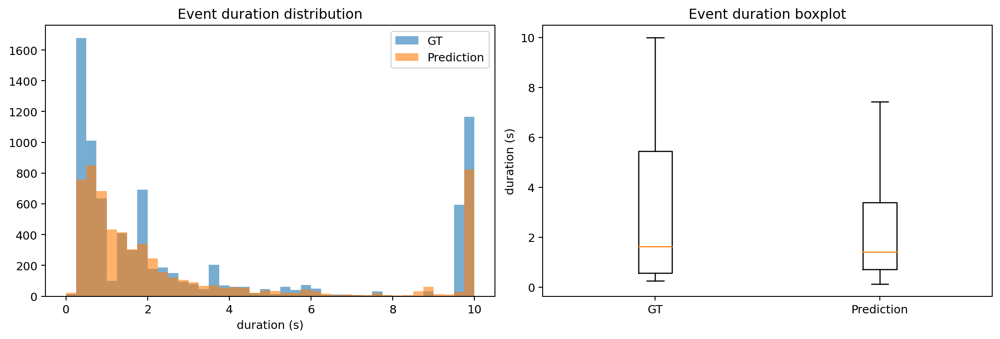

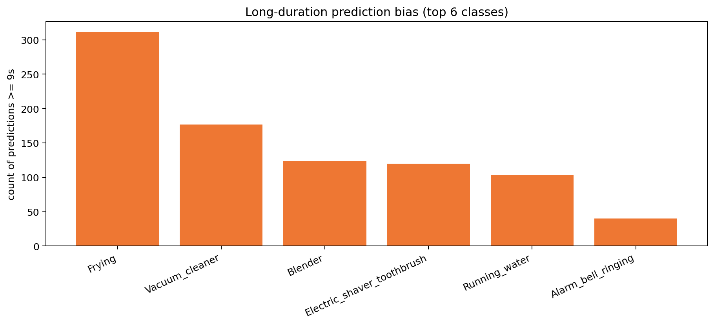

| 类别                         | GT事件数 | Pred事件数 | Pred-GT |
| -------------------------- | ----- | ------- | ------- |
| Alarm_bell_ringing         | 431   | 250     | -181    |
| Blender                    | 266   | 302     | 36      |
| Cat                        | 429   | 318     | -111    |
| Dishes                     | 1309  | 208     | -1101   |
| Dog                        | 550   | 139     | -411    |
| Electric_shaver_toothbrush | 286   | 266     | -20     |
| Frying                     | 377   | 406     | 29      |
| Running_water              | 306   | 212     | -94     |
| Speech                     | 3927  | 3788    | -139    |
| Vacuum_cleaner             | 251   | 204     | -47     |

| 类别                         | 平均预测时长 | >=9s 预测段数 |
| -------------------------- | ------ | --------- |
| Frying                     | 8.52s  | 311       |
| Vacuum_cleaner             | 9.14s  | 177       |
| Blender                    | 6.37s  | 124       |
| Electric_shaver_toothbrush | 7.11s  | 120       |
| Running_water              | 7.06s  | 103       |
| Alarm_bell_ringing         | 3.28s  | 40        |

当前系统已经摆脱了单独 frozen BEATs 时那种“大面积类别塌缩”的状态。从 2500 个文件中，有预测的文件达到 2430 个，空预测文件 70 个，空预测比例只有 2.80%，明显比 frozen BEATs 单模型更健康。

但它仍没有明显超过 CRNN baseline：总预测事件数为 6093，低于真值 8132，说明系统整体仍偏保守，弱类召回不足仍在。尤其 `Dishes`、`Dog`、`Alarm_bell_ringing` 仍呈现明显的欠预测。

长时段偏置依然存在。预测中 `>=9s` 的长段有 875 个，主要集中在 `Vacuum_cleaner`、`Frying`、`Running_water` 和 `Blender` 这类更容易被建模为持续纹理的类别上。这说明融合主要改善了长持续类和设备类的粗粒度覆盖，但对复杂短事件和多事件场景帮助有限。

同时，疑似碎片化过预测文件数为 136 个，说明系统虽然不再像 frozen BEATs 那样大面积空预测，但在部分长持续类上仍会出现切段和边界偏移。

## 典型样本分析

### 355.wav | 长持续类检测较好

- 代表性：Frying 长持续事件几乎完整命中，适合展示融合模型已经恢复到正常工作状态。
- 真值事件：Frying (0.000-10.000s)
- 预测事件：Frying (0.000-9.984s)
- 简短点评：这是当前 fusion 模型表现最稳的一类：长持续、纹理稳定、边界基本连续。

### 1088.wav | 弱类部分恢复但仍漏检

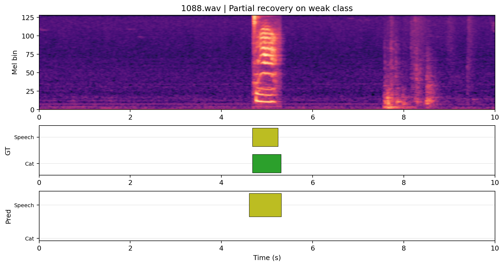

- 代表性：Cat + Speech 双事件中，Speech 已经恢复，但 Cat 仍漏检，能体现“恢复正常但弱类仍吃亏”。
- 真值事件：Cat (4.682-5.308s) Speech (4.683-5.243s)
- 预测事件：Speech (4.608-5.312s)
- 简短点评：相较单独 frozen BEATs 的空预测，这里至少把 Speech 报出来了，但 Cat 仍然没能恢复，说明融合帮助有限且偏向主类。

### 234.wav | 长持续类碎片化与边界偏移

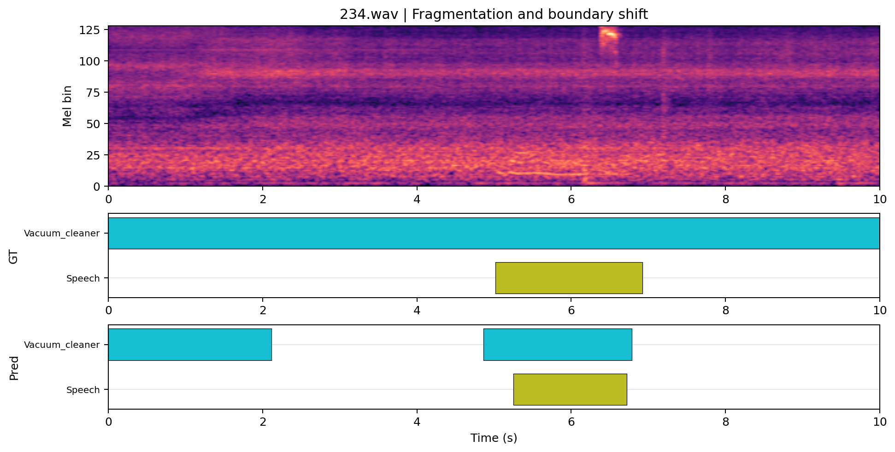

- 代表性：Vacuum_cleaner 被切成多段，同时 Speech 只覆盖中间部分，适合体现边界与后处理问题。
- 真值事件：Vacuum_cleaner (0.000-10.000s) Speech (5.017-6.922s)
- 预测事件：Vacuum_cleaner (0.000-2.112s) Vacuum_cleaner (4.864-6.784s) Speech (5.248-6.720s)
- 简短点评：融合没有完全塌掉，但对长持续类的完整覆盖仍不够稳定，表现为切段和漏掉前后边界。

### 1312.wav | 多事件场景明显欠检

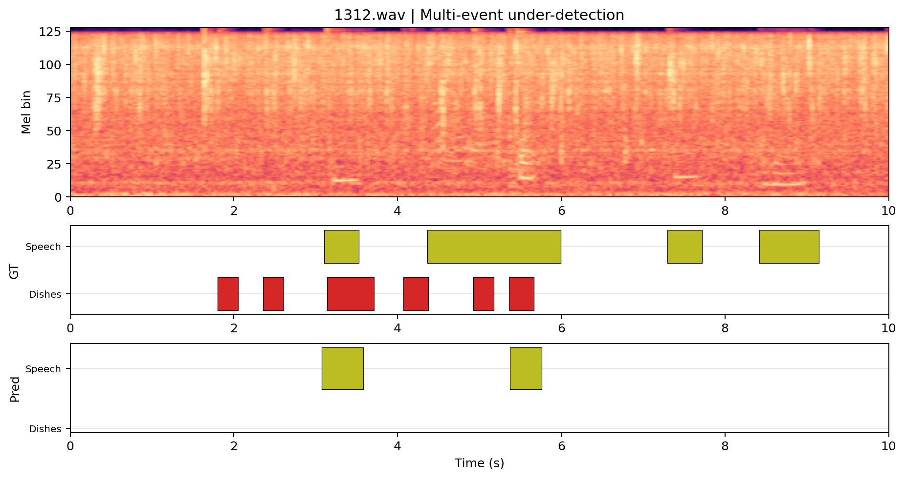

- 代表性：Dishes + Speech 的复杂场景只留下少量 Speech 片段，能展示 fusion 在复杂场景里并没有明显胜过 CRNN。
- 真值事件：Dishes (1.800-2.050s) Dishes (2.358-2.608s) Speech (3.101-3.528s) Dishes (3.142-3.710s) Dishes (4.069-4.374s) Speech (4.362-5.993s) Dishes (4.927-5.177s) Dishes (5.362-5.666s) Speech (7.296-7.723s) Speech (8.420-9.149s)
- 预测事件：Speech (3.072-3.584s) Speech (5.376-5.760s)
- 简短点评：这类样本最能说明当前 late fusion 还没有把多事件建模能力真正拉起来，尤其 Dishes 仍然弱。

### 1195.wav | Dog 弱类完全漏检

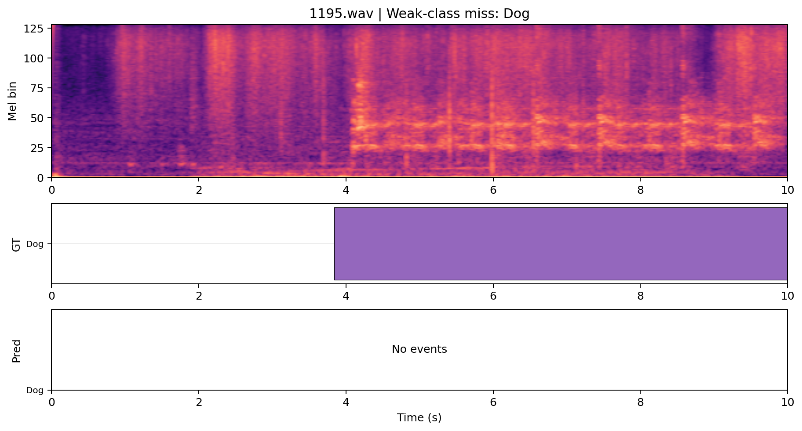

- 代表性：Dog 长事件完全无预测，是当前弱类召回不足的直接证据。
- 真值事件：Dog (3.839-10.000s)
- 预测事件：无预测
- 简短点评：Dog 仍接近 CRNN 明显偏弱的那一侧，说明融合没有实质解决动物类表征问题。

### 1278.wav | 设备类混淆与长段偏置

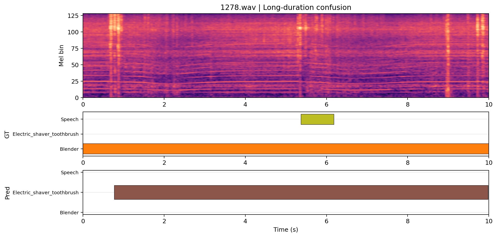

- 代表性：Blender + Speech 被预测成接近整段的 Electric_shaver_toothbrush，体现长持续设备类的语义混淆。
- 真值事件：Blender (0.000-10.000s) Speech (5.370-6.184s)
- 预测事件：Electric_shaver_toothbrush (0.768-9.984s)
- 简短点评：这类错误说明 BEATs 分支带来了一些粗粒度语义覆盖，但没有稳定转化成精确的类别边界判别。

## 结论与讨论

这次训练是正常的，late fusion 也确实已经跑通。无论从训练曲线、最终指标，还是典型样本来看，它都不是 bug、不是 NaN、不是全空预测，而是一版能稳定工作的融合 baseline。

和单独 frozen BEATs 相比，这次结果已经明显更好：类别覆盖恢复、PSDS 回升、event/segment 指标大幅改善，说明将 CRNN branch 和 BEATs branch 在模型内部做 late fusion 的方向本身是成立的。

但它还没有明显优于 CRNN baseline。当前最主要的问题不是“模型没学到”，而是“融合增益有限”：BEATs 分支带来了一些对长持续设备类的补充，但还没有稳定提升复杂多事件、弱类、动物类和边界精度。

这也是为什么它更像“CRNN 为主，BEATs 帮一点”。融合有效，说明信息确实进来了；收益有限，说明这些额外信息还没有被共享 temporal/classification head 充分转化。

至于为什么最佳轮在 20 左右就出现：从 `val/obj_metric`、`val/synth/student/event_f1_macro` 和 `val/synth/student/loss_strong` 三条曲线一起看，它们都在同一阶段附近达到最佳或接近最佳，后续继续训练到 40 epoch 主要是平台震荡，而不是继续稳定变好。因此这次结果足以作为一版“成功跑通、结果正常的 late fusion baseline”，但还不值得继续盲目长训堆 epoch。

## 后续建议

1. 以后把 `epoch≈20` 作为 late fusion 的经验上限，先做早停或缩短训练，不要继续盲目长训到 40。
2. 优先针对 `Dishes / Dog / Alarm_bell_ringing / Cat` 做阈值与类不平衡分析，因为这些类别仍是 fusion 的主要短板。
3. 检查融合前后的尺度归一化与 feature scale，对 `cnn_feat` 与 `beats_feat` 加更明确的 normalization/projection，避免一边主导融合。
4. 做一页式 `CRNN vs Fusion` 对比，把每类 Event/Segment F1、Pred/GT 和典型样本并排放出来，尽快判断 late fusion 是否值得继续深挖。
5. 如果后续扩展资源有限，可以先评估 posterior fusion、WavLM 或部分解冻 BEATs，而不是继续单纯增加 late fusion 训练轮数。
