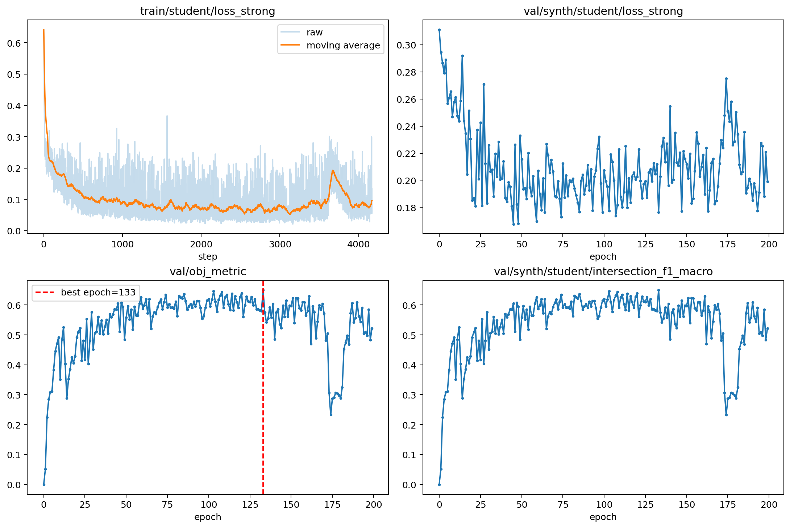
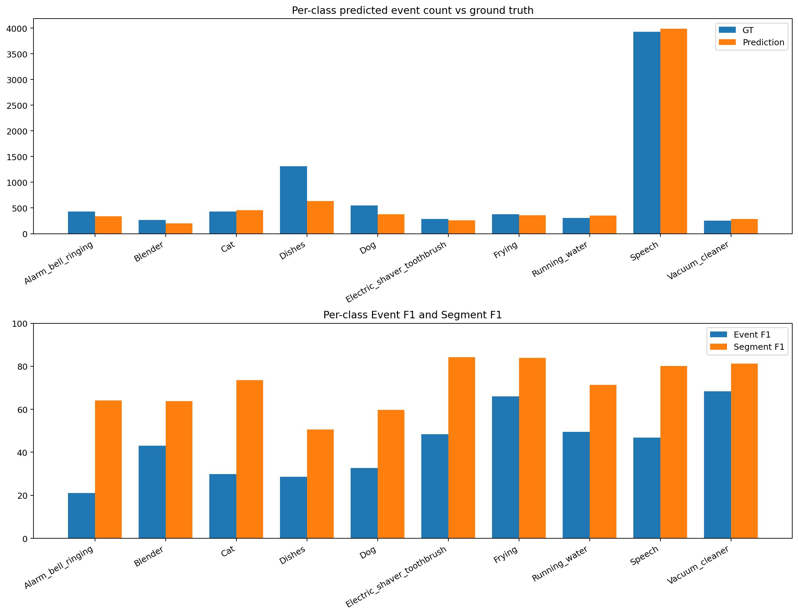
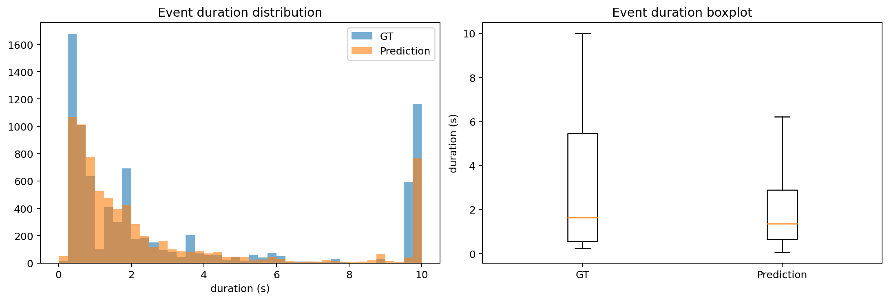
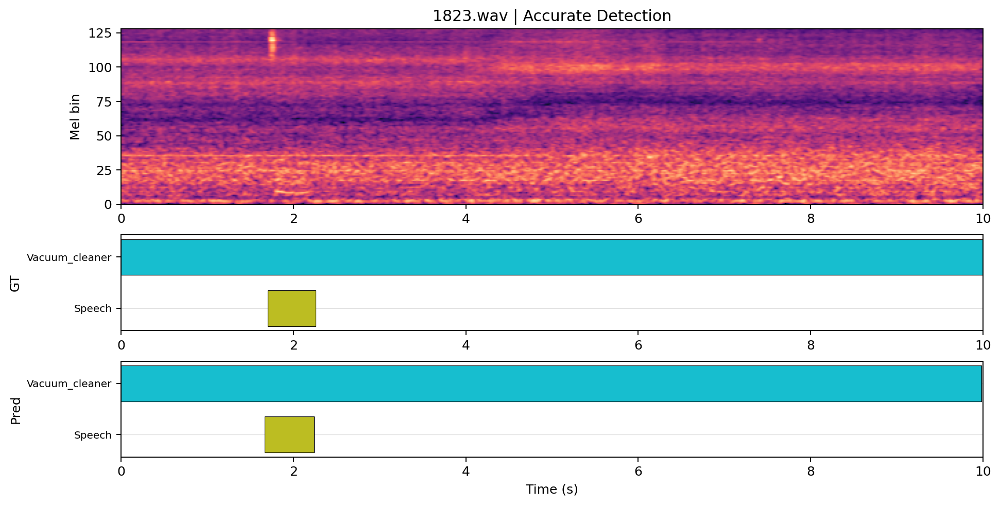
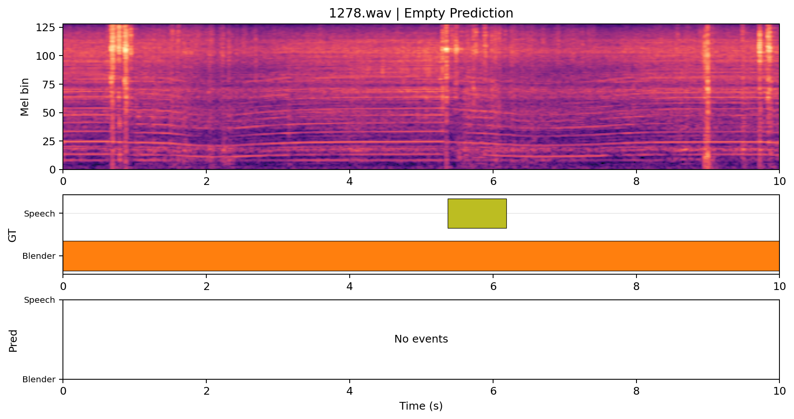
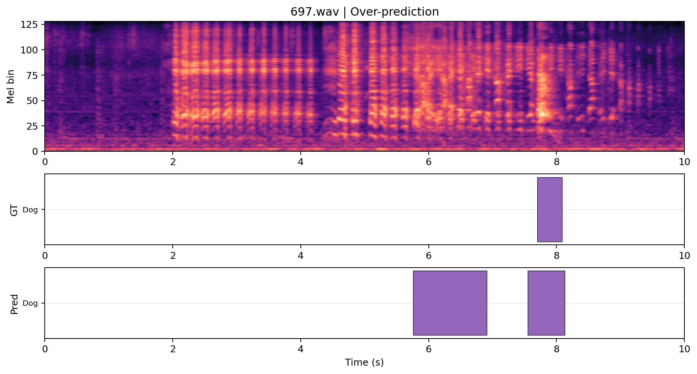
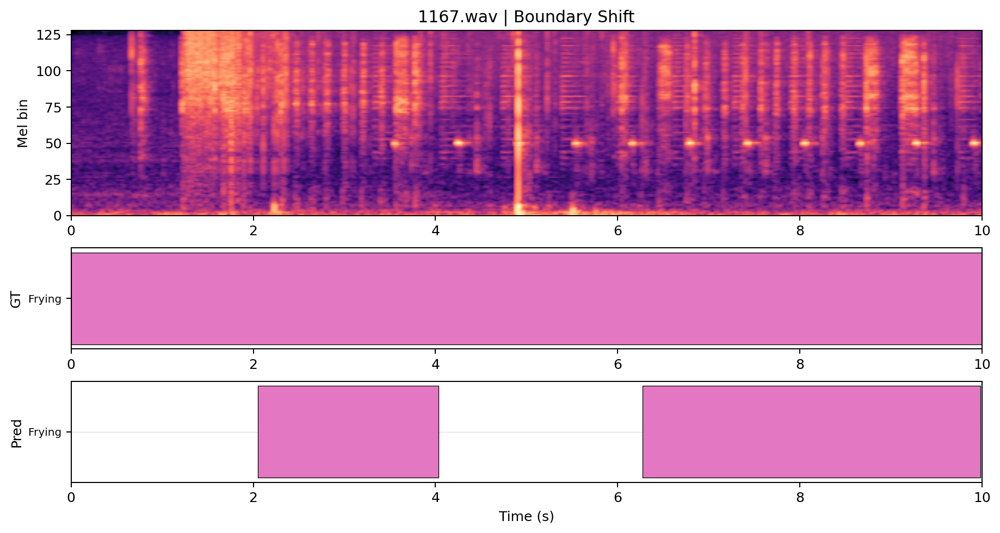
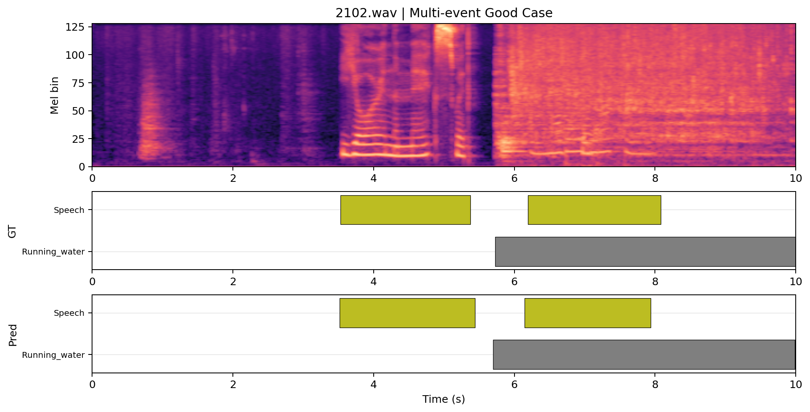
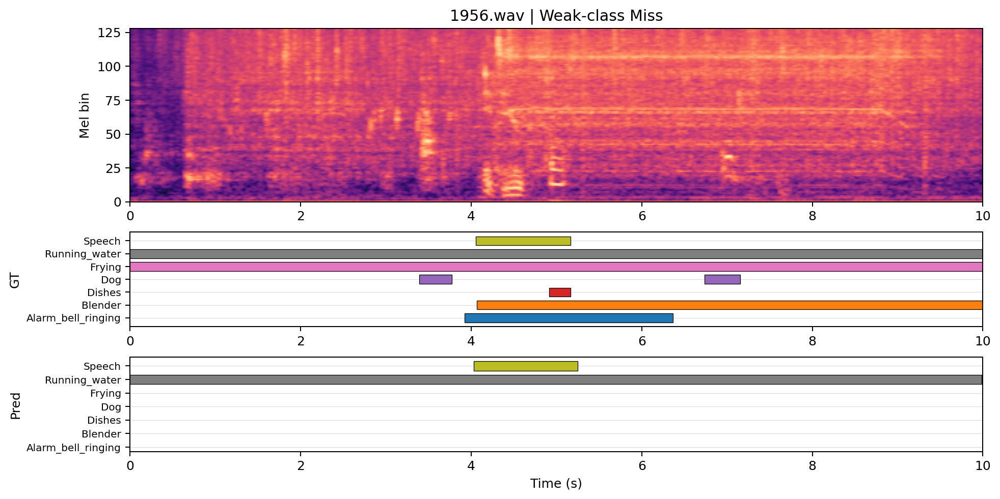

# CRNN Baseline 训练结果详细分析报告

## 目录
- [1. 实验概况](#1-实验概况)
- [2. 最终指标汇总](#2-最终指标汇总)
- [3. 训练过程分析](#3-训练过程分析)
- [4. 预测行为统计](#4-预测行为统计)
- [5. 典型样本分析](#5-典型样本分析)
- [6. 结论与建议](#6-结论与建议)

## 1. 实验概况

本次分析对象是当前仓库中的 CRNN baseline。模型训练逻辑采用 mean-teacher 框架，包含 `student` 与 `teacher` 两个分支，训练和最终推理时均会记录两路指标；本报告以 `student` 结果为主，因为当前 `metrics_test/student` 是最直接的主结果输出目录。

从本次运行使用的配置看，实验属于 `synth_only` 设置，关键配置来自 [confs/synth_only_d_drive.yaml](/home/llxxll/pyProj/dcase-2022-task4/confs/synth_only_d_drive.yaml)。本次训练：

- 使用 synthetic train 作为训练集
- 使用 synthetic validation 作为验证集
- 当前 `test_folder/test_tsv` 也指向同一份 synthetic validation
- 因此当前最终结果更接近“自测分数”，对模型是否学会了 synthetic validation 分布有较强参考价值，但对真实泛化能力的结论仍然有限

本次最佳 checkpoint 为：

- `epoch=133`，文件为 [epoch=133-step=111756.ckpt](/home/llxxll/pyProj/dcase-2022-task4/exp/2022_baseline/version_4/epoch=133-step=111756.ckpt)

补充环境信息：

- 最大训练轮数：`200`
- early stop patience：`200`
- batch size：`12`
- `obj_metric_synth_type`：`intersection`
- 训练能耗：`0.683 kWh`
- dev-test 能耗：`0.039 kWh`

## 2. 最终指标汇总

### 2.1 整体指标

| 指标                       | 数值     |
| ------------------------ | ------ |
| PSDS-scenario1           | 0.356  |
| PSDS-scenario2           | 0.578  |
| Intersection-based F1    | 0.650  |
| Event-based F1 (micro)   | 43.14% |
| Event-based F1 (macro)   | 43.42% |
| Segment-based F1 (micro) | 75.70% |
| Segment-based F1 (macro) | 71.25% |

简要解读：

- `PSDS-scenario1/2` 分别为 `0.356` 和 `0.578`，说明模型在不同容错设定下都能给出可用结果，scenario2 明显更高，符合通常“宽松场景分数更高”的预期。
- `Intersection-based F1` 为 `0.650`，整体处于较好水平。
- `Event-based F1 (micro)` 为 `43.14%`，显著低于 segment-based F1，这是事件边界评估比 1 秒分段评估更严格所致。
- `Segment-based F1 (micro)` 为 `75.70%`，说明在较粗粒度时序上模型整体检测稳定。

### 2.2 各类别指标

| 类别                         | GT事件数 | Pred事件数 | Pred/GT | Event F1 | Segment F1 |
| -------------------------- | ----- | ------- | ------- | -------- | ---------- |
| Alarm_bell_ringing         | 431   | 338     | 0.78    | 21.07%   | 64.04%     |
| Blender                    | 266   | 198     | 0.74    | 43.10%   | 63.83%     |
| Cat                        | 429   | 455     | 1.06    | 29.86%   | 73.48%     |
| Dishes                     | 1309  | 637     | 0.49    | 28.57%   | 50.55%     |
| Dog                        | 550   | 380     | 0.69    | 32.69%   | 59.67%     |
| Electric_shaver_toothbrush | 286   | 260     | 0.91    | 48.35%   | 84.23%     |
| Frying                     | 377   | 360     | 0.95    | 65.94%   | 83.89%     |
| Running_water              | 306   | 349     | 1.14    | 49.47%   | 71.40%     |
| Speech                     | 3927  | 3986    | 1.02    | 46.86%   | 80.20%     |
| Vacuum_cleaner             | 251   | 288     | 1.15    | 68.27%   | 81.20%     |

简要解读：

- 整体较强类别：`Vacuum_cleaner, Frying, Running_water`。这些类别的 event/segment F1 都相对靠前，通常具有更稳定的声学模式或更容易在 synthetic 数据中建模。
- 整体较弱类别：`Alarm_bell_ringing, Dishes, Cat, Dog, Blender`。这些类别并非“完全失效”，但在事件级别上明显更难，主要表现为召回不足和边界控制较弱。
- 从 `Pred/GT` 看，`Dishes`、`Alarm_bell_ringing`、`Dog`、`Blender` 等类别存在不同程度的欠预测；`Speech` 数量接近真值，`Cat` 甚至略有过预测。

## 3. 训练过程分析

### 3.1 loss 变化是否正常

- `train/student/loss_strong` 从约 `0.6421` 下降到 `0.0650`，下降趋势清晰，没有出现持续发散。
- `val/synth/student/loss_strong` 从约 `0.3112` 下降到 `0.1991`，最低达到 `0.1677`，说明验证损失整体也在改善。
- 从曲线形态看，训练后期仍有波动，但没有出现异常抖动到失控的迹象。

### 3.2 选模指标与最佳轮次

- `val/obj_metric` 的最佳值约为 `0.6501`，出现在约第 `133` 轮。
- 最后一轮 `val/obj_metric` 约为 `0.5221`，明显低于最佳值。
- 最佳 checkpoint 文件名为 `epoch=133`，与 `val/obj_metric` 中后期达到峰值的现象一致。

这说明：

- “最后一轮不等于最佳轮”在本次实验中是有明确证据的；
- 如果只看最后一轮结果，会低估模型在中后期达到过的最好性能；
- 当前保存 best checkpoint 的策略是有效的。

### 3.3 对当前曲线的判断

- 训练不像崩溃，也不像完全没有学到东西；
- 模型在前中期快速提升，后期进入波动区；
- 对于 `synth_only` 设置，这种“中后期达到峰值、最后略回落”的现象是合理的，提示后续可考虑更积极的早停或更稳的选模标准。

## 4. 预测行为统计

### 4.1 整体统计

| 统计项             | 数值     |
| --------------- | ------ |
| 真值文件数           | 2500   |
| 有预测的文件数         | 2468   |
| 空预测文件数          | 32     |
| 空预测比例           | 1.28%  |
| 真值事件数           | 8132   |
| 预测事件数           | 7251   |
| 预测事件平均时长        | 2.64s  |
| 预测事件中位时长        | 1.34s  |
| 真值事件平均时长        | 3.38s  |
| 真值事件中位时长        | 1.63s  |
| 预测事件 p95 时长     | 9.98s  |
| 真值事件 p95 时长     | 10.00s |
| 接近整段(>=9.5s)预测数 | 812    |
| 接近整段(>=9.5s)真值数 | 1760   |

### 4.2 各类别预测数 vs 真值数

| 类别                         | GT事件数 | Pred事件数 | 差值   | Pred/GT |
| -------------------------- | ----- | ------- | ---- | ------- |
| Alarm_bell_ringing         | 431   | 338     | -93  | 0.78    |
| Blender                    | 266   | 198     | -68  | 0.74    |
| Cat                        | 429   | 455     | 26   | 1.06    |
| Dishes                     | 1309  | 637     | -672 | 0.49    |
| Dog                        | 550   | 380     | -170 | 0.69    |
| Electric_shaver_toothbrush | 286   | 260     | -26  | 0.91    |
| Frying                     | 377   | 360     | -17  | 0.95    |
| Running_water              | 306   | 349     | 43   | 1.14    |
| Speech                     | 3927  | 3986    | 59   | 1.02    |
| Vacuum_cleaner             | 251   | 288     | 37   | 1.15    |

### 4.3 统计解读

- 总文件数为 `2500`，其中有预测的文件为 `2468`，空预测文件为 `32`（`1.28%`）。这说明模型不是“全预测为空”，但确实存在小比例完全漏检文件。
- 总预测事件数 `7251` 低于总真值事件数 `8132`，整体更偏“保守”，主要表现为局部类别召回不足，而不是全局过预测。
- 预测事件平均时长 `2.64s` 低于真值的 `3.38s`，说明模型更常见的问题是把事件段预测得偏短，而不是普遍把整段涂满。
- 接近整段（`>=9.5s`）的预测共有 `812` 个，而真值中本身就有 `1760` 个长事件。因此“长条预测”存在，但大部分与数据分布本身一致，不能简单视为失控。
- 各类别都有预测输出，没有出现“某个类别永远检测不到”的情况。
- 更主要的问题是局部类别偏弱，尤其体现在：`Alarm_bell_ringing, Dishes, Cat, Dog, Blender`。

综合判断：当前现象更像“部分类别召回不足 + 个别文件存在过预测/漏预测”，而不是整体性失效。

## 5. 典型样本分析

下面选取 6 个典型样本，覆盖高质量检测、完全漏检、过预测、边界偏移、多事件场景和弱类漏检等情况。图中：

- 顶部为 log-mel 频谱
- 中部为 Ground Truth 时间轴
- 底部为 Prediction 时间轴

### 高质量检测：`1823.wav`

- 文件名：`1823.wav`
- 代表模式：高质量检测
- 代表性原因：人工抽样中表现准确，适合作为正例。
- 简短点评：主要事件的类别与时序均较贴近真值，可作为本次模型表现较好的代表。

**Ground Truth 事件列表**

Vacuum_cleaner (0.000-10.000s) Speech (1.701-2.261s)

**Prediction 事件列表**

Vacuum_cleaner (0.000-9.984s) Speech (1.664-2.240s)

### 空预测/漏检：`1278.wav`

- 文件名：`1278.wav`
- 代表模式：空预测/漏检
- 代表性原因：人工抽样中为典型空预测样本。
- 简短点评：该样本没有输出任何预测，属于明显漏检案例。

**Ground Truth 事件列表**

Blender (0.000-10.000s) Speech (5.370-6.184s)

**Prediction 事件列表**

无预测

### 过预测：`697.wav`

- 文件名：`697.wav`
- 代表模式：过预测
- 代表性原因：人工抽样中存在明显多报时间段。
- 简短点评：该样本输出了额外的事件片段，体现了局部过预测现象。

**Ground Truth 事件列表**

Dog (7.702-8.088s)

**Prediction 事件列表**

Dog (5.760-6.912s) Dog (7.552-8.128s)

### 边界偏移但类别正确：`1167.wav`

- 文件名：`1167.wav`
- 代表模式：边界偏移但类别正确
- 代表性原因：预测类别正确，但起止边界存在明显偏移。
- 简短点评：模型识别到了正确类别，但事件起止时间与真值仍有偏移。

**Ground Truth 事件列表**

Frying (0.000-10.000s)

**Prediction 事件列表**

Frying (2.048-4.032s) Frying (6.272-9.984s)

### 多事件重叠表现较好：`2102.wav`

- 文件名：`2102.wav`
- 代表模式：多事件重叠表现较好
- 代表性原因：多事件样本中，类别覆盖和时长匹配都较好。
- 简短点评：在多事件场景中仍能保留较好的类别覆盖，说明模型没有在复杂场景下完全失效。

**Ground Truth 事件列表**

Speech (3.531-5.372s) Running_water (5.730-10.000s) Speech (6.191-8.082s)

**Prediction 事件列表**

Speech (3.520-5.440s) Running_water (5.696-9.984s) Speech (6.144-7.936s)

### 弱类漏检：`1956.wav`

- 文件名：`1956.wav`
- 代表模式：弱类漏检
- 代表性原因：包含弱类事件，但该弱类在预测中缺失或明显不足。
- 简短点评：样本包含弱类事件，但模型未能稳定捕获，反映了类别层面的不足。

**Ground Truth 事件列表**

Frying (0.000-10.000s) Running_water (0.000-10.000s) Dog (3.390-3.773s) Alarm_bell_ringing (3.924-6.368s) Speech (4.051-5.164s) Blender (4.066-10.000s) Dishes (4.916-5.166s) Dog (6.739-7.156s)

**Prediction 事件列表**

Running_water (0.000-9.984s) Speech (4.032-5.248s)

## 6. 结论与建议

### 6.1 结论

- 本次训练结果**不像训练崩了**。证据包括：loss 正常下降、验证指标在中后期明显上升、最终输出覆盖大多数文件与全部类别。
- 当前最主要的问题不是“全局异常”，而是**部分类别召回不足**与**少量文件的局部过预测/漏预测**。
- 在 `synth_only` 设定下，这次结果已经显示出较稳定的 synthetic validation 拟合能力，但由于当前 test 实际仍是 synthetic validation，本报告不应被解读为强泛化结论。

### 6.2 最主要的问题

1. 弱类事件在 event-based 评估上明显吃亏，尤其是 `Alarm_bell_ringing, Dishes, Cat, Dog, Blender`。
2. 少量文件存在空预测，说明模型在部分样本上仍有明显漏检。
3. 最佳 checkpoint 出现在中后期而非最后一轮，说明当前训练后期存在一定回落，继续盲目长训收益有限。

### 6.3 是否建议继续训练

- **不建议简单继续按原设置长训同一实验**。当前曲线已经表明最佳点出现在中后期，继续硬跑到最后并不能带来更好的选模结果。
- **建议保留当前 best checkpoint**，并把后续工作重点放在阈值、类别平衡和弱类改进上。

### 6.4 后续最值得优先尝试的方向

1. **阈值调优**：当前报告基于固定阈值预测文件；对弱类分别调阈值，通常是性价比最高的第一步。
2. **弱类补强**：优先针对 `Alarm_bell_ringing, Dishes, Cat` 做重采样、损失加权或针对性增强。
3. **更积极的早停/选模**：当前最佳轮次早于最后一轮，建议缩短 patience，或直接按 synthetic event F1 / intersection F1 的更稳组合选模。
4. **数据层改进**：若后续允许，可引入非 synth_only 的 weak/unlabeled/real 数据，减少“自测分数偏高、泛化有限”的问题。
5. **分析 teacher 分支**：本次 teacher 指标略高于 student，可进一步确认是否在最终推理或蒸馏策略上有改进空间。

---

本报告由脚本自动生成，主要依据以下文件：

- [event_f1.txt](/home/llxxll/pyProj/dcase-2022-task4/exp/2022_baseline/metrics_test/student/event_f1.txt)
- [segment_f1.txt](/home/llxxll/pyProj/dcase-2022-task4/exp/2022_baseline/metrics_test/student/segment_f1.txt)
- [predictions_th_0.49.tsv](/home/llxxll/pyProj/dcase-2022-task4/exp/2022_baseline/metrics_test/student/scenario1/predictions_dtc0.7_gtc0.7_cttc0.3/predictions_th_0.49.tsv)
- [soundscapes.tsv](/mnt/d/Downloads/Compressed/dcase_synth/metadata/validation/synthetic21_validation/soundscapes.tsv)
- [version_4 TensorBoard](/home/llxxll/pyProj/dcase-2022-task4/exp/2022_baseline/version_4)
