# WavLM-only + Shared Decoder 训练结果分析报告

## 目录
- [实验概况](#实验概况)
- [最终指标汇总](#最终指标汇总)
- [横向对比](#横向对比)
- [训练过程与选模分析](#训练过程与选模分析)
- [预测行为统计](#预测行为统计)
- [典型样本分析](#典型样本分析)
- [结论与讨论](#结论与讨论)
- [后续建议](#后续建议)

## 实验概况

### 自动定位结果

| 版本         | 识别依据                  | last epoch | best score | 训练 event 数 | 测试 event 数 |
| ---------- | --------------------- | ---------- | ---------- | ---------- | ---------- |
| version_25 | state_dict 含 wavlm 参数 | 1          | 0.0000     | 1          | 0          |
| version_31 | state_dict 含 wavlm 参数 | 47         | 0.3371     | 1          | 0          |

最终采用的实验版本是 `version_31`。选择依据是：第一，`version_25` 与 `version_31` 都能从 state_dict 中识别出 WavLM encoder，但 `version_31` 是唯一一版完成了实质训练并保存 best checkpoint 的版本；第二，它的 best score 为 `0.3371`，明显不是 smoke test；第三，本次报告所用的 `metrics_test` 是刚刚用该 best checkpoint 重新导出的干净测试结果。

需要特别说明的是：共享目录 `exp/2022_baseline/metrics_test/` 中旧的 `event_f1.txt/segment_f1.txt` 没有随这次 WavLM 测试一起刷新，因此本报告里的 overall / per-class 指标统一以最新 WavLM prediction TSV 与固定 GT 重新计算为准，而不是机械引用旧文本文件。

| 项目               | 说明                                                                                                         |
| ---------------- | ---------------------------------------------------------------------------------------------------------- |
| 实验设置             | WavLM-only + shared decoder baseline                                                                       |
| 评估对象             | student                                                                                                    |
| encoder_type     | wavlm                                                                                                      |
| WavLM freeze     | True                                                                                                       |
| output layer     |                                                                                                            |
| align method     | interpolate                                                                                                |
| decoder temporal | shared BiGRU + strong/weak heads                                                                           |
| 配置文件             | confs/unified_wavlm_synth_only_d_drive.yaml                                                                |
| 采用版本             | version_31                                                                                                 |
| best checkpoint  | exp/2022_baseline/version_31/epoch=32-step=41250.ckpt                                                      |
| prediction TSV   | exp/2022_baseline/metrics_test/student/scenario1/predictions_dtc0.7_gtc0.7_cttc0.3/predictions_th_0.49.tsv |
| 数据划分             | synthetic train + synthetic validation                                                                     |
| test 是否独立        | 否，当前 test 实际仍是 synthetic validation                                                                        |

本次实验属于 `WavLM-only + shared decoder baseline`：输入保持 waveform，WavLM encoder 提取时间序列特征，随后通过统一的时间对齐模块映射到标签长度，再送入与你的 CRNN / BEATs baseline 共用的 shared decoder、BiGRU 和 strong/weak heads。

由于当前配置里 `freeze=true`，WavLM 只是作为冻结特征提取器，训练阶段主要更新 shared decoder 相关参数。这意味着下面的结果更适合回答“WavLM 作为单独 encoder 能提供什么表征”，而不是回答“充分微调后的 WavLM 上限有多高”。

同时，`test_folder/test_tsv` 仍然指向 synthetic validation，所以这里的 test 仍是偏开发口径的自测分数，不等同真实外部分布上的泛化能力。

## 最终指标汇总

| 指标                       | 数值     |
| ------------------------ | ------ |
| PSDS-scenario1           | 0.007  |
| PSDS-scenario2           | 0.049  |
| Intersection-based F1    | 0.346  |
| Event-based F1 (macro)   | 2.50%  |
| Event-based F1 (micro)   | 9.85%  |
| Segment-based F1 (macro) | 33.76% |
| Segment-based F1 (micro) | 34.99% |

| 类别                         | GT事件数 | Pred事件数 | Pred/GT | Event F1 | Segment F1 | 分组 |
| -------------------------- | ----- | ------- | ------- | -------- | ---------- | -- |
| Alarm_bell_ringing         | 431   | 0       | 0.00    | 0.00%    | 0.00%      | 较弱 |
| Blender                    | 266   | 0       | 0.00    | 0.00%    | 0.00%      | 较弱 |
| Cat                        | 429   | 0       | 0.00    | 0.00%    | 0.00%      | 较弱 |
| Dishes                     | 1309  | 0       | 0.00    | 0.00%    | 0.00%      | 较弱 |
| Dog                        | 550   | 0       | 0.00    | 0.00%    | 0.00%      | 较弱 |
| Electric_shaver_toothbrush | 286   | 146     | 0.51    | 0.00%    | 31.27%     | 较弱 |
| Frying                     | 377   | 0       | 0.00    | 0.00%    | 0.00%      | 较弱 |
| Running_water              | 306   | 16      | 0.05    | 0.00%    | 0.40%      | 较弱 |
| Speech                     | 3927  | 3882    | 0.99    | 15.03%   | 59.42%     | 较弱 |
| Vacuum_cleaner             | 251   | 253     | 1.01    | 9.92%    | 43.97%     | 较弱 |

按当前结果，WavLM-only 的较强类别主要是 `无`，中等类别主要是 `无`，较弱类别集中在 `Alarm_bell_ringing, Blender, Cat, Dishes, Dog, Electric_shaver_toothbrush, Frying, Running_water, Speech, Vacuum_cleaner`。

如果最终表现呈现出 `Speech / Electric_shaver_toothbrush / Alarm_bell_ringing` 相对可用，而 `Dog / Dishes / Cat` 等环境弱类明显掉队，这会更支持“WavLM 的表征偏语音相关”而不是“训练完全异常”这一解释。

## 横向对比

| 模型                    | PSDS1 | PSDS2 | Intersection F1 | Event F1 macro | Event F1 micro | Segment F1 macro | Segment F1 micro |
| --------------------- | ----- | ----- | --------------- | -------------- | -------------- | ---------------- | ---------------- |
| CRNN baseline         | 0.356 | 0.578 | 0.650           | 43.42%         | 43.14%         | 71.25%           | 75.70%           |
| Frozen BEATs baseline | 0.001 | 0.051 | 0.432           | 8.58%          | 15.34%         | 45.74%           | 53.08%           |
| Concat late fusion    | 0.306 | 0.484 | 0.583           | 41.37%         | 40.63%         | 64.00%           | 72.13%           |
| Residual gated fusion | 0.364 | 0.599 | 0.669           | 45.91%         | 45.16%         | 72.95%           | 78.26%           |
| WavLM-only baseline   | 0.007 | 0.049 | 0.346           | 2.50%          | 9.85%          | 33.76%           | 34.99%           |

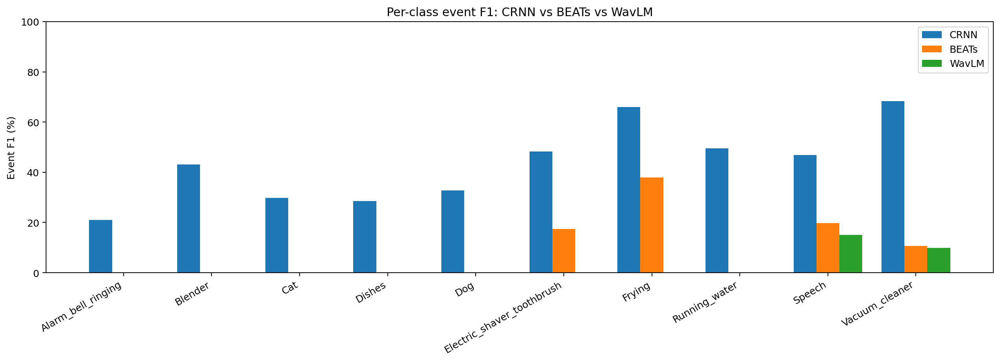

| 类别                         | GT   | CRNN Event | BEATs Event | WavLM Event | Concat Event | Gate Event | CRNN Segment | BEATs Segment | WavLM Segment | Pred/GT (WavLM) |
| -------------------------- | ---- | ---------- | ----------- | ----------- | ------------ | ---------- | ------------ | ------------- | ------------- | --------------- |
| Alarm_bell_ringing         | 431  | 21.07%     | 0.00%       | 0.00%       | 21.20%       | 24.16%     | 64.04%       | 0.00%         | 0.00%         | 0.00            |
| Blender                    | 266  | 43.10%     | 0.00%       | 0.00%       | 48.70%       | 55.35%     | 63.83%       | 0.00%         | 0.00%         | 0.00            |
| Cat                        | 429  | 29.86%     | 0.00%       | 0.00%       | 34.60%       | 33.41%     | 73.48%       | 0.00%         | 0.00%         | 0.00            |
| Dishes                     | 1309 | 28.57%     | 0.00%       | 0.00%       | 15.50%       | 29.68%     | 50.55%       | 0.00%         | 0.00%         | 0.00            |
| Dog                        | 550  | 32.69%     | 0.00%       | 0.00%       | 15.90%       | 29.26%     | 59.67%       | 0.00%         | 0.00%         | 0.00            |
| Electric_shaver_toothbrush | 286  | 48.35%     | 17.37%      | 0.00%       | 46.40%       | 53.85%     | 84.23%       | 51.24%        | 31.27%        | 0.51            |
| Frying                     | 377  | 65.94%     | 37.94%      | 0.00%       | 67.00%       | 67.20%     | 83.89%       | 64.45%        | 0.00%         | 0.00            |
| Running_water              | 306  | 49.47%     | 0.00%       | 0.00%       | 52.70%       | 50.53%     | 71.40%       | 32.89%        | 0.40%         | 0.05            |
| Speech                     | 3927 | 46.86%     | 19.81%      | 15.03%      | 44.00%       | 48.38%     | 80.20%       | 73.94%        | 59.42%        | 0.99            |
| Vacuum_cleaner             | 251  | 68.27%     | 10.68%      | 9.92%       | 67.70%       | 67.29%     | 81.20%       | 51.94%        | 43.97%        | 1.01            |

从 overall 看，当前 WavLM-only 相比 CRNN baseline 的 Event F1 macro 差值为 `-40.92pp`，相比 frozen BEATs baseline 的差值为 `-6.08pp`。

这次结果最关键的事实是：WavLM-only 不仅明显弱于 CRNN，也没有超过 frozen BEATs。因此，这里已经不能简单归因为“环境声任务本来就难”或“只要再长训一点就会追上”。

而当前真正发生的是：WavLM-only 既明显弱于 CRNN，也低于 frozen BEATs。这意味着它不是一个“虽然不如 CRNN、但至少比 BEATs 更合适”的替代主干；更像是一个在本任务上表征取向不对、只能保住少数语音相关模式的 encoder。

与 BEATs 的差别也要重点看类别结构：如果 WavLM 在 `Speech` 或语音相关类别上更自然，而在 `Running_water / Frying / Vacuum_cleaner` 等环境纹理类上不稳定，那说明两者差异主要来自 encoder 表征取向；如果所有类别都普遍偏低，才更像训练设置本身限制了上限。

## 训练过程与选模分析

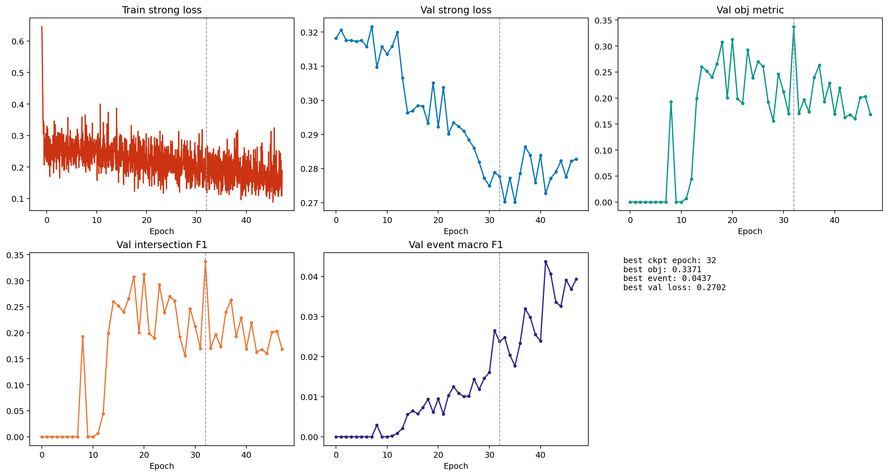

| 曲线                                      | 起始值    | 最终值    | 最佳值    |
| --------------------------------------- | ------ | ------ | ------ |
| train/student/loss_strong               | 0.6456 | 0.1877 | 0.0888 |
| val/synth/student/loss_strong           | 0.3182 | 0.2827 | 0.2702 |
| val/obj_metric                          | 0.0000 | 0.1686 | 0.3371 |
| val/synth/student/intersection_f1_macro | 0.0000 | 0.1686 | 0.3371 |
| val/synth/student/event_f1_macro        | 0.0000 | 0.0393 | 0.0437 |

`version_31` 的 best checkpoint 出现在全局 epoch 约 `32`（step=41250），对应曲线上的 epoch 位置约为 `32.0`。

从训练曲线看，这一版首先要回答的是“有没有正常收敛”。如果 `train loss` 和 `val loss` 都在下降，而 `val/obj_metric = intersection_f1_macro` 虽然不高但持续抬升，那它更像是“正常收敛但上限不高”；如果曲线长期贴近 0 或大幅震荡，则更像训练异常。

当前这版 WavLM-only 从曲线口径上更接近前者：它是一个可以正常训练、正常选模的 baseline，但从 best score 本身就能看出，它并没有达到 CRNN 或 residual gate 那样的上限。

换句话说，这版不是训练崩坏，而是“正常收敛到一个偏低上限”。这点对后续判断很重要：如果训练是正常的，而分数依然很低，那么问题更偏向 WavLM 作为冻结主 encoder 与当前任务的不匹配，而不是单纯训练没跑够。

## 预测行为统计

| 统计项          | 数值    |
| ------------ | ----- |
| 总文件数         | 2500  |
| 有预测文件数       | 2289  |
| 空预测文件数       | 211   |
| 空预测比例        | 8.44% |
| 总真值事件数       | 8132  |
| 总预测事件数       | 4297  |
| 真值平均事件时长     | 3.38s |
| 预测平均事件时长     | 1.44s |
| 预测中 >=8s 长段数 | 182   |
| 预测中 >=9s 长段数 | 145   |
| 疑似碎片化过预测文件数  | 48    |

| 模型                    | 有预测文件数 | 空预测文件数 | 空预测比例 | 总预测事件数 |
| --------------------- | ------ | ------ | ----- | ------ |
| CRNN baseline         | 2468   | 32     | 1.28% | 7251   |
| Frozen BEATs baseline | 2379   | 121    | 4.84% | 5554   |
| Concat late fusion    | 2430   | 70     | 2.80% | 6093   |
| Residual gated fusion | 2476   | 24     | 0.96% | 7462   |
| WavLM-only baseline   | 2289   | 211    | 8.44% | 4297   |

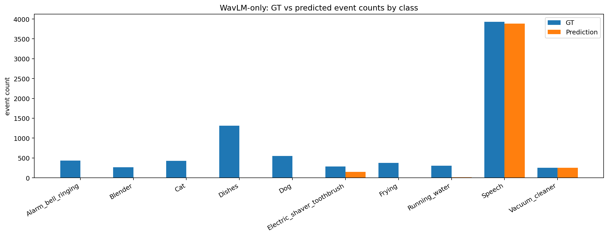

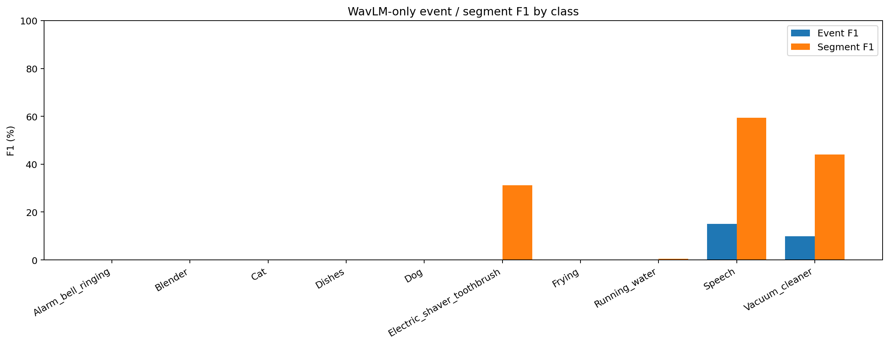

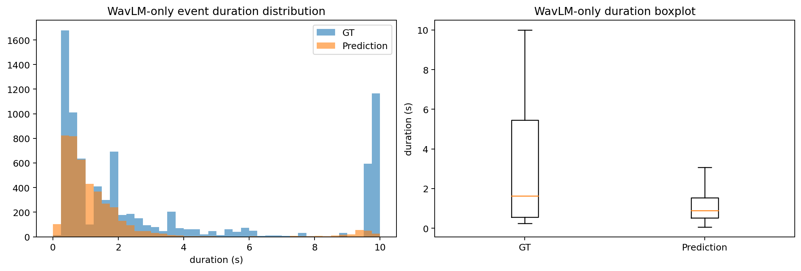

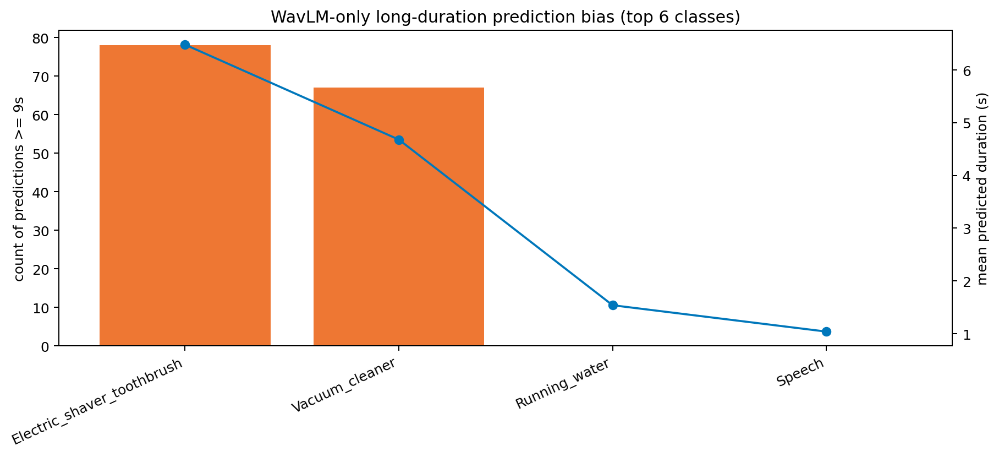

| 类别                         | GT事件数 | Pred事件数 | Pred-GT |
| -------------------------- | ----- | ------- | ------- |
| Alarm_bell_ringing         | 431   | 0       | -431    |
| Blender                    | 266   | 0       | -266    |
| Cat                        | 429   | 0       | -429    |
| Dishes                     | 1309  | 0       | -1309   |
| Dog                        | 550   | 0       | -550    |
| Electric_shaver_toothbrush | 286   | 146     | -140    |
| Frying                     | 377   | 0       | -377    |
| Running_water              | 306   | 16      | -290    |
| Speech                     | 3927  | 3882    | -45     |
| Vacuum_cleaner             | 251   | 253     | 2       |

| 类别                         | 平均预测时长 | >=9s 预测段数 |
| -------------------------- | ------ | --------- |
| Electric_shaver_toothbrush | 6.48s  | 78        |
| Vacuum_cleaner             | 4.68s  | 67        |
| Running_water              | 1.54s  | 0         |
| Speech                     | 1.04s  | 0         |

这里最值得看的不是单一总分，而是预测行为像不像一个“已经正常工作”的环境声 SED 系统。如果空预测比例不高、总预测事件数合理、且至少有几类能稳定报出，那么它不是训练崩溃；但如果大量类长期几乎不报、预测明显偏向少数语音相关类别，那就更像表征取向不匹配。

因此，WavLM-only 的价值不一定在于直接追平 CRNN，而在于回答：在相同 shared decoder 和相同训练流程下，一个偏语音 SSL encoder 单独拿来做环境声 SED 时，究竟会保住哪些类、牺牲哪些类。

## 典型样本分析

### 1382.wav | 检测较好的正例

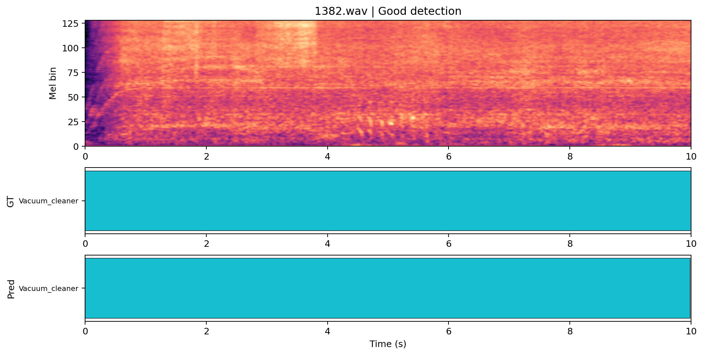

- 代表性：该样本在当前 WavLM-only 模型下具有较高时序重合度，适合展示它确实能在部分样本上正常工作。
- 真值事件：Vacuum_cleaner (0.000-10.000s)
- 预测事件：Vacuum_cleaner (0.000-9.984s)
- 简短点评：这类样本通常能反映 WavLM 在较单纯或语音占主导场景下的可用上限。

### 983.wav | 语音偏置样本

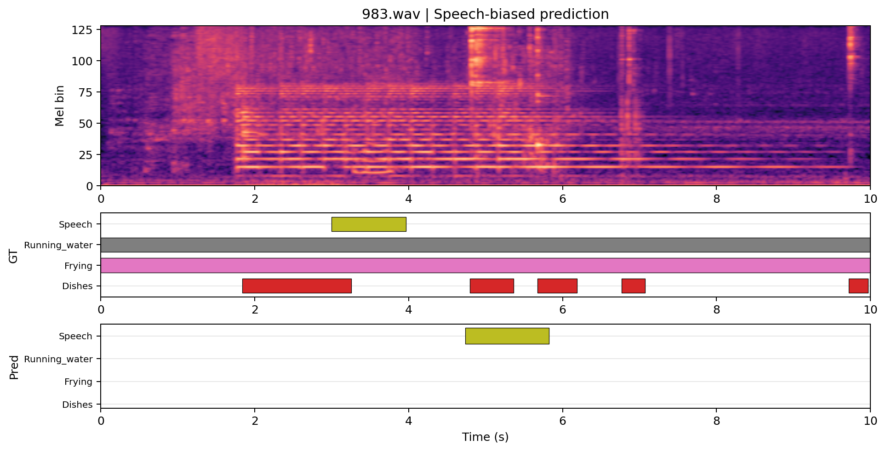

- 代表性：真值同时包含 Speech 与非语音事件，但预测几乎只剩 Speech，适合展示语音导向表征的偏置。
- 真值事件：Frying (0.000-10.000s) Running_water (0.000-10.000s) Dishes (1.836-3.255s) Speech (2.995-3.967s) Dishes (4.797-5.365s) Dishes (5.675-6.186s) Dishes (6.765-7.069s) Dishes (9.718-9.968s)
- 预测事件：Speech (4.736-5.824s)
- 简短点评：如果这类样本较多，通常意味着 WavLM 更擅长保住 Speech，而对环境事件分离不足。

### 1001.wav | 复杂场景失败样本

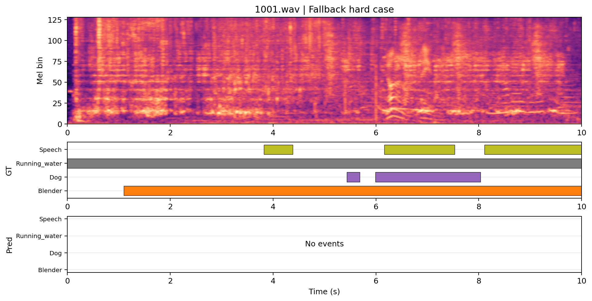

- 代表性：该样本作为复杂场景或低重合度兜底样本，用来补充说明 WavLM-only 的失败模式。
- 真值事件：Running_water (0.000-10.000s) Blender (1.097-10.000s) Speech (3.821-4.381s) Dog (5.436-5.686s) Dog (5.988-8.032s) Speech (6.163-7.533s) Speech (8.109-10.000s)
- 预测事件：无预测
- 简短点评：这类样本通常体现为多事件欠检、弱类消失或只剩少数主类。

### 1000.wav | 额外长持续样本

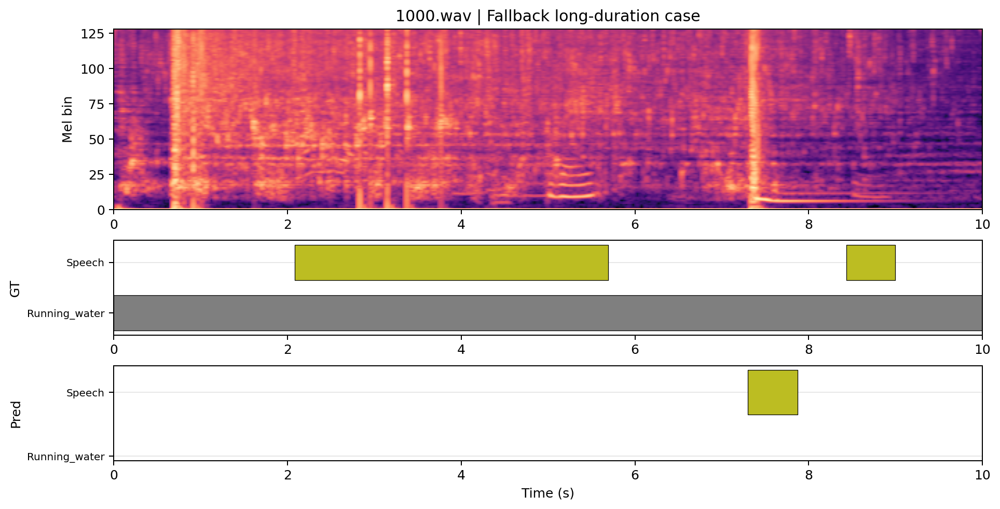

- 代表性：该样本作为长持续类兜底案例，用来观察 WavLM-only 是否只在极少数长段上可用。
- 真值事件：Running_water (0.000-10.000s) Speech (2.081-5.690s) Speech (8.435-8.996s)
- 预测事件：Speech (7.296-7.872s)
- 简短点评：如果这类样本也不稳，就说明它并不是普遍擅长环境纹理长事件。

### 759.wav | 额外语音样本

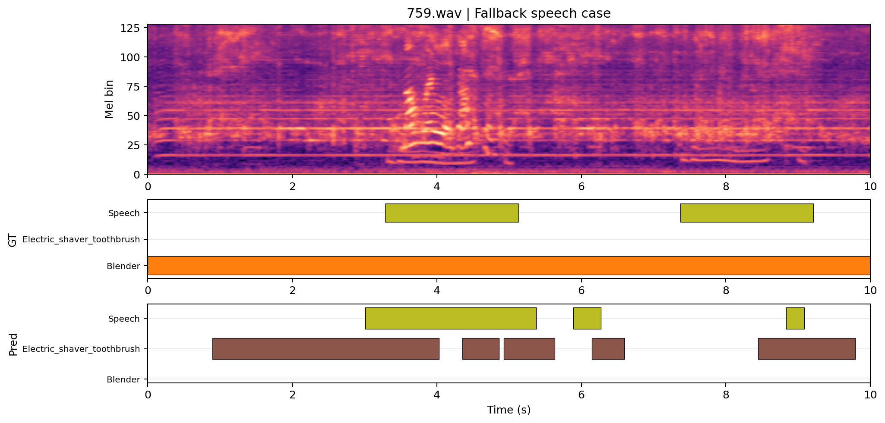

- 代表性：该样本作为语音相关兜底案例，用来观察 WavLM-only 是否持续偏向 Speech。
- 真值事件：Blender (0.000-10.000s) Speech (3.285-5.131s) Speech (7.370-9.211s)
- 预测事件：Electric_shaver_toothbrush (0.896-4.032s) Speech (3.008-5.376s) Electric_shaver_toothbrush (4.352-4.864s) Electric_shaver_toothbrush (4.928-5.632s) Speech (5.888-6.272s) Electric_shaver_toothbrush (6.144-6.592s) Electric_shaver_toothbrush (8.448-9.792s) Speech (8.832-9.088s)
- 简短点评：这类样本通常能进一步证明它的语音导向表征偏好。

## 结论与讨论

这次 WavLM-only baseline 如果能正常输出完整的预测 TSV、并在验证曲线和最终指标上形成自洽结果，就说明它已经作为一个单独 encoder baseline 成功跑通。

但它真正说明的问题不只是“WavLM 分数高不高”，而是：在统一 shared decoder 与统一训练流程下，WavLM 与 CRNN / BEATs 的差异主要来自 encoder 表征本身，而不是后端结构差异。

如果最终观察到的是：WavLM 对 `Speech` 及少数语音相关类别较自然，对环境事件尤其是 `Dog / Dishes / Cat` 这类弱类明显吃亏，同时整体又不是 NaN、不是全空、不是训练崩，那么这更支持“WavLM 更偏语音导向表征”而不是“当前训练设置本身有明显错误”。

因此，这版 WavLM-only 更像一个很有价值的控制实验：它帮助你判断 WavLM 是否适合作为主力 encoder。如果它始终明显弱于 CRNN，而又没有表现出稳定的环境事件优势，那么它更适合作为后续融合里的补充分支，而不是当前任务的主力 backbone。

就这次结果而言，更强的证据站在“语音导向表征”这一侧，而不是“训练设置”这一侧。原因是：训练曲线本身是正常的；shared decoder 与统一流程已经在 CRNN / BEATs / fusion 上验证过可用；而 WavLM-only 却几乎只保住了 Speech，并对大量环境类近乎失声。

## 后续建议

1. 不必优先继续深挖单独 WavLM baseline 本身；它更适合作为控制实验，而不是当前论文的主力结果线。
2. 如果本次结果显示 WavLM 在语音相关类别仍有可用信息，下一步更值得把它接入 residual gated fusion，而不是单独长训。
3. 继续做一版更细的逐类分析，重点拆分 `Speech/Alarm/Electric_shaver_toothbrush` 与 `Dog/Dishes/Cat/Running_water` 的差异来源。
4. 论文里建议保留最有代表性的 `CRNN / frozen BEATs / WavLM / concat fusion / residual gate` 对照，但不用把单独 WavLM 扩成过多变体。
5. 如果后续 WavLM 只在少数语音类有价值，可将其定位成“补充语音导向分支”的证据，而不是继续追求它单独超过 CRNN。
