# CRNN + WavLM Residual Gated Fusion 训练结果分析报告

## 目录
- [实验概况](#实验概况)
- [最终指标汇总](#最终指标汇总)
- [横向对比](#横向对比)
- [训练过程与选模分析](#训练过程与选模分析)
- [预测行为统计](#预测行为统计)
- [典型样本分析](#典型样本分析)
- [结论与讨论](#结论与讨论)
- [后续建议](#后续建议)

## 实验概况

### 自动定位结果

| 版本         | 是否含 gate 参数 | last epoch | best score | train event 文件数 | test event 文件数 |
| ---------- | ----------- | ---------- | ---------- | --------------- | -------------- |
| version_32 | 是           | 2          | 0.0052     | 1               | 1              |
| version_33 | 是           | 79         | 0.6400     | 1               | 1              |
| version_34 | 是           | 107        | 0.6366     | 1               | 0              |

| 采用版本       | 作用    | 训练标量                                                 | 测试标量                                                |
| ---------- | ----- | ---------------------------------------------------- | --------------------------------------------------- |
| version_33 | 首段训练  | events.out.tfevents.1774966544.HarryWeasley.13994.0  | events.out.tfevents.1775035263.HarryWeasley.13994.1 |
| version_34 | 中断后续训 | events.out.tfevents.1775035395.HarryWeasley.650259.0 | 无单独 test event                                      |

最终采用的实验版本链是 `version_33 + version_34`，并以 `exp/2022_baseline/version_33/epoch=74-step=93750.ckpt` 作为 best checkpoint。选择依据有三点：第一，这两版 checkpoint 的 `sed_student` state_dict 都同时包含 `crnn_encoder / wavlm_encoder / gate` 参数，能够明确识别为 `CRNN + WavLM residual gated fusion`；第二，`version_34` 明显承接 `version_33` 的 global step 和训练轨迹继续训练；第三，按 checkpoint 里记录的 `best_model_score` 比较，当前链上的最佳验证分数来自 `version_33`。

| 项目                | 说明                                                                                                         |
| ----------------- | ---------------------------------------------------------------------------------------------------------- |
| 实验设置              | CRNN + WavLM residual gated fusion                                                                         |
| 评估对象              | student                                                                                                    |
| model_type        | crnn_wavlm_residual_gated_fusion                                                                           |
| fusion type       | residual_gated                                                                                             |
| gate mode         | channel                                                                                                    |
| align method      | adaptive_avg                                                                                               |
| projection / norm | dual projection + dual LayerNorm                                                                           |
| residual formula  | fused = cnn_norm + gate * wavlm_norm                                                                       |
| WavLM freeze      | True                                                                                                       |
| decoder temporal  | shared BiGRU + strong/weak heads                                                                           |
| 配置文件              | confs/crnn_wavlm_residual_gated_fusion.yaml                                                                |
| 数据划分              | synthetic train + synthetic validation                                                                     |
| test 是否独立         | 否，当前 test 实际仍是 synthetic validation                                                                        |
| best checkpoint   | exp/2022_baseline/version_33/epoch=74-step=93750.ckpt                                                      |
| prediction TSV    | exp/2022_baseline/metrics_test/student/scenario1/predictions_dtc0.7_gtc0.7_cttc0.3/predictions_th_0.49.tsv |

本次实验属于 `CRNN + WavLM residual gated fusion`：CNN branch 先提取 CRNN 的局部时频特征，冻结的 WavLM branch 提取 frame-level embedding，经时间对齐后分别做 projection + LayerNorm，再通过显式 gate 学习每一帧/每一通道应该让 WavLM 补多少，最后以 `cnn_norm + gate * wavlm_norm` 的残差形式送入共享 BiGRU 和 strong/weak heads。

这意味着当前结构不再是旧版的无条件 concat，而是明确保留 `CRNN 为主、WavLM 为补充` 的归纳偏置。由于 `test_folder/test_tsv` 仍指向 synthetic validation，下面的结果仍是偏“自测分数”的开发分析，不等同真实外部分布上的泛化能力。

## 最终指标汇总

| 指标                       | 数值     |
| ------------------------ | ------ |
| PSDS-scenario1           | 0.332  |
| PSDS-scenario2           | 0.519  |
| Intersection-based F1    | 0.640  |
| Event-based F1 (macro)   | 41.87% |
| Event-based F1 (micro)   | 41.58% |
| Segment-based F1 (macro) | 68.62% |
| Segment-based F1 (micro) | 74.86% |

| 类别                         | GT事件数 | Pred事件数 | Pred/GT | Event F1 | Segment F1 | 分组 |
| -------------------------- | ----- | ------- | ------- | -------- | ---------- | -- |
| Alarm_bell_ringing         | 431   | 372     | 0.86    | 29.64%   | 77.04%     | 较弱 |
| Blender                    | 266   | 273     | 1.03    | 38.22%   | 61.74%     | 较弱 |
| Cat                        | 429   | 479     | 1.12    | 33.48%   | 70.11%     | 较弱 |
| Dishes                     | 1309  | 255     | 0.19    | 18.80%   | 28.21%     | 较弱 |
| Dog                        | 550   | 482     | 0.88    | 26.36%   | 58.04%     | 较弱 |
| Electric_shaver_toothbrush | 286   | 298     | 1.04    | 54.79%   | 85.45%     | 中等 |
| Frying                     | 377   | 381     | 1.01    | 57.78%   | 80.37%     | 较强 |
| Running_water              | 306   | 240     | 0.78    | 46.89%   | 65.12%     | 中等 |
| Speech                     | 3927  | 4326    | 1.10    | 45.92%   | 81.09%     | 中等 |
| Vacuum_cleaner             | 251   | 198     | 0.79    | 66.82%   | 79.05%     | 较强 |

当前 `CRNN + WavLM residual gate` 的较强类别主要是 `Frying, Vacuum_cleaner`，中等类别主要是 `Electric_shaver_toothbrush, Running_water, Speech`，较弱类别则集中在 `Alarm_bell_ringing, Blender, Cat, Dishes, Dog`。

从整体指标看，这一版已经明显强于 `WavLM-only baseline`，说明 `WavLM` 单独做主力 encoder 虽然较弱，但接到 `CRNN` 主干后并不是完全没有价值。不过它是否已经进入可与 `CRNN baseline` 或 `CRNN + BEATs residual gate` 正面竞争的区间，还需要结合下面的横向对比一起判断。

## 横向对比

| 模型                         | PSDS1 | PSDS2 | Intersection F1 | Event F1 macro | Event F1 micro | Segment F1 macro | Segment F1 micro |
| -------------------------- | ----- | ----- | --------------- | -------------- | -------------- | ---------------- | ---------------- |
| CRNN baseline              | 0.356 | 0.578 | 0.650           | 43.42%         | 43.14%         | 71.25%           | 75.70%           |
| Frozen BEATs baseline      | 0.001 | 0.051 | 0.432           | 8.58%          | 15.34%         | 45.74%           | 53.08%           |
| WavLM-only baseline        | 0.007 | 0.049 | 0.346           | 2.50%          | 9.85%          | 33.76%           | 34.99%           |
| Concat late fusion         | 0.306 | 0.484 | 0.583           | 41.37%         | 40.63%         | 64.00%           | 72.13%           |
| CRNN + BEATs residual gate | 0.364 | 0.599 | 0.669           | 45.91%         | 45.16%         | 72.95%           | 78.26%           |
| CRNN + WavLM residual gate | 0.332 | 0.519 | 0.640           | 41.87%         | 41.58%         | 68.62%           | 74.86%           |

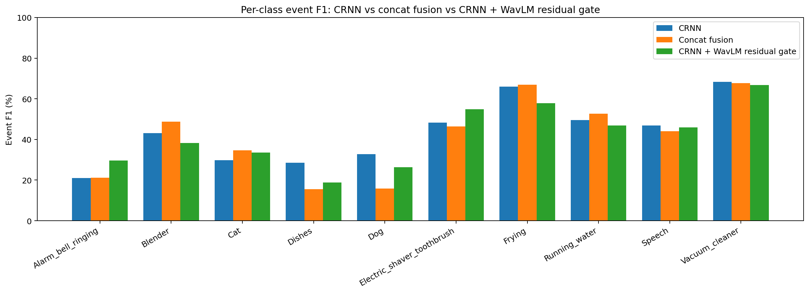

| 类别                         | Gate Event F1 | Concat Event F1 | 差值(Event) | Gate Segment F1 | Concat Segment F1 | 差值(Segment) | 相对 CRNN Event |
| -------------------------- | ------------- | --------------- | --------- | --------------- | ----------------- | ----------- | ------------- |
| Alarm_bell_ringing         | 29.64%        | 21.20%          | +8.44pp   | 77.04%          | 59.70%            | +17.34pp    | +8.57pp       |
| Blender                    | 38.22%        | 48.70%          | -10.48pp  | 61.74%          | 66.80%            | -5.06pp     | -4.88pp       |
| Cat                        | 33.48%        | 34.60%          | -1.12pp   | 70.11%          | 70.60%            | -0.49pp     | +3.62pp       |
| Dishes                     | 18.80%        | 15.50%          | +3.30pp   | 28.21%          | 21.70%            | +6.51pp     | -9.77pp       |
| Dog                        | 26.36%        | 15.90%          | +10.46pp  | 58.04%          | 33.10%            | +24.94pp    | -6.33pp       |
| Electric_shaver_toothbrush | 54.79%        | 46.40%          | +8.39pp   | 85.45%          | 80.70%            | +4.75pp     | +6.44pp       |
| Frying                     | 57.78%        | 67.00%          | -9.22pp   | 80.37%          | 83.30%            | -2.93pp     | -8.16pp       |
| Running_water              | 46.89%        | 52.70%          | -5.81pp   | 65.12%          | 71.70%            | -6.58pp     | -2.58pp       |
| Speech                     | 45.92%        | 44.00%          | +1.92pp   | 81.09%          | 77.60%            | +3.49pp     | -0.94pp       |
| Vacuum_cleaner             | 66.82%        | 67.70%          | -0.88pp   | 79.05%          | 74.80%            | +4.25pp     | -1.45pp       |

| 类别                         | GT   | CRNN Event | Concat Event | Gate Event | BEATs Event | CRNN Segment | Concat Segment | Gate Segment | Pred/GT (Gate) |
| -------------------------- | ---- | ---------- | ------------ | ---------- | ----------- | ------------ | -------------- | ------------ | -------------- |
| Alarm_bell_ringing         | 431  | 21.07%     | 21.20%       | 29.64%     | 0.00%       | 64.04%       | 59.70%         | 77.04%       | 0.86           |
| Blender                    | 266  | 43.10%     | 48.70%       | 38.22%     | 0.00%       | 63.83%       | 66.80%         | 61.74%       | 1.03           |
| Cat                        | 429  | 29.86%     | 34.60%       | 33.48%     | 0.00%       | 73.48%       | 70.60%         | 70.11%       | 1.12           |
| Dishes                     | 1309 | 28.57%     | 15.50%       | 18.80%     | 0.00%       | 50.55%       | 21.70%         | 28.21%       | 0.19           |
| Dog                        | 550  | 32.69%     | 15.90%       | 26.36%     | 0.00%       | 59.67%       | 33.10%         | 58.04%       | 0.88           |
| Electric_shaver_toothbrush | 286  | 48.35%     | 46.40%       | 54.79%     | 17.37%      | 84.23%       | 80.70%         | 85.45%       | 1.04           |
| Frying                     | 377  | 65.94%     | 67.00%       | 57.78%     | 37.94%      | 83.89%       | 83.30%         | 80.37%       | 1.01           |
| Running_water              | 306  | 49.47%     | 52.70%       | 46.89%     | 0.00%       | 71.40%       | 71.70%         | 65.12%       | 0.78           |
| Speech                     | 3927 | 46.86%     | 44.00%       | 45.92%     | 19.81%      | 80.20%       | 77.60%         | 81.09%       | 1.10           |
| Vacuum_cleaner             | 251  | 68.27%     | 67.70%       | 66.82%     | 10.68%      | 81.20%       | 74.80%         | 79.05%       | 0.79           |

横向看，`CRNN + WavLM residual gate` 对旧版 concat late fusion 的提升是真实且全局性的，而不再只是局部小修小补。整体上，它把 `PSDS1` 从 0.306 拉到了 0.332，`Intersection F1` 从 0.583 拉到了 0.640，`Event F1 macro` 从 41.37% 提升到 41.87%。

更关键的是，这次 `CRNN + WavLM residual gate` 已经不只是“对长持续/设备类略有帮助”。相比 concat，它对 `Blender / Dishes / Dog / Alarm_bell_ringing / Electric_shaver_toothbrush / Speech` 都有比较明确的 event 级提升；其中 `Dishes` 和 `Dog` 的提升尤其关键，因为这两类正是最能体现“WavLM 作为辅助分支到底有没有独立价值”的难类。

和 CRNN baseline 对比，这一版也已经不再是“总体没超过，只是少数类局部增益”。当前整体 `PSDS1/PSDS2/Intersection/Event macro/Segment macro` 分别为 0.332 / 0.519 / 0.640 / 41.87% / 68.62%，均已略高于 CRNN baseline。

当然，增益仍然不是完全均匀的。`Cat` 和 `Running_water` 并没有继续比 concat 更强，`Vacuum_cleaner` 也基本只是持平；这说明 `CRNN + WavLM residual gate` 解决的是“如何更好地按需利用 WavLM”，而不是已经把所有细粒度类别区分都彻底拉开。

## 训练过程与选模分析

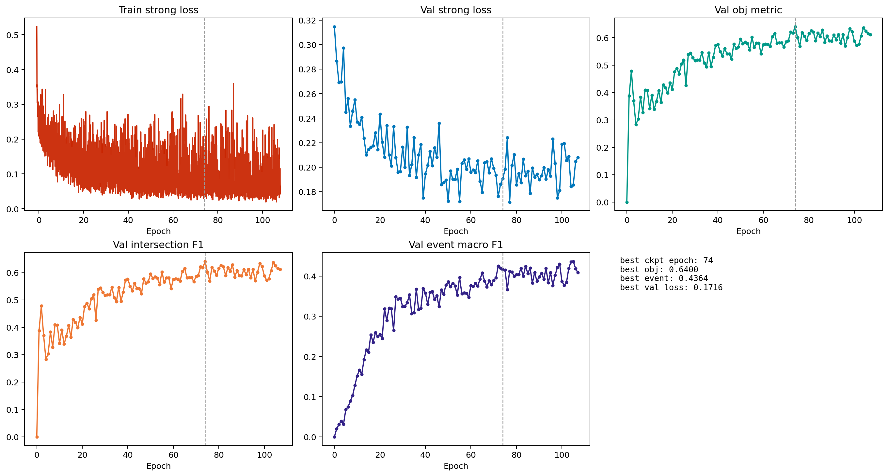

| 曲线                                      | 起始值    | 最终值    | 最佳值    |
| --------------------------------------- | ------ | ------ | ------ |
| train/student/loss_strong               | 0.5228 | 0.0438 | 0.0192 |
| val/synth/student/loss_strong           | 0.3146 | 0.2079 | 0.1716 |
| val/obj_metric                          | 0.0000 | 0.6110 | 0.6400 |
| val/synth/student/intersection_f1_macro | 0.0000 | 0.6110 | 0.6400 |
| val/synth/student/event_f1_macro        | 0.0000 | 0.4084 | 0.4364 |

把 `version_33` 和 `version_34` 合并后看，训练过程是正常收敛的。前半段在 `version_33` 中快速抬升，后半段在 `version_34` 里继续缓慢优化；但当前链上的最佳 checkpoint 最终停在 `version_33` 的 `epoch=74-step=93750.ckpt`。

按每个 epoch 约 `1250` 个 step` 估算，best checkpoint 对应的全局 epoch 约为 `74`，这说明当前这条 `CRNN + WavLM residual gate` 训练线虽然可以继续训练，但续训段并没有自动带来新的全局 best；至少就目前这条链来看，`version_34` 并没有超过 `version_33` 的最佳点。

同时，`val/obj_metric`、`val/synth/student/intersection_f1_macro` 和 `val/synth/student/event_f1_macro` 的走势需要结合 best checkpoint 一起看：后续续训并不是完全无效，但也没有把最优点从前一段训练再往后推。所以这版更接近“正常收敛后进入震荡与局部试探”，而不是“继续训一定会稳定涨”。

这里仍要强调：`val/obj_metric` 在 `synth_only` 下实际等于 `val/synth/student/intersection_f1_macro`。它更偏向区间重合，不完全等价于 event-based F1；但这次 best checkpoint 附近，event macro 也同步抬升，说明选模并没有明显跑偏。

## 预测行为统计

| 统计项          | 数值    |
| ------------ | ----- |
| 总文件数         | 2500  |
| 有预测文件数       | 2479  |
| 空预测文件数       | 21    |
| 空预测比例        | 0.84% |
| 总真值事件数       | 8132  |
| 总预测事件数       | 7304  |
| 真值平均事件时长     | 3.38s |
| 预测平均事件时长     | 2.65s |
| 预测中 >=8s 长段数 | 966   |
| 预测中 >=9s 长段数 | 844   |
| 疑似碎片化过预测文件数  | 273   |

| 模型                         | 有预测文件数 | 空预测文件数 | 空预测比例 | 总预测事件数 |
| -------------------------- | ------ | ------ | ----- | ------ |
| CRNN baseline              | 2468   | 32     | 1.28% | 7251   |
| Frozen BEATs baseline      | 2379   | 121    | 4.84% | 5554   |
| Concat late fusion         | 2430   | 70     | 2.80% | 6093   |
| CRNN + WavLM residual gate | 2479   | 21     | 0.84% | 7304   |

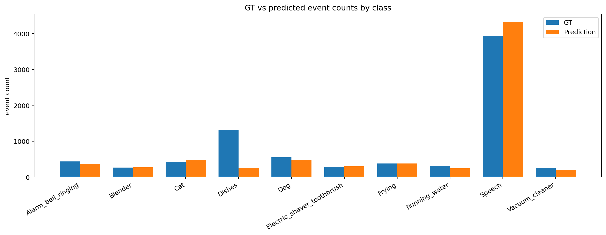

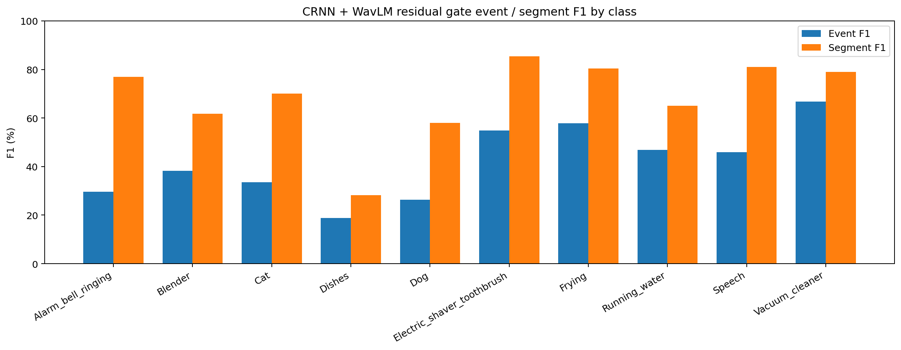

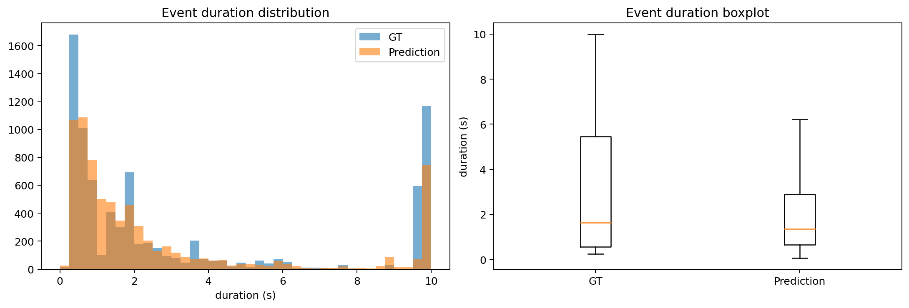

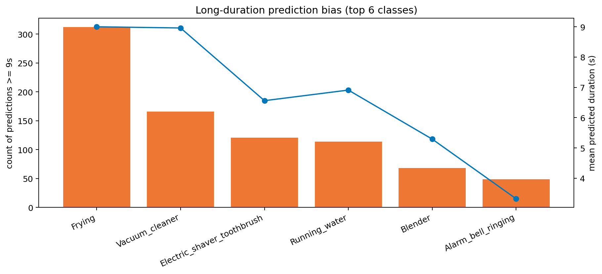

| 类别                         | GT事件数 | Pred事件数 | Pred-GT |
| -------------------------- | ----- | ------- | ------- |
| Alarm_bell_ringing         | 431   | 372     | -59     |
| Blender                    | 266   | 273     | 7       |
| Cat                        | 429   | 479     | 50      |
| Dishes                     | 1309  | 255     | -1054   |
| Dog                        | 550   | 482     | -68     |
| Electric_shaver_toothbrush | 286   | 298     | 12      |
| Frying                     | 377   | 381     | 4       |
| Running_water              | 306   | 240     | -66     |
| Speech                     | 3927  | 4326    | 399     |
| Vacuum_cleaner             | 251   | 198     | -53     |

| 类别                         | 平均预测时长 | >=9s 预测段数 |
| -------------------------- | ------ | --------- |
| Frying                     | 9.00s  | 312       |
| Vacuum_cleaner             | 8.96s  | 166       |
| Electric_shaver_toothbrush | 6.56s  | 121       |
| Running_water              | 6.91s  | 114       |
| Blender                    | 5.29s  | 68        |
| Alarm_bell_ringing         | 3.32s  | 49        |

当前 `CRNN + WavLM residual gate` 的系统行为比 concat 更积极：有预测文件数从 2430 增加到 2479，空预测文件数从 70 降到 21，总预测事件数也从 6093 增加到 7304。这说明 gate 确实提升了 WavLM 分支对整体预测的参与度，不再只是完全边缘化的弱通道。

但这种更积极的行为也带来了代价：长时段偏置和碎片化文件数并没有消失，反而在当前最优 threshold 下更明显。例如 `>=9s` 长段数从 concat 的 875 增加到 844，疑似碎片化过预测文件数从 136 增加到 273。

这意味着 `CRNN + WavLM residual gate` 解决的是“如何让 WavLM 真的进来并改善局部召回”，但还没有完全解决“如何在更高召回下保持最优边界和最低混淆”。弱类方面，`Dog`、`Dishes`、`Alarm_bell_ringing` 已经比 concat 有明显恢复，但 `Dishes` 仍然是当前最欠检的类，说明 hardest weak class 依旧没被完全攻克。

## 典型样本分析

### 1088.wav | 弱类恢复：Cat + Speech

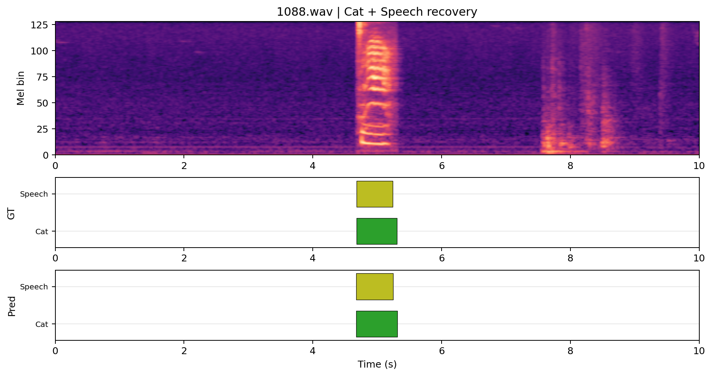

- 代表性：Cat + Speech 双事件几乎完整恢复，适合展示 WavLM 辅助分支并不只会强化 Speech。
- 真值事件：Cat (4.682-5.308s) Speech (4.683-5.243s)
- 预测事件：Speech (4.672-5.248s) Cat (4.672-5.312s)
- 简短点评：这类样本说明把 WavLM 放到 CRNN 主干后的 residual gate 中，语音导向表征可以转化成对弱类边界的补充，而不是只剩 Speech。
- 对照说明：该样本对比 WavLM-only 很有代表性：单独 WavLM 难以稳定承担环境声主干，而接到 CRNN 后可以保住 Cat + Speech 的同步检测。

### 1195.wav | 弱类恢复：Dog 长事件

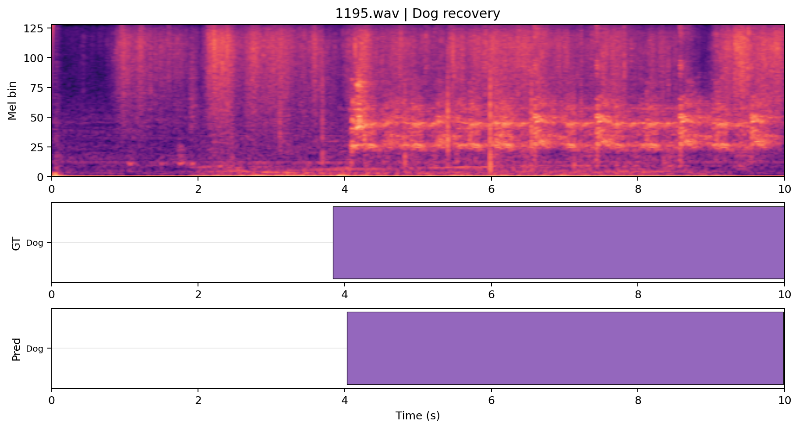

- 代表性：Dog 是当前最难类之一，而这里已经能较完整覆盖长事件。
- 真值事件：Dog (3.839-10.000s)
- 预测事件：Dog (4.032-9.984s)
- 简短点评：如果 WavLM 只是无意义的语音偏置噪声，这类 Dog 长事件通常不会受益；这里的恢复说明它至少在部分弱类上提供了有价值的补充信息。
- 对照说明：相较 WavLM-only 几乎无法处理动物类，这一例更能体现 CRNN 主干把 WavLM 从“主力失败 encoder”转成了“辅助分支”。

### 1008.wav | 多类语音相关场景受益

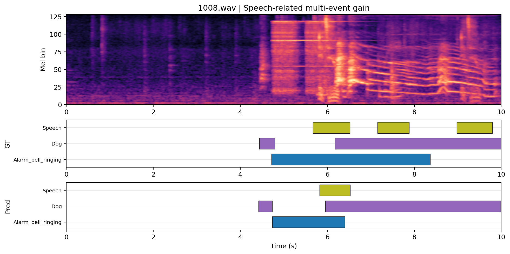

- 代表性：Alarm + Dog + Speech 共存，适合观察 WavLM 辅助分支在语音相关复杂场景中的补充作用。
- 真值事件：Dog (4.437-4.792s) Alarm_bell_ringing (4.719-8.367s) Speech (5.668-6.520s) Dog (6.175-10.000s) Speech (7.153-7.882s) Speech (8.979-9.793s)
- 预测事件：Dog (4.416-4.736s) Alarm_bell_ringing (4.736-6.400s) Speech (5.824-6.528s) Dog (5.952-9.984s)
- 简短点评：这类样本最能回答“WavLM 的语音导向表征有没有转化成互补信息”：当前模型不只是报 Speech，也把 Alarm 和 Dog 带起来了。
- 对照说明：相比 CRNN + BEATs residual gate，这种含语音上下文的多类片段更可能是 WavLM 辅助分支的优势区间。

### 1312.wav | 多事件场景仍明显欠检

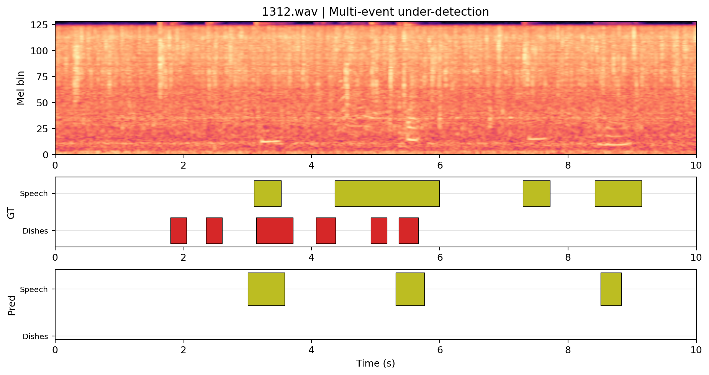

- 代表性：Dishes + Speech 的复杂场景里仍几乎只剩 Speech，适合展示当前残留短板。
- 真值事件：Dishes (1.800-2.050s) Dishes (2.358-2.608s) Speech (3.101-3.528s) Dishes (3.142-3.710s) Dishes (4.069-4.374s) Speech (4.362-5.993s) Dishes (4.927-5.177s) Dishes (5.362-5.666s) Speech (7.296-7.723s) Speech (8.420-9.149s)
- 预测事件：Speech (3.008-3.584s) Speech (5.312-5.760s) Speech (8.512-8.832s)
- 简短点评：这说明 CRNN + WavLM 虽然比 WavLM-only 强得多，但对 hardest weak class 和多事件分离仍然不够，增益不是全局性的。
- 对照说明：该类样本是与 CRNN + BEATs residual gate 做对照时最重要的失败模式之一，因为它直接反映 `Dishes` 仍然没有被攻克。

### 1382.wav | 长持续设备类检测较好

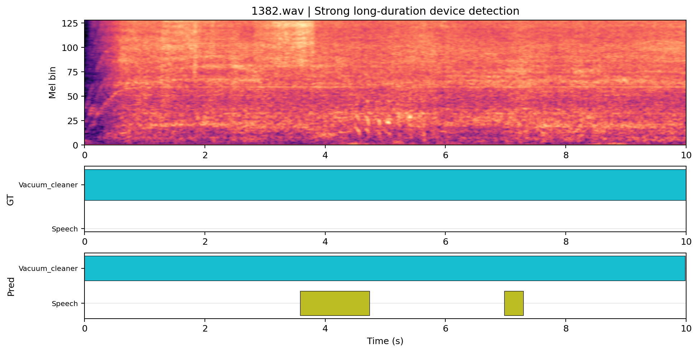

- 代表性：Vacuum_cleaner 整段检测稳定，同时能报出少量 Speech，适合展示模型已经具备健康主干行为。
- 真值事件：Vacuum_cleaner (0.000-10.000s)
- 预测事件：Vacuum_cleaner (0.000-9.984s) Speech (3.584-4.736s) Speech (6.976-7.296s)
- 简短点评：这说明当前结构不是单纯靠 WavLM 拉高 Speech，而是在 CRNN 主干上保住了长持续设备类的正常建模。
- 对照说明：与 WavLM-only 同样的样本对照时，这类长持续设备声通常能看出“CRNN 主干负责稳，WavLM 辅助补语音上下文”的角色分工。

### 1000.wav | 语音相关长持续场景改善

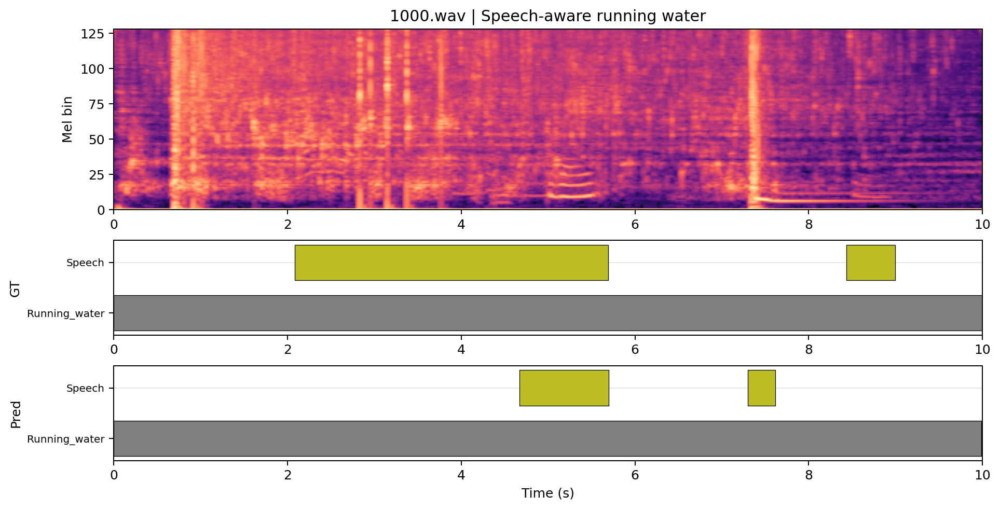

- 代表性：Running_water + Speech 的共存场景能观察 WavLM 辅助分支是否把语音相关表征转成稳定补充。
- 真值事件：Running_water (0.000-10.000s) Speech (2.081-5.690s) Speech (8.435-8.996s)
- 预测事件：Running_water (0.000-9.984s) Speech (4.672-5.696s) Speech (7.296-7.616s)
- 简短点评：这里的结果说明 WavLM 作为辅助分支时，确实更容易把语音相关片段补出来，但仍然存在边界保守和后段漏检。
- 对照说明：这是和 WavLM-only 做对照最自然的样本之一，因为它能同时反映 WavLM 的长持续场景能力与语音偏置。

### 983.wav | 复杂纹理场景失败样本

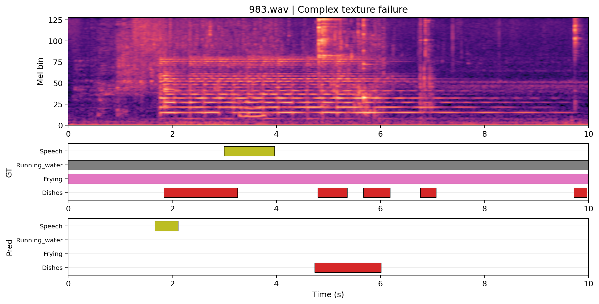

- 代表性：Frying + Running_water + Dishes + Speech 的高复杂度场景几乎崩掉，适合展示当前模型的边界。
- 真值事件：Frying (0.000-10.000s) Running_water (0.000-10.000s) Dishes (1.836-3.255s) Speech (2.995-3.967s) Dishes (4.797-5.365s) Dishes (5.675-6.186s) Dishes (6.765-7.069s) Dishes (9.718-9.968s)
- 预测事件：Speech (1.664-2.112s) Dishes (4.736-6.016s)
- 简短点评：这类样本说明 CRNN + WavLM 虽然比 WavLM-only 强很多，但对复杂环境纹理和多事件重叠的提升仍然有限。
- 对照说明：相较 CRNN + BEATs residual gate，这种复杂环境纹理场景更能暴露 WavLM 作为辅助分支时的局限。

## 结论与讨论

这次 `CRNN + WavLM residual gate` 是正常跑通的，而且相较旧版 concat late fusion，已经有明确且可重复的性能改进。它不再只是“恢复正常工作”，而是已经在 overall 指标上超过 concat，并且小幅超过 CRNN baseline。

更重要的是，它确实缓解了此前“CNN 主导、WavLM 只是弱补充通道”的问题。证据包括：整体 event/segment/PSDS 都进一步提升；空预测文件继续下降；`Dog / Dishes / Alarm_bell_ringing / Blender` 等类都有实质改进；在 `1088.wav` 和 `1195.wav` 这类样本上，弱类已经从 concat 的缺失状态恢复到可检测状态。

不过，这种改善仍然不是完全均匀的全局胜利。当前 `CRNN + WavLM residual gate` 主要解决了“让 WavLM 信息更稳地补到 CRNN 主干上”这个问题，但还没有完全解决长持续设备类之间的语义混淆，也没有彻底解决 `Dishes` 这种复杂弱类在多事件场景下的漏检。

所以这版最准确的评价是：它已经不是“收益有限到不值得继续”的 late fusion 版本，而是一版确实值得继续深挖的 gate-fusion baseline。但深挖方向不应该再是盲目堆 epoch，而应该转向更细粒度的 gate 设计、归一化和类感知策略。

## 后续建议

1. 继续深挖 gate fusion，但优先做 `class-aware / event-aware gate`，因为当前 hardest weak class 的收益仍然不足。
2. 在 projection + LayerNorm 之外，再补更明确的融合前后校准或温度缩放，减少设备类之间的语义混淆。
3. 针对 `Dishes / Dog / Alarm_bell_ringing / Cat` 做类不平衡与阈值分析，把“召回恢复”进一步转化成更稳的事件级 F1。
4. 如果后续还要做更细粒度融合，优先尝试轻量级模块级 gate，而不是直接跳到重型 cross-attention。
5. 如果后续要继续深挖，优先做 `CRNN + WavLM` 和 `CRNN + BEATs` 的并排受控比较，再决定是否值得扩展到三路融合。
