# BEATs 全量微调训练结果分析报告

## 1. 实验概况

### 1.1 自动定位结果

| 版本        | last epoch | best score | global step | train event 文件数 | best checkpoint                                                              |
| --------- | ---------- | ---------- | ----------- | --------------- | ---------------------------------------------------------------------------- |
| version_5 | 56         | 0.7791     | 8792        | 1               | exp/unified_beats_synth_only_a800_finetune/version_5/epoch=55-step=8791.ckpt |
| version_2 | 1          | 0.0000     | 157         | 1               | exp/unified_beats_synth_only_a800_finetune/version_2/epoch=0-step=156.ckpt   |
| version_1 | 1          | 0.0000     | 313         | 1               | exp/unified_beats_synth_only_a800_finetune/version_1/epoch=0-step=312.ckpt   |

最终采用的是 `version_5`，并以 `exp/unified_beats_synth_only_a800_finetune/version_5/epoch=55-step=8791.ckpt` 作为 best checkpoint。选择依据是：它是最近一次完成的 `encoder_type=beats`、`freeze=False`、非 fusion 的候选版本；checkpoint 内的 best score 为 `0.7791`，同时训练事件文件与 `metrics_test` 时间戳也与这次 full finetune 结果回写一致。

| 项目               | 说明                                                                                                                                  |
| ---------------- | ----------------------------------------------------------------------------------------------------------------------------------- |
| 实验设置             | BEATs 全量微调（full finetune）                                                                                                           |
| 评估对象             | student                                                                                                                             |
| encoder_type     | beats                                                                                                                               |
| BEATs freeze     | False                                                                                                                               |
| 是否 full finetune | 是，BEATs 参数参与训练                                                                                                                      |
| 共享 decoder       | BiGRU + strong/weak heads                                                                                                           |
| 数据划分             | synthetic train + synthetic validation                                                                                              |
| 当前 test          | 仍然是 synthetic validation                                                                                                            |
| 含义               | 结果更适合判断模型是否在合成分布上跑通与比较相对增益，不等同真实外部分布泛化                                                                                              |
| 自动定位的配置文件        | confs/unified_beats_synth_only_a800_finetune.yaml                                                                                   |
| best checkpoint  | exp/unified_beats_synth_only_a800_finetune/version_5/epoch=55-step=8791.ckpt                                                        |
| prediction TSV   | exp/unified_beats_synth_only_a800_finetune/metrics_test/student/scenario1/predictions_dtc0.7_gtc0.7_cttc0.3/predictions_th_0.49.tsv |
| event_f1.txt     | exp/unified_beats_synth_only_a800_finetune/metrics_test/student/event_f1.txt                                                        |
| segment_f1.txt   | exp/unified_beats_synth_only_a800_finetune/metrics_test/student/segment_f1.txt                                                      |
| ground truth TSV | runtime_data/dcase_synth/metadata/validation/synthetic21_validation/soundscapes.tsv                                                 |

这次实验属于 `BEATs 全量微调`：主干仍是 `encoder -> shared decoder -> strong/weak heads` 的统一结构，但与 frozen baseline 最大的区别在于 `model.beats.freeze=False`，也就是 BEATs 编码器不再固定，而是和 decoder 一起参与训练。

你在任务说明里给的 GT 路径占位符是 `<GT_TSV>`，服务器上并不存在这个字面路径。本报告已自动回退到 checkpoint / 配置里实际存在的 `runtime_data/dcase_synth/metadata/validation/synthetic21_validation/soundscapes.tsv`，并用它作为固定真值文件。

## 2. 最终指标汇总

| 指标                       | 数值     |
| ------------------------ | ------ |
| PSDS-scenario1           | 0.465  |
| PSDS-scenario2           | 0.735  |
| Intersection-based F1    | 0.779  |
| Event-based F1 (macro)   | 52.65% |
| Event-based F1 (micro)   | 54.54% |
| Segment-based F1 (macro) | 81.85% |
| Segment-based F1 (micro) | 83.60% |

| 类别                         | GT事件数 | Pred事件数 | Pred/GT | Event F1 | Segment F1 | 分组 |
| -------------------------- | ----- | ------- | ------- | -------- | ---------- | -- |
| Alarm_bell_ringing         | 431   | 441     | 1.02    | 35.90%   | 78.70%     | 较弱 |
| Blender                    | 266   | 397     | 1.49    | 47.80%   | 89.70%     | 中等 |
| Cat                        | 429   | 488     | 1.14    | 42.50%   | 84.40%     | 中等 |
| Dishes                     | 1309  | 939     | 0.72    | 46.10%   | 73.10%     | 中等 |
| Dog                        | 550   | 529     | 0.96    | 41.60%   | 66.50%     | 中等 |
| Electric_shaver_toothbrush | 286   | 318     | 1.11    | 61.60%   | 94.20%     | 较强 |
| Frying                     | 377   | 426     | 1.13    | 60.70%   | 81.10%     | 较强 |
| Running_water              | 306   | 335     | 1.09    | 52.00%   | 71.40%     | 中等 |
| Speech                     | 3927  | 4577    | 1.17    | 59.70%   | 85.50%     | 较强 |
| Vacuum_cleaner             | 251   | 275     | 1.10    | 78.50%   | 94.00%     | 较强 |

整体上，较强类别主要是 `Vacuum_cleaner, Electric_shaver_toothbrush, Frying`；中等类别主要是 `Blender, Cat, Dishes, Dog, Running_water`；相对较弱的类别主要是 `Alarm_bell_ringing`。

最值得注意的是，这次 full finetune 的整体指标已经达到 `PSDS1=0.465`、`PSDS2=0.735`、`Intersection=0.779`、`Event macro=52.65%`、`Segment macro=81.85%`。这说明它不只是“从 frozen BEATs 的类别塌缩中恢复”，而是已经进入可以和 CRNN / fusion baseline 正面对比的区间。

## 3. 横向对比

| 模型                             | PSDS1 | PSDS2 | Intersection F1 | Event F1 macro | Segment F1 macro |
| ------------------------------ | ----- | ----- | --------------- | -------------- | ---------------- |
| CRNN baseline                  | 0.356 | 0.578 | 0.650           | 43.42%         | 71.25%           |
| Frozen BEATs baseline          | 0.001 | 0.051 | 0.432           | 8.58%          | 45.74%           |
| Concat late fusion baseline    | 0.306 | 0.484 | 0.583           | 41.37%         | 64.00%           |
| Residual gated fusion baseline | 0.364 | 0.599 | 0.669           | 45.91%         | 72.95%           |
| BEATs 全量微调                     | 0.465 | 0.735 | 0.779           | 52.65%         | 81.85%           |

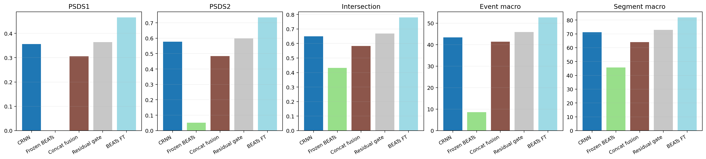

| 类别                         | Full FT Event | Full FT Segment | Full FT Pred/GT | CRNN Event | CRNN Segment | CRNN Pred/GT | Frozen Event | Frozen Segment | Concat Event | Concat Segment | Concat Pred/GT | Gate Event | Gate Segment | Gate Pred/GT |
| -------------------------- | ------------- | --------------- | --------------- | ---------- | ------------ | ------------ | ------------ | -------------- | ------------ | -------------- | -------------- | ---------- | ------------ | ------------ |
| Alarm_bell_ringing         | 35.90%        | 78.70%          | 1.02            | 21.07%     | 64.04%       | 0.78         | 0.00%        | 0.00%          | 21.20%       | 59.70%         | 0.58           | 24.16%     | 67.81%       | 0.73         |
| Blender                    | 47.80%        | 89.70%          | 1.49            | 43.10%     | 63.83%       | 0.74         | 0.00%        | 0.00%          | 48.70%       | 66.80%         | 1.14           | 55.35%     | 76.81%       | 1.04         |
| Cat                        | 42.50%        | 84.40%          | 1.14            | 29.86%     | 73.48%       | 1.06         | 0.00%        | 0.00%          | 34.60%       | 70.60%         | 0.74           | 33.41%     | 78.42%       | 1.16         |
| Dishes                     | 46.10%        | 73.10%          | 0.72            | 28.57%     | 50.55%       | 0.49         | 0.00%        | 0.00%          | 15.50%       | 21.70%         | 0.16           | 29.68%     | 44.78%       | 0.36         |
| Dog                        | 41.60%        | 66.50%          | 0.96            | 32.69%     | 59.67%       | 0.69         | 0.00%        | 0.00%          | 15.90%       | 33.10%         | 0.25           | 29.26%     | 58.80%       | 0.65         |
| Electric_shaver_toothbrush | 61.60%        | 94.20%          | 1.11            | 48.35%     | 84.23%       | 0.91         | 17.37%       | 51.24%         | 46.40%       | 80.70%         | 0.93           | 53.85%     | 84.11%       | 1.00         |
| Frying                     | 60.70%        | 81.10%          | 1.13            | 65.94%     | 83.89%       | 0.95         | 37.94%       | 64.45%         | 67.00%       | 83.30%         | 1.08           | 67.20%     | 81.41%       | 0.99         |
| Running_water              | 52.00%        | 71.40%          | 1.09            | 49.47%     | 71.40%       | 1.14         | 0.00%        | 32.89%         | 52.70%       | 71.70%         | 0.69           | 50.53%     | 69.78%       | 0.86         |
| Speech                     | 59.70%        | 85.50%          | 1.17            | 46.86%     | 80.20%       | 1.02         | 19.81%       | 73.94%         | 44.00%       | 77.60%         | 0.96           | 48.38%     | 84.06%       | 1.10         |
| Vacuum_cleaner             | 78.50%        | 94.00%          | 1.10            | 68.27%     | 81.20%       | 1.15         | 10.68%       | 51.94%         | 67.70%       | 74.80%         | 0.81           | 67.29%     | 83.53%       | 1.13         |

### 3.1 逐类变化（full finetune 相对各 baseline）

| 类别                         | 相对 Frozen Event | 相对 CRNN Event | 相对 Concat Event | 相对 Gate Event | 相对 Frozen Segment |
| -------------------------- | --------------- | ------------- | --------------- | ------------- | ----------------- |
| Alarm_bell_ringing         | +35.90pp        | +14.83pp      | +14.70pp        | +11.74pp      | +78.70pp          |
| Blender                    | +47.80pp        | +4.70pp       | -0.90pp         | -7.55pp       | +89.70pp          |
| Cat                        | +42.50pp        | +12.64pp      | +7.90pp         | +9.09pp       | +84.40pp          |
| Dishes                     | +46.10pp        | +17.53pp      | +30.60pp        | +16.42pp      | +73.10pp          |
| Dog                        | +41.60pp        | +8.91pp       | +25.70pp        | +12.34pp      | +66.50pp          |
| Electric_shaver_toothbrush | +44.23pp        | +13.25pp      | +15.20pp        | +7.75pp       | +42.96pp          |
| Frying                     | +22.76pp        | -5.24pp       | -6.30pp         | -6.50pp       | +16.65pp          |
| Running_water              | +52.00pp        | +2.53pp       | -0.70pp         | +1.47pp       | +38.51pp          |
| Speech                     | +39.89pp        | +12.84pp      | +15.70pp        | +11.32pp      | +11.56pp          |
| Vacuum_cleaner             | +67.82pp        | +10.23pp      | +10.80pp        | +11.21pp      | +42.06pp          |

和 frozen BEATs baseline 相比，这次 full finetune 是显著提升，不是边角增益。例如 overall `Event macro` 从 8.58% 提升到 52.65%；`PSDS1` 从 0.001 提升到 0.465。

和 CRNN baseline 相比，这次 full finetune 在 synthetic validation 上同样已经形成明确优势：`PSDS1/PSDS2/Intersection/Event macro/Segment macro` 分别从 0.356/0.578/0.650/43.42%/71.25% 提升到 0.465/0.735/0.779/52.65%/81.85%。

如果只以当前 synthetic validation 作为开发分析标准，这版 full finetune 已经足够值得作为论文里的重要结果候选。不过它依然不是“所有类都被彻底解决”：`Dog`、`Alarm_bell_ringing` 仍偏弱，`Dishes` 也没有像强类那样完全被拉平。

## 4. 训练过程与选模分析

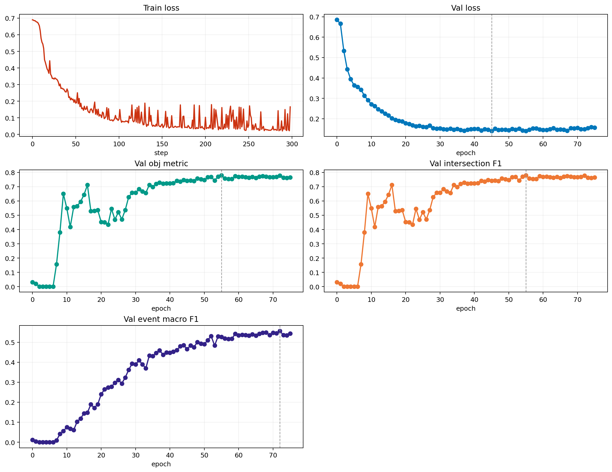

| 曲线                                      | 起始值    | 最终值    | 最佳值    |
| --------------------------------------- | ------ | ------ | ------ |
| train/student/loss_strong               | 0.6898 | 0.1661 | 0.0210 |
| val/synth/student/loss_strong           | 0.6852 | 0.1568 | 0.1398 |
| val/obj_metric                          | 0.0315 | 0.7659 | 0.7791 |
| val/synth/student/intersection_f1_macro | 0.0315 | 0.7659 | 0.7791 |
| val/synth/student/event_f1_macro        | 0.0111 | 0.5433 | 0.5561 |

训练过程总体是正常的。`train/student/loss_strong` 从 0.6898 降到 0.1661，`val/synth/student/loss_strong` 从 0.6852 降到 0.1568；`val/obj_metric` 在 best checkpoint 对应阶段达到 0.7791，与 `epoch=55, step=8791` 的 best checkpoint 一致。

从曲线形态看，这版 full finetune 比 frozen baseline 更难训，但上限也明显更高。前期它并不是马上起飞，而是在前十来个 epoch 先完成稳定化，随后 `val/obj_metric`、`val/synth/student/event_f1_macro` 和 `intersection_f1_macro` 一起抬升。后期虽然有波动，但没有出现失控发散，更像正常平台期与局部震荡。

这里仍然要提醒：在 `synth_only` 设置下，`val/obj_metric` 实际上等于 `val/synth/student/intersection_f1_macro`。它对区间覆盖更敏感，对严格事件边界和跨阈值稳定性不如 event-based F1 和 PSDS 敏感。不过这次 best checkpoint 附近，event macro 也同步进入高位，因此选模没有明显跑偏。

## 5. 预测行为统计

| 统计项             | 数值     |
| --------------- | ------ |
| 总文件数            | 2500   |
| 有预测文件数          | 2494   |
| 空预测文件数          | 6      |
| 空预测比例           | 0.24%  |
| 总真值事件数          | 8132   |
| 总预测事件数          | 8725   |
| 真值平均时长          | 3.38s  |
| 预测平均时长          | 2.43s  |
| 真值中位时长          | 1.63s  |
| 预测中位时长          | 1.28s  |
| 预测事件 p95 时长     | 9.98s  |
| 真值事件 p95 时长     | 10.00s |
| 接近整段(>=9.5s)预测数 | 821    |
| 接近整段(>=9.5s)真值数 | 1760   |
| 疑似碎片化过预测文件数     | 56     |

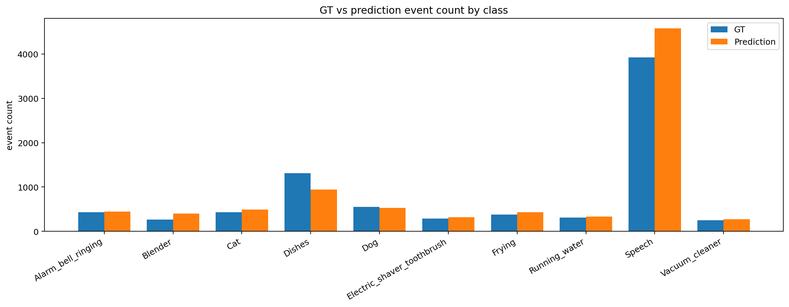

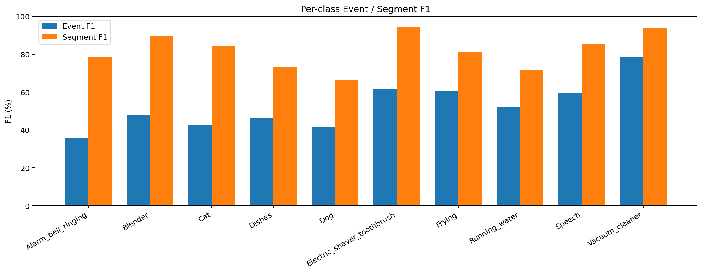

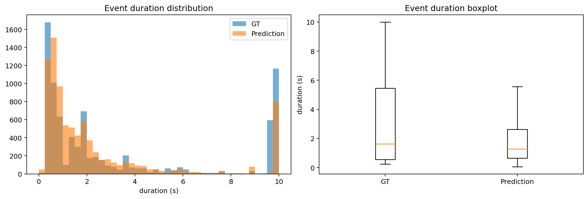

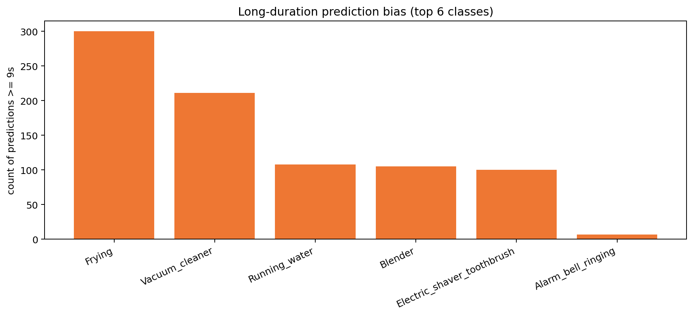

| 类别                         | GT事件数 | Pred事件数 | Pred-GT |
| -------------------------- | ----- | ------- | ------- |
| Alarm_bell_ringing         | 431   | 441     | 10      |
| Blender                    | 266   | 397     | 131     |
| Cat                        | 429   | 488     | 59      |
| Dishes                     | 1309  | 939     | -370    |
| Dog                        | 550   | 529     | -21     |
| Electric_shaver_toothbrush | 286   | 318     | 32      |
| Frying                     | 377   | 426     | 49      |
| Running_water              | 306   | 335     | 29      |
| Speech                     | 3927  | 4577    | 650     |
| Vacuum_cleaner             | 251   | 275     | 24      |

| 类别                         | 平均预测时长 | >=9s 预测段数 |
| -------------------------- | ------ | --------- |
| Frying                     | 7.88s  | 300       |
| Vacuum_cleaner             | 8.21s  | 211       |
| Running_water              | 5.67s  | 108       |
| Blender                    | 5.22s  | 105       |
| Electric_shaver_toothbrush | 5.85s  | 100       |
| Alarm_bell_ringing         | 2.78s  | 7         |

当前 full finetune 已经恢复到“正常工作”状态。它在 2500 个文件里只有 6 个空预测，空预测比例 0.24%；而 frozen BEATs baseline 的空预测比例是 4.84%。

和 frozen BEATs 相比，这次最大的变化不是单一长持续类涨分，而是整体类别覆盖恢复：`Cat`、`Dishes`、`Dog`、`Alarm_bell_ringing` 这些曾经接近失效的类，现在至少都能稳定产出预测并拿到非零事件级分数。不过弱类仍没有完全解决，特别是 `Dog` 和 `Alarm_bell_ringing` 依然明显落后于强类。

从时长分布看，当前预测平均时长 2.43s 仍低于真值的 3.38s，因此主问题更像局部欠检与边界偏移，而不是全局把整段涂满。同时 `>=9s` 长段预测仍有 821 个，说明长持续类仍然更容易被完整覆盖。

## 6. 典型样本分析

### 355.wav | 检测较好的正例 / 长持续类

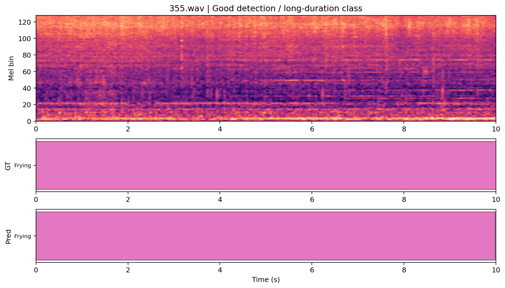

- 文件名：`355.wav`
- 典型模式：检测较好的正例 / 长持续类
- 代表性原因：Frying 长持续事件近乎完整命中，适合作为 full finetune 已经恢复稳定检测能力的正例。
- 真值事件列表：Frying (0.000-10.000s)
- 预测事件列表：Frying (0.000-9.984s)
- 简短点评：Frying 长事件几乎完整命中，说明 full finetune 已经把长持续纹理类稳定拉回到可用区间。

### 1088.wav | 相比 frozen BEATs 明显改善

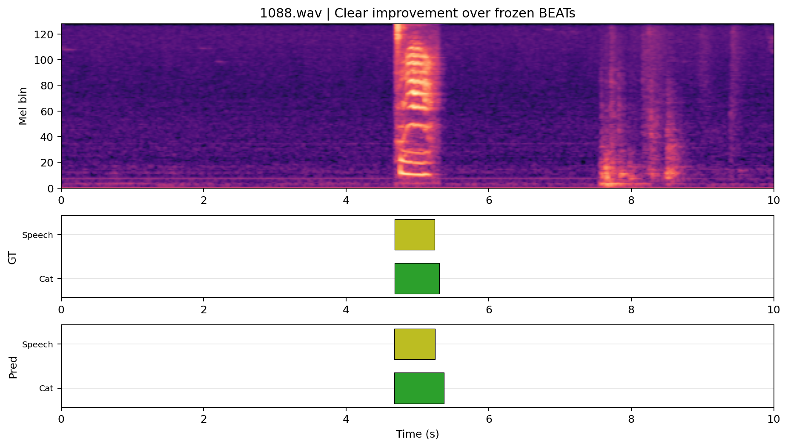

- 文件名：`1088.wav`
- 典型模式：相比 frozen BEATs 明显改善
- 代表性原因：同一文件在 frozen BEATs 报告里是空预测，而这次已经能同时报出 Cat 和 Speech。
- 真值事件列表：Cat (4.682-5.308s) Speech (4.683-5.243s)
- 预测事件列表：Speech (4.672-5.248s) Cat (4.672-5.376s)
- 简短点评：frozen BEATs 报告里这条样本是空预测；当前不仅恢复了 Speech，还把 Cat 也一并报了出来，是最直观的恢复样本之一。

### 234.wav | 相比 frozen BEATs 明显改善 / 边界更稳

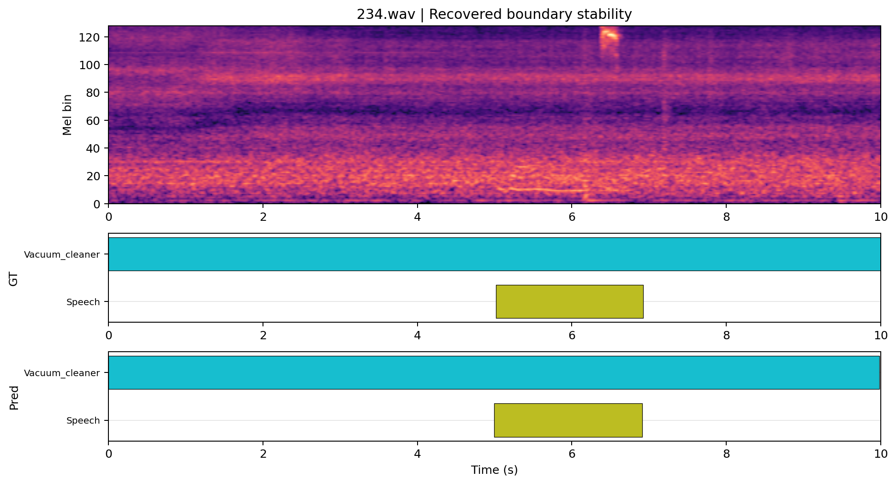

- 文件名：`234.wav`
- 典型模式：相比 frozen BEATs 明显改善 / 边界更稳
- 代表性原因：frozen BEATs 曾把 Vacuum_cleaner 切成碎片，这次已恢复成接近整段的连续预测。
- 真值事件列表：Vacuum_cleaner (0.000-10.000s) Speech (5.017-6.922s)
- 预测事件列表：Vacuum_cleaner (0.000-9.984s) Speech (4.992-6.912s)
- 简短点评：同一文件在 frozen BEATs 里是大量碎片化 Vacuum_cleaner，而当前已经恢复成接近整段的连续预测，边界稳定性明显提升。

### 1000.wav | 长持续类表现较好

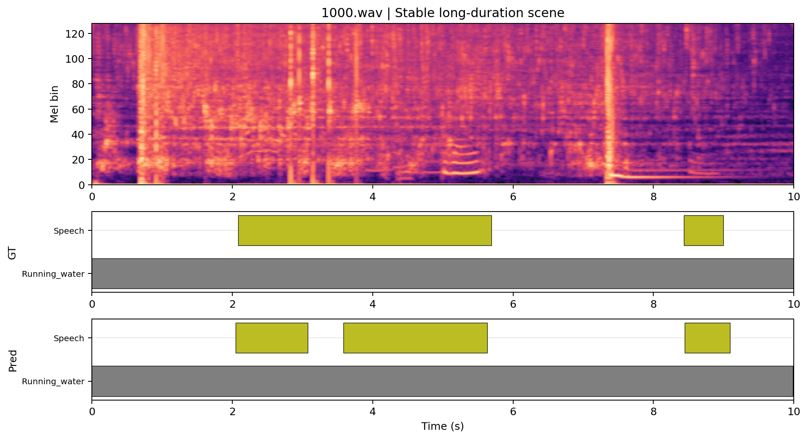

- 文件名：`1000.wav`
- 典型模式：长持续类表现较好
- 代表性原因：Running_water 长事件能够稳定覆盖整段，同时仍能保留部分 Speech 片段。
- 真值事件列表：Running_water (0.000-10.000s) Speech (2.081-5.690s) Speech (8.435-8.996s)
- 预测事件列表：Running_water (0.000-9.984s) Speech (2.048-3.072s) Speech (3.584-5.632s) Speech (8.448-9.088s)
- 简短点评：Running_water 主事件覆盖已经接近满段，同时保留了三段 Speech，说明 full finetune 对长持续类和叠加语音都更稳。

### 1195.wav | 弱类仍然较差

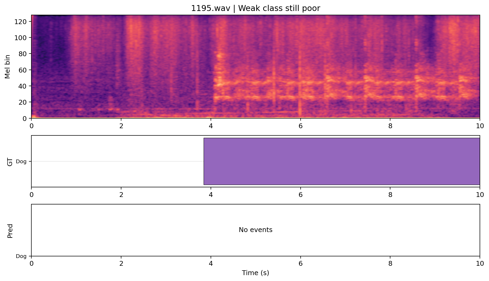

- 文件名：`1195.wav`
- 典型模式：弱类仍然较差
- 代表性原因：Dog 长事件依旧完全漏检，适合展示 hardest weak class 仍未解决。
- 真值事件列表：Dog (3.839-10.000s)
- 预测事件列表：无预测
- 简短点评：Dog 仍然完全漏检，说明动物类依旧是当前 full finetune 的主要短板，尤其在长事件上仍会失效。

### 1312.wav | 多事件场景欠检

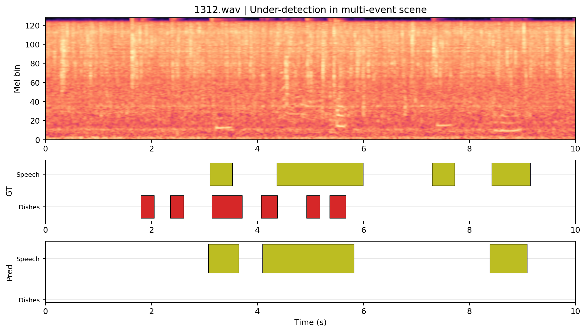

- 文件名：`1312.wav`
- 典型模式：多事件场景欠检
- 代表性原因：Dishes + Speech 的复杂场景仍主要只剩 Speech，体现多事件召回不足。
- 真值事件列表：Dishes (1.800-2.050s) Dishes (2.358-2.608s) Speech (3.101-3.528s) Dishes (3.142-3.710s) Dishes (4.069-4.374s) Speech (4.362-5.993s) Dishes (4.927-5.177s) Dishes (5.362-5.666s) Speech (7.296-7.723s) Speech (8.420-9.149s)
- 预测事件列表：Speech (3.072-3.648s) Speech (4.096-5.824s) Speech (8.384-9.088s)
- 简短点评：复杂多事件场景里仍主要只剩 Speech，Dishes 几乎全部漏掉，说明 hardest multi-event scene 还没有被真正攻克。

## 7. 结论与讨论

这次 full finetune 是正常跑通的，而且不是勉强可用，而是真正取得了强结果。从 current metrics 看，它已经显著优于 frozen BEATs baseline，也已经明显超过当前仓库里的 CRNN baseline 和两种 BEATs-CRNN fusion baseline。

如果论文当前阶段允许把 synthetic validation 结果作为开发实验主表的一部分，那么这版 full finetune 是值得写进正式表格的。它给出的核心结论很明确：对 BEATs 而言，单纯 frozen encoder + 共享 decoder 的确不够；一旦允许全量微调，模型性能会有质变。

但这不意味着问题已经结束。当前主要问题仍集中在 hardest weak classes 和复杂多事件场景：`Dog` 仍有空预测样本，`Dishes` 在多事件场景里仍容易被 `Speech` 压制，`Alarm_bell_ringing` 也还没有进入第一梯队。换句话说，full finetune 解决了“整体不工作”的问题，但还没有彻底解决“所有类都同样强”的问题。

## 8. 后续建议

1. 优先把这版 full finetune 写进正式实验主表，并明确标注它当前是在 synthetic validation 上取得的开发结果。
2. 在这版 checkpoint 基础上做更细的逐类分析，重点盯 `Dog / Dishes / Alarm_bell_ringing`，确认它们落后的原因是召回不足、边界不稳还是混淆。
3. 单独搜索 threshold 和 median filter，因为当前 `Pred/GT` 和长段统计表明，后处理仍有进一步挖潜空间。
4. 如果论文还想继续深挖 encoder 价值，优先比较 `full finetune` 与 `residual gated fusion` 在同一评估协议下的取舍，而不是回到 frozen baseline。
5. 在 synthetic validation 之外补一组更贴近真实分布的测试或评估，否则 full finetune 是否真正泛化，论文里仍需要更谨慎表述。