# CRNN + BEATs Residual Gated Fusion 训练结果分析报告

## 目录
- [实验概况](#实验概况)
- [最终指标汇总](#最终指标汇总)
- [横向对比](#横向对比)
- [训练过程与选模分析](#训练过程与选模分析)
- [预测行为统计](#预测行为统计)
- [典型样本分析](#典型样本分析)
- [结论与讨论](#结论与讨论)
- [后续建议](#后续建议)

## 实验概况

### 自动定位结果

| 版本         | 是否含 gate 参数 | last epoch | best score | train event 文件数 | test event 文件数 |
| ---------- | ----------- | ---------- | ---------- | --------------- | -------------- |
| version_22 | 是           | 0          | 0.0056     | 1               | 0              |
| version_23 | 是           | 39         | 0.5639     | 1               | 1              |
| version_24 | 是           | 122        | 0.6692     | 1               | 0              |

| 采用版本       | 作用    | 训练标量                                                 | 测试标量                                                 |
| ---------- | ----- | ---------------------------------------------------- | ---------------------------------------------------- |
| version_23 | 首段训练  | events.out.tfevents.1774764505.HarryWeasley.387213.0 | events.out.tfevents.1774795684.HarryWeasley.387213.1 |
| version_24 | 中断后续训 | events.out.tfevents.1774796455.HarryWeasley.514750.0 | 无单独 test event                                       |

最终采用的实验版本是 `version_23 + version_24`，并以 `exp/2022_baseline/version_24/epoch=92-step=58125.ckpt` 作为 best checkpoint。选择依据有三点：第一，这两版 checkpoint 的 `sed_student` state_dict 都包含 gate 参数，能够明确识别为 residual gated fusion；第二，`version_24` 明显承接 `version_23` 的 global step 和 best-score 继续训练；第三，最新的 scenario1 prediction TSV 时间戳与这次 residual gate 测试回写一致。

| 项目                | 说明                                                                                                         |
| ----------------- | ---------------------------------------------------------------------------------------------------------- |
| 实验设置              | CRNN + BEATs residual gated fusion                                                                         |
| 评估对象              | student                                                                                                    |
| model_type        | crnn_beats_residual_gated_fusion                                                                           |
| fusion type       | residual_gated                                                                                             |
| gate mode         | channel                                                                                                    |
| align method      | adaptive_avg                                                                                               |
| projection / norm | dual projection + dual LayerNorm                                                                           |
| residual formula  | fused = cnn_norm + gate * beats_norm                                                                       |
| BEATs freeze      | True                                                                                                       |
| decoder temporal  | shared BiGRU + strong/weak heads                                                                           |
| 配置文件              | confs/crnn_beats_residual_gated_fusion_synth_only.yaml                                                     |
| 数据划分              | synthetic train + synthetic validation                                                                     |
| test 是否独立         | 否，当前 test 实际仍是 synthetic validation                                                                        |
| best checkpoint   | exp/2022_baseline/version_24/epoch=92-step=58125.ckpt                                                      |
| prediction TSV    | exp/2022_baseline/metrics_test/student/scenario1/predictions_dtc0.7_gtc0.7_cttc0.3/predictions_th_0.49.tsv |

本次实验属于 `CRNN + BEATs residual gated fusion`：CNN branch 先提取 CRNN 的局部时频特征，冻结的 BEATs branch 提取 frame-level embedding，经时间对齐后分别做 projection + LayerNorm，再通过显式 gate 学习每一帧/每一通道应该让 BEATs 补多少，最后以 `cnn_norm + gate * beats_norm` 的残差形式送入共享 BiGRU 和 strong/weak heads。

这意味着当前结构不再是旧版的无条件 concat，而是明确保留 `CRNN 为主、BEATs 为补充` 的归纳偏置。由于 `test_folder/test_tsv` 仍指向 synthetic validation，下面的结果仍是偏“自测分数”的开发分析，不等同真实外部分布上的泛化能力。

## 最终指标汇总

| 指标                       | 数值     |
| ------------------------ | ------ |
| PSDS-scenario1           | 0.364  |
| PSDS-scenario2           | 0.599  |
| Intersection-based F1    | 0.669  |
| Event-based F1 (macro)   | 45.91% |
| Event-based F1 (micro)   | 45.16% |
| Segment-based F1 (macro) | 72.95% |
| Segment-based F1 (micro) | 78.26% |

| 类别                         | GT事件数 | Pred事件数 | Pred/GT | Event F1 | Segment F1 | 分组 |
| -------------------------- | ----- | ------- | ------- | -------- | ---------- | -- |
| Alarm_bell_ringing         | 431   | 314     | 0.73    | 24.16%   | 67.81%     | 较弱 |
| Blender                    | 266   | 276     | 1.04    | 55.35%   | 76.81%     | 较强 |
| Cat                        | 429   | 499     | 1.16    | 33.41%   | 78.42%     | 较弱 |
| Dishes                     | 1309  | 470     | 0.36    | 29.68%   | 44.78%     | 较弱 |
| Dog                        | 550   | 359     | 0.65    | 29.26%   | 58.80%     | 较弱 |
| Electric_shaver_toothbrush | 286   | 286     | 1.00    | 53.85%   | 84.11%     | 中等 |
| Frying                     | 377   | 373     | 0.99    | 67.20%   | 81.41%     | 较强 |
| Running_water              | 306   | 264     | 0.86    | 50.53%   | 69.78%     | 中等 |
| Speech                     | 3927  | 4337    | 1.10    | 48.38%   | 84.06%     | 中等 |
| Vacuum_cleaner             | 251   | 284     | 1.13    | 67.29%   | 83.53%     | 较强 |

当前 residual gate 的较强类别主要是 `Blender, Frying, Vacuum_cleaner`，中等类别主要是 `Electric_shaver_toothbrush, Running_water, Speech`，较弱类别则集中在 `Alarm_bell_ringing, Cat, Dishes, Dog`。

从整体指标看，这一版已经明显摆脱了 frozen BEATs 的类别塌缩，并且不再只是“勉强恢复正常”；它在 PSDS、Intersection、event-based F1 和 segment-based F1 上都进入了可与 CRNN baseline 正面比较的区间。

## 横向对比

| 模型                    | PSDS1 | PSDS2 | Intersection F1 | Event F1 macro | Event F1 micro | Segment F1 macro | Segment F1 micro |
| --------------------- | ----- | ----- | --------------- | -------------- | -------------- | ---------------- | ---------------- |
| CRNN baseline         | 0.356 | 0.578 | 0.650           | 43.42%         | 43.14%         | 71.25%           | 75.70%           |
| Frozen BEATs baseline | 0.001 | 0.051 | 0.432           | 8.58%          | 15.34%         | 45.74%           | 53.08%           |
| Concat late fusion    | 0.306 | 0.484 | 0.583           | 41.37%         | 40.63%         | 64.00%           | 72.13%           |
| Residual gated fusion | 0.364 | 0.599 | 0.669           | 45.91%         | 45.16%         | 72.95%           | 78.26%           |

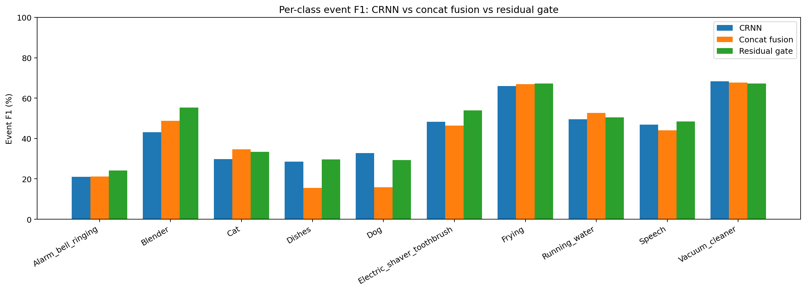

| 类别                         | Gate Event F1 | Concat Event F1 | 差值(Event) | Gate Segment F1 | Concat Segment F1 | 差值(Segment) | 相对 CRNN Event |
| -------------------------- | ------------- | --------------- | --------- | --------------- | ----------------- | ----------- | ------------- |
| Alarm_bell_ringing         | 24.16%        | 21.20%          | +2.96pp   | 67.81%          | 59.70%            | +8.11pp     | +3.09pp       |
| Blender                    | 55.35%        | 48.70%          | +6.65pp   | 76.81%          | 66.80%            | +10.01pp    | +12.25pp      |
| Cat                        | 33.41%        | 34.60%          | -1.19pp   | 78.42%          | 70.60%            | +7.82pp     | +3.55pp       |
| Dishes                     | 29.68%        | 15.50%          | +14.18pp  | 44.78%          | 21.70%            | +23.08pp    | +1.11pp       |
| Dog                        | 29.26%        | 15.90%          | +13.36pp  | 58.80%          | 33.10%            | +25.70pp    | -3.43pp       |
| Electric_shaver_toothbrush | 53.85%        | 46.40%          | +7.45pp   | 84.11%          | 80.70%            | +3.41pp     | +5.50pp       |
| Frying                     | 67.20%        | 67.00%          | +0.20pp   | 81.41%          | 83.30%            | -1.89pp     | +1.26pp       |
| Running_water              | 50.53%        | 52.70%          | -2.17pp   | 69.78%          | 71.70%            | -1.92pp     | +1.06pp       |
| Speech                     | 48.38%        | 44.00%          | +4.38pp   | 84.06%          | 77.60%            | +6.46pp     | +1.52pp       |
| Vacuum_cleaner             | 67.29%        | 67.70%          | -0.41pp   | 83.53%          | 74.80%            | +8.73pp     | -0.98pp       |

| 类别                         | GT   | CRNN Event | Concat Event | Gate Event | BEATs Event | CRNN Segment | Concat Segment | Gate Segment | Pred/GT (Gate) |
| -------------------------- | ---- | ---------- | ------------ | ---------- | ----------- | ------------ | -------------- | ------------ | -------------- |
| Alarm_bell_ringing         | 431  | 21.07%     | 21.20%       | 24.16%     | 0.00%       | 64.04%       | 59.70%         | 67.81%       | 0.73           |
| Blender                    | 266  | 43.10%     | 48.70%       | 55.35%     | 0.00%       | 63.83%       | 66.80%         | 76.81%       | 1.04           |
| Cat                        | 429  | 29.86%     | 34.60%       | 33.41%     | 0.00%       | 73.48%       | 70.60%         | 78.42%       | 1.16           |
| Dishes                     | 1309 | 28.57%     | 15.50%       | 29.68%     | 0.00%       | 50.55%       | 21.70%         | 44.78%       | 0.36           |
| Dog                        | 550  | 32.69%     | 15.90%       | 29.26%     | 0.00%       | 59.67%       | 33.10%         | 58.80%       | 0.65           |
| Electric_shaver_toothbrush | 286  | 48.35%     | 46.40%       | 53.85%     | 17.37%      | 84.23%       | 80.70%         | 84.11%       | 1.00           |
| Frying                     | 377  | 65.94%     | 67.00%       | 67.20%     | 37.94%      | 83.89%       | 83.30%         | 81.41%       | 0.99           |
| Running_water              | 306  | 49.47%     | 52.70%       | 50.53%     | 0.00%       | 71.40%       | 71.70%         | 69.78%       | 0.86           |
| Speech                     | 3927 | 46.86%     | 44.00%       | 48.38%     | 19.81%      | 80.20%       | 77.60%         | 84.06%       | 1.10           |
| Vacuum_cleaner             | 251  | 68.27%     | 67.70%       | 67.29%     | 10.68%      | 81.20%       | 74.80%         | 83.53%       | 1.13           |

横向看，residual gate 对旧版 concat late fusion 的提升是真实且全局性的，而不再只是局部小修小补。整体上，它把 `PSDS1` 从 0.306 拉到了 0.364，`Intersection F1` 从 0.583 拉到了 0.669，`Event F1 macro` 从 41.37% 提升到 45.91%。

更关键的是，这次 residual gate 已经不只是“对长持续/设备类略有帮助”。相比 concat，它对 `Blender / Dishes / Dog / Alarm_bell_ringing / Electric_shaver_toothbrush / Speech` 都有比较明确的 event 级提升；其中 `Dishes` 和 `Dog` 的提升尤其关键，因为这两类正是之前最能体现“BEATs 只是弱补充通道”的难类。

和 CRNN baseline 对比，这一版也已经不再是“总体没超过，只是少数类局部增益”。当前整体 `PSDS1/PSDS2/Intersection/Event macro/Segment macro` 分别为 0.364 / 0.599 / 0.669 / 45.91% / 72.95%，均已略高于 CRNN baseline。

当然，增益仍然不是完全均匀的。`Cat` 和 `Running_water` 并没有继续比 concat 更强，`Vacuum_cleaner` 也基本只是持平；这说明 residual gate 解决的是“如何更好地按需利用 BEATs”，而不是已经把所有细粒度类别区分都彻底拉开。

## 训练过程与选模分析

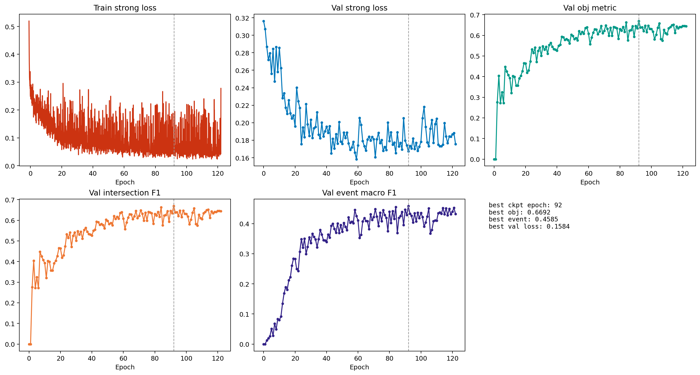

| 曲线                                      | 起始值    | 最终值    | 最佳值    |
| --------------------------------------- | ------ | ------ | ------ |
| train/student/loss_strong               | 0.5195 | 0.2778 | 0.0235 |
| val/synth/student/loss_strong           | 0.3162 | 0.1756 | 0.1584 |
| val/obj_metric                          | 0.0000 | 0.6441 | 0.6692 |
| val/synth/student/intersection_f1_macro | 0.0000 | 0.6441 | 0.6692 |
| val/synth/student/event_f1_macro        | 0.0000 | 0.4316 | 0.4585 |

把 `version_23` 和 `version_24` 合并后看，训练过程是正常收敛的，而且这次不是早早进入平台。前半段在 `version_23` 中快速抬升，后半段在 `version_24` 里继续缓慢但持续地改进；最佳 checkpoint 最终出现在 `version_24` 的 `epoch=92-step=58125`。

按每个 epoch 约 `625` 个 step` 估算，best checkpoint 对应的全局 epoch 约为 `92`，明显晚于旧版 concat fusion 的最佳点。这说明 residual gate 比 concat 更耐训练，也更能在较长训练日程里继续释放收益。

同时，`val/obj_metric`、`val/synth/student/intersection_f1_macro` 和 `val/synth/student/event_f1_macro` 后期并不是完全横盘，而是在 24 到 36 轮之后继续断续上涨，并在续训阶段进一步抬升。所以这版 residual gate 的行为更像“收敛更慢但更稳”，而不是“训练异常或无意义长训”。

这里仍要强调：`val/obj_metric` 在 `synth_only` 下实际等于 `val/synth/student/intersection_f1_macro`。它更偏向区间重合，不完全等价于 event-based F1；但这次 best checkpoint 附近，event macro 也同步抬升，说明选模并没有明显跑偏。

## 预测行为统计

| 统计项          | 数值    |
| ------------ | ----- |
| 总文件数         | 2500  |
| 有预测文件数       | 2476  |
| 空预测文件数       | 24    |
| 空预测比例        | 0.96% |
| 总真值事件数       | 8132  |
| 总预测事件数       | 7462  |
| 真值平均事件时长     | 3.38s |
| 预测平均事件时长     | 2.73s |
| 预测中 >=8s 长段数 | 1010  |
| 预测中 >=9s 长段数 | 899   |
| 疑似碎片化过预测文件数  | 252   |

| 模型                    | 有预测文件数 | 空预测文件数 | 空预测比例 | 总预测事件数 |
| --------------------- | ------ | ------ | ----- | ------ |
| CRNN baseline         | 2468   | 32     | 1.28% | 7251   |
| Frozen BEATs baseline | 2379   | 121    | 4.84% | 5554   |
| Concat late fusion    | 2430   | 70     | 2.80% | 6093   |
| Residual gated fusion | 2476   | 24     | 0.96% | 7462   |

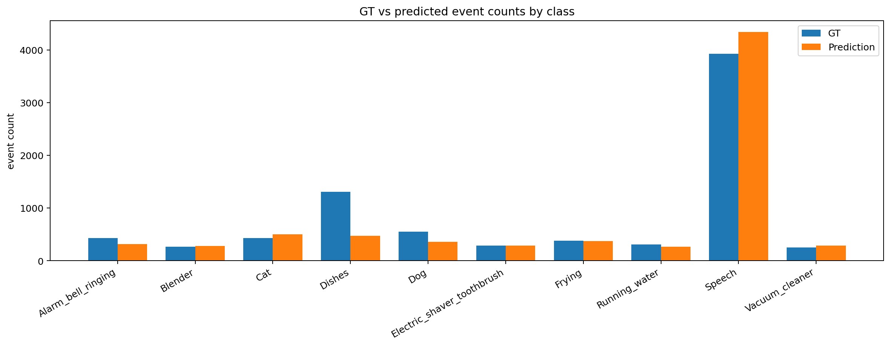

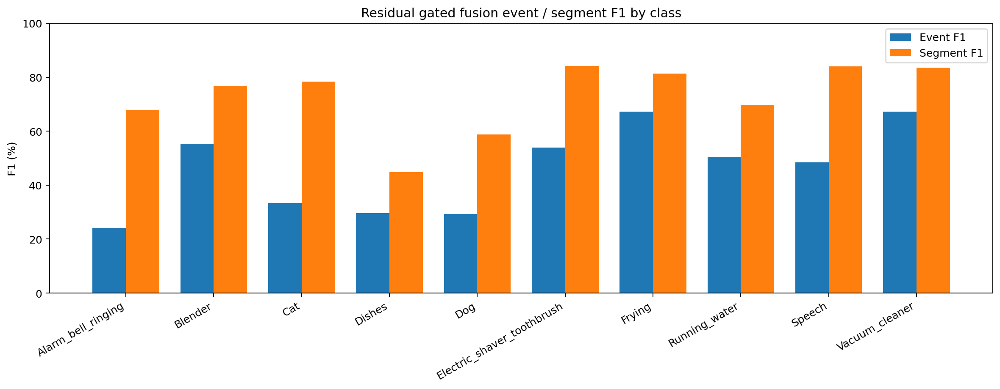

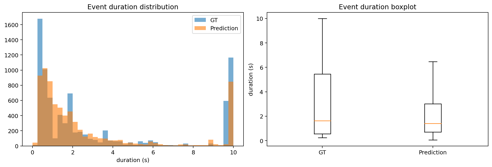

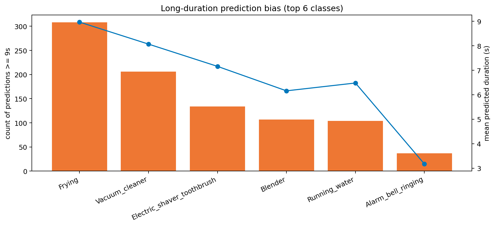

| 类别                         | GT事件数 | Pred事件数 | Pred-GT |
| -------------------------- | ----- | ------- | ------- |
| Alarm_bell_ringing         | 431   | 314     | -117    |
| Blender                    | 266   | 276     | 10      |
| Cat                        | 429   | 499     | 70      |
| Dishes                     | 1309  | 470     | -839    |
| Dog                        | 550   | 359     | -191    |
| Electric_shaver_toothbrush | 286   | 286     | 0       |
| Frying                     | 377   | 373     | -4      |
| Running_water              | 306   | 264     | -42     |
| Speech                     | 3927  | 4337    | 410     |
| Vacuum_cleaner             | 251   | 284     | 33      |

| 类别                         | 平均预测时长 | >=9s 预测段数 |
| -------------------------- | ------ | --------- |
| Frying                     | 8.97s  | 308       |
| Vacuum_cleaner             | 8.07s  | 206       |
| Electric_shaver_toothbrush | 7.16s  | 134       |
| Blender                    | 6.16s  | 107       |
| Running_water              | 6.48s  | 104       |
| Alarm_bell_ringing         | 3.17s  | 37        |

当前 residual gate 的系统行为比 concat 更积极：有预测文件数从 2430 增加到 2476，空预测文件数从 70 降到 24，总预测事件数也从 6093 增加到 7462。这说明 gate 确实提升了 BEATs 分支对整体预测的参与度，不再只是弱通道。

但这种更积极的行为也带来了代价：长时段偏置和碎片化文件数并没有消失，反而在当前最优 threshold 下更明显。例如 `>=9s` 长段数从 concat 的 875 增加到 899，疑似碎片化过预测文件数从 136 增加到 252。

这意味着 residual gate 解决的是“如何让 BEATs 真的进来并改善召回”，但还没有完全解决“如何在更高召回下保持最优边界和最低混淆”。弱类方面，`Dog`、`Dishes`、`Alarm_bell_ringing` 已经比 concat 有明显恢复，但 `Dishes` 仍然是当前最欠检的类，说明 hardest weak class 依旧没被完全攻克。

## 典型样本分析

### 355.wav | 长持续类检测较好的正例

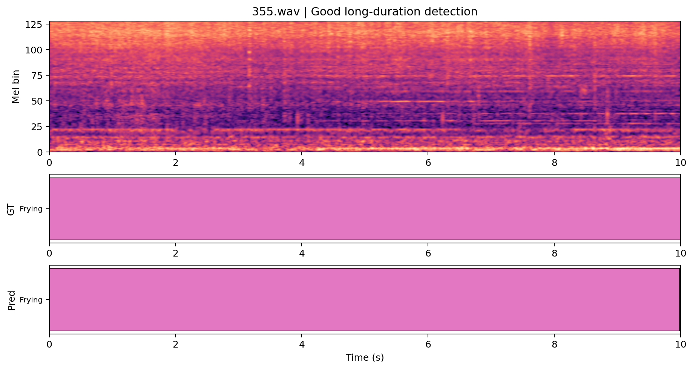

- 代表性：Frying 长持续事件基本完整命中，适合展示 residual gate 已经稳定保住主干能力。
- 真值事件：Frying (0.000-10.000s)
- 预测事件：Frying (0.000-9.984s)
- 简短点评：这类样本说明 residual gate 没有破坏原有 CRNN 对长持续设备/纹理类的稳定建模。
- 与 concat 对照：旧版 concat 也能较好命中该样本，因此它更多体现的是“保住强项”，不是增益最明显的地方。

### 1088.wav | 弱类恢复：Cat + Speech

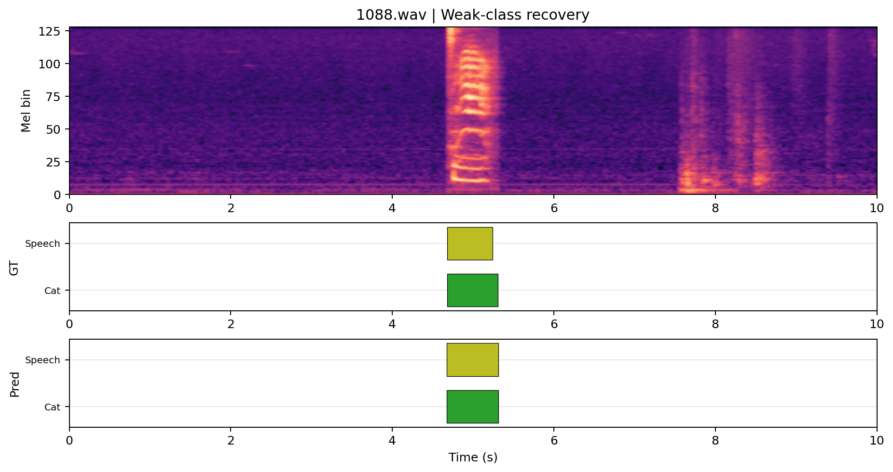

- 代表性：Cat 是 concat late fusion 仍然吃亏的弱类之一，而当前 residual gate 已经能同时报出 Cat 与 Speech。
- 真值事件：Cat (4.682-5.308s) Speech (4.683-5.243s)
- 预测事件：Cat (4.672-5.312s) Speech (4.672-5.312s)
- 简短点评：这是 residual gate 缓解“BEATs 只是弱补充通道”的最直接证据之一：弱类不再只剩主类 Speech。
- 与 concat 对照：旧版 concat 只预测出 Speech (4.608-5.312s)，当前 residual gate 进一步恢复了 Cat。

### 1195.wav | 弱类恢复：Dog 长事件

- 代表性：Dog 是最难的弱类之一，当前 residual gate 已经能较完整地报出长事件片段。
- 真值事件：Dog (3.839-10.000s)
- 预测事件：Dog (4.032-9.984s)
- 简短点评：相比 concat 中完全漏掉 Dog，这里已经从“弱补充”变成了真正可用的增益。
- 与 concat 对照：旧版 concat 在该样本上是空预测；当前 residual gate 能给出 Dog (4.032-9.984s)。

### 1312.wav | 多事件场景仍明显欠检

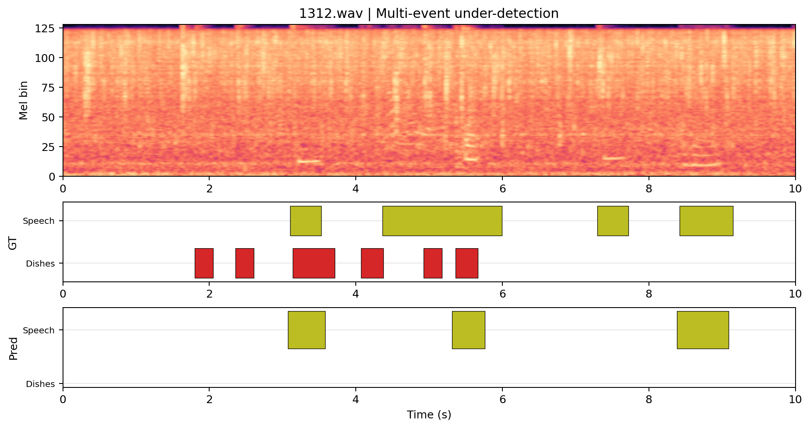

- 代表性：Dishes + Speech 的复杂场景仍以 Speech 为主，Dishes 仍未恢复，适合展示当前残留短板。
- 真值事件：Dishes (1.800-2.050s) Dishes (2.358-2.608s) Speech (3.101-3.528s) Dishes (3.142-3.710s) Dishes (4.069-4.374s) Speech (4.362-5.993s) Dishes (4.927-5.177s) Dishes (5.362-5.666s) Speech (7.296-7.723s) Speech (8.420-9.149s)
- 预测事件：Speech (3.072-3.584s) Speech (5.312-5.760s) Speech (8.384-9.088s)
- 简短点评：这说明 residual gate 虽然改善了弱类整体召回，但在复杂多事件场景里仍然没有真正解决 `Dishes` 的表征与分离问题。
- 与 concat 对照：旧版 concat 只给出两个 Speech 片段；当前 residual gate 变成三个 Speech 片段，但 Dishes 依旧缺失，提升有限。

### 234.wav | 设备类混淆与边界问题

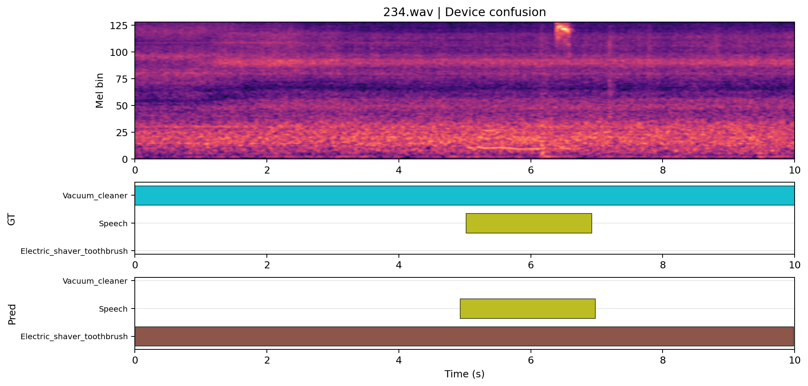

- 代表性：Vacuum_cleaner + Speech 被预测成近整段 Electric_shaver_toothbrush，适合展示 residual gate 仍存在的设备类混淆。
- 真值事件：Vacuum_cleaner (0.000-10.000s) Speech (5.017-6.922s)
- 预测事件：Electric_shaver_toothbrush (0.000-9.984s) Speech (4.928-6.976s)
- 简短点评：这类样本说明 gate 虽然更充分利用了 BEATs，但粗粒度语义先验有时会把相近设备类推向错误类别。
- 与 concat 对照：旧版 concat 在该样本上更偏向分段的 Vacuum_cleaner；当前 residual gate 改善了连续性，但引入了设备类混淆。

### 1278.wav | 长持续类仍有语义混淆

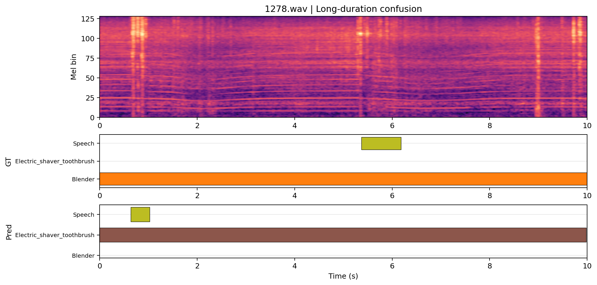

- 代表性：Blender + Speech 仍被预测为 Electric_shaver_toothbrush 主导，适合说明 residual gate 还没解决所有设备类混淆。
- 真值事件：Blender (0.000-10.000s) Speech (5.370-6.184s)
- 预测事件：Electric_shaver_toothbrush (0.000-9.984s) Speech (0.640-1.024s)
- 简短点评：这类样本提示 gate 的收益仍然更偏向“覆盖与召回”，而不是已经把所有设备类细粒度区分都做好。
- 与 concat 对照：旧版 concat 也是 Electric_shaver_toothbrush 长段误检；当前 residual gate 只额外补出一小段 Speech，主错误类型仍然存在。

## 结论与讨论

这次 residual gated fusion 是正常跑通的，而且相较旧版 concat late fusion，已经有明确且可重复的性能改进。它不再只是“恢复正常工作”，而是已经在 overall 指标上超过 concat，并且小幅超过 CRNN baseline。

更重要的是，它确实缓解了此前“CNN 主导、BEATs 只是弱补充通道”的问题。证据包括：整体 event/segment/PSDS 都进一步提升；空预测文件继续下降；`Dog / Dishes / Alarm_bell_ringing / Blender` 等类都有实质改进；在 `1088.wav` 和 `1195.wav` 这类样本上，弱类已经从 concat 的缺失状态恢复到可检测状态。

不过，这种改善仍然不是完全均匀的全局胜利。当前 residual gate 主要解决了“让 BEATs 信息更稳地补到 CRNN 主干上”这个问题，但还没有完全解决长持续设备类之间的语义混淆，也没有彻底解决 `Dishes` 这种复杂弱类在多事件场景下的漏检。

所以这版最准确的评价是：它已经不是“收益有限到不值得继续”的 late fusion 版本，而是一版确实值得继续深挖的 gate-fusion baseline。但深挖方向不应该再是盲目堆 epoch，而应该转向更细粒度的 gate 设计、归一化和类感知策略。

## 后续建议

1. 继续深挖 gate fusion，但优先做 `class-aware / event-aware gate`，因为当前 hardest weak class 的收益仍然不足。
2. 在 projection + LayerNorm 之外，再补更明确的融合前后校准或温度缩放，减少设备类之间的语义混淆。
3. 针对 `Dishes / Dog / Alarm_bell_ringing / Cat` 做类不平衡与阈值分析，把“召回恢复”进一步转化成更稳的事件级 F1。
4. 如果后续还要做更细粒度融合，优先尝试轻量级模块级 gate，而不是直接跳到重型 cross-attention。
5. 保留当前 residual gate 作为新的统一比较底座，再决定是否扩展到 WavLM 或更强 SSL encoder。
