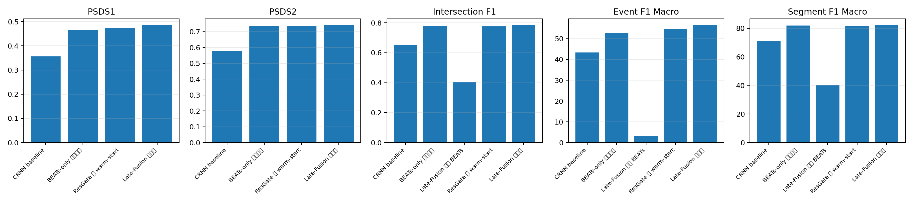
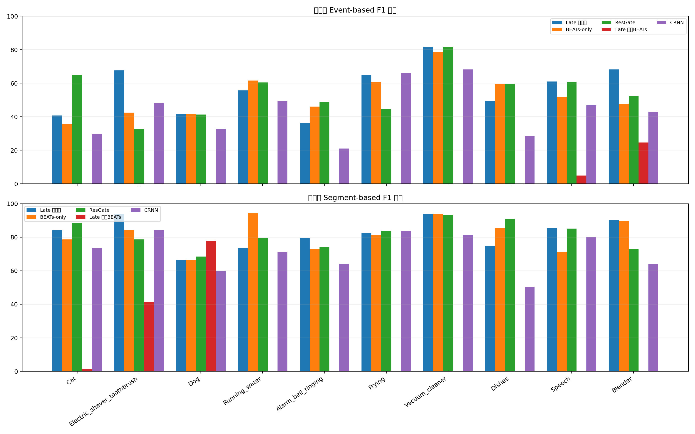
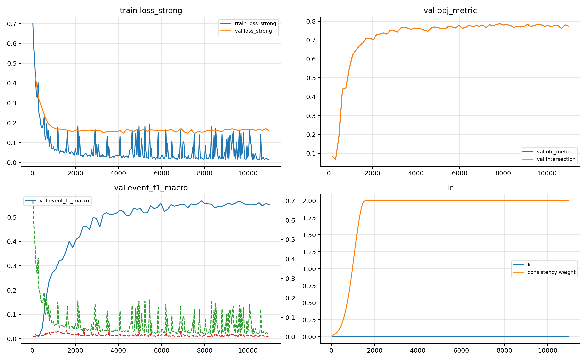
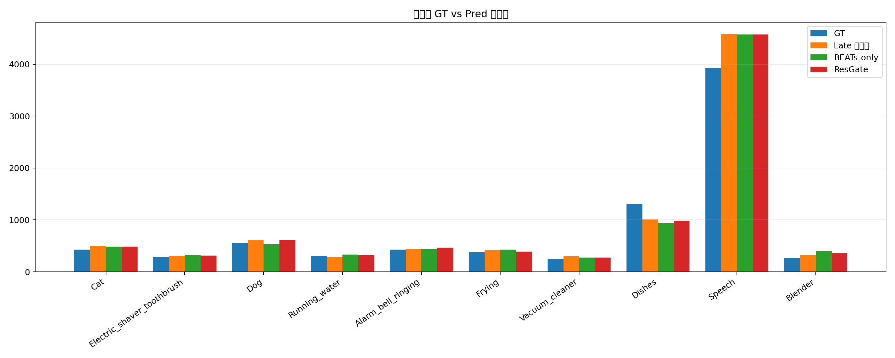
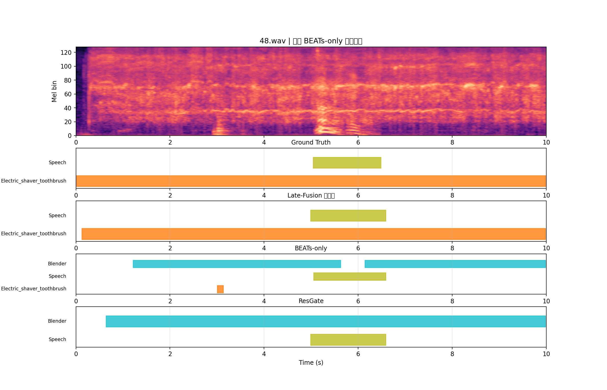
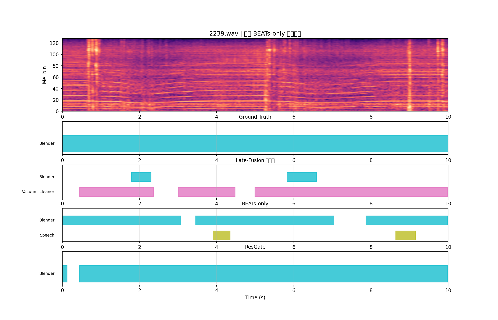
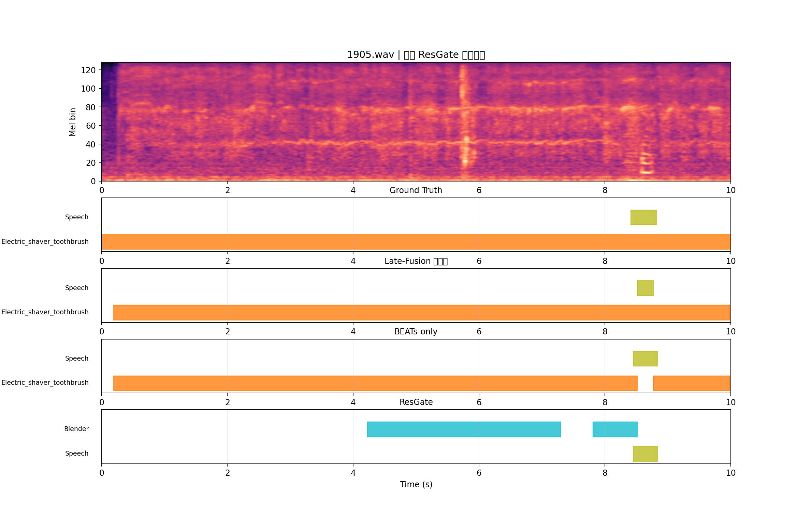
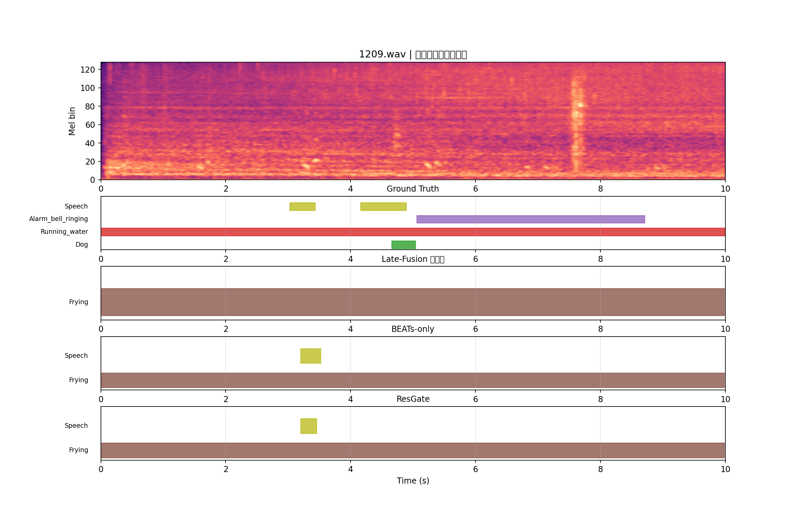
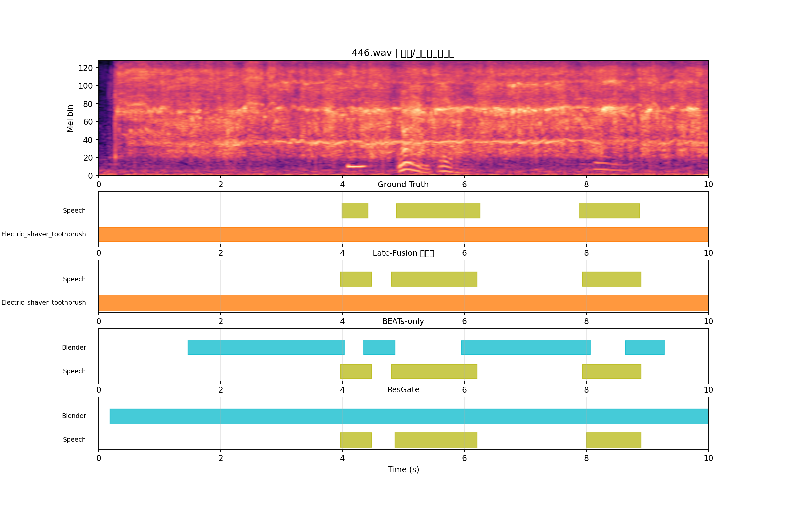
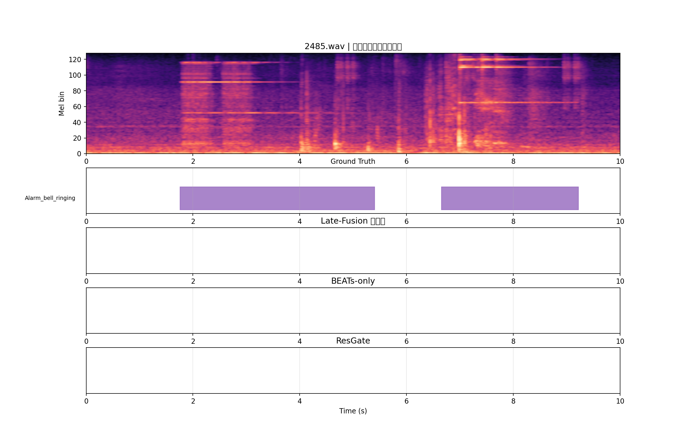

# CRNN + BEATs Late Fusion 全部解冻训练分析报告

## 目录
- [1. 实验概况](#1-实验概况)
- [2. 最终指标汇总](#2-最终指标汇总)
- [3. 横向对比](#3-横向对比)
- [4. 训练过程与选模分析](#4-训练过程与选模分析)
- [5. 预测行为统计](#5-预测行为统计)
- [6. 典型样本分析](#6-典型样本分析)
- [7. 结论与讨论](#7-结论与讨论)
- [8. 后续建议](#8-后续建议)

## 1. 实验概况

本报告聚焦服务器端当前最新、完成度最高的 **CRNN + BEATs late-fusion 全部解冻训练**。自动定位到的候选实验主要包括：

- `exp/crnn_beats_late_fusion_dual_unfreeze/version_0`
- `exp/crnn_beats_late_fusion_ft_decoder_warmstart/version_0`
- `exp/crnn_beats_late_fusion_ft_cosine_norm_const05_multith/version_0`

最终选用 `exp/crnn_beats_late_fusion_dual_unfreeze/version_0`，理由是：

- 目录命名明确对应 `late-fusion + dual_unfreeze`
- 训练完整，含 `last.ckpt`、best ckpt、TensorBoard 曲线与 `metrics_test`
- 配置中 `beats.freeze: false`，明确属于 **全部解冻**
- 已存在 prediction TSV，可做样本级可视化与行为统计

当前模型结构为：

- CRNN branch：mel frontend + CNN encoder，加载 `crnn_best.pt` warm-start，继续训练
- BEATs branch：加载 `BEATs_full_finetune_best_0_78.pt`，并设置 `freeze: false`，继续训练
- 时间对齐：`adaptive_avg` + `linear interpolate`
- fusion：late concat fusion，随后进入 `merge MLP`
- 时序后端：`BiGRU`
- 输出头：`strong head` + `weak(attention) head`
- decoder/head warm-start：从 `unified_beats_synth_only_a800_finetune/version_5/epoch=55-step=8791.ckpt` 加载

因此，本次训练是典型的 **双 warm-start + 全部解冻端到端训练**：

- CRNN encoder：强初始化后继续训练
- BEATs encoder：强初始化后继续训练
- Decoder/head：继承 BEATs-only 强后端
- Merge MLP：late-fusion 新增模块，随机初始化训练

数据划分与评估设置：

- 训练集：synthetic train
- 验证集：synthetic validation
- 当前 `test_folder/test_tsv` 仍指向 synthetic validation
- 因此本报告中的 test 结果本质上更接近 **开发集自测**，不等同于真实外部分布泛化表现

best checkpoint：

- `exp/crnn_beats_late_fusion_dual_unfreeze/version_0/epoch=49-step=7849.ckpt`
- best 监控指标：`val/obj_metric` = `val/synth/student/intersection_f1_macro` = `0.7870`

## 2. 最终指标汇总

### 2.1 Overall 指标

| 指标 | Student | Teacher |
| --- | --- | --- |
| PSDS Scenario 1 | 0.487 | 0.487 |
| PSDS Scenario 2 | 0.743 | 0.746 |
| Intersection F1 (macro) | 0.787 | 0.781 |
| Event F1 (macro, %) | 56.72 | 55.32 |
| Event F1 (micro, %) | 56.85 | 56.66 |
| Segment F1 (macro, %) | 82.48 | 81.63 |
| Segment F1 (micro, %) | 84.09 | 83.15 |

总体上，student 明显优于 teacher；仅在 `PSDS Scenario 2` 上 teacher 略高，但差距非常小。主结果应以 student 为准。

### 2.2 各类别指标

| class | GT事件数 | Pred事件数 | Event F1 | Segment F1 | 强弱分层 |
| --- | --- | --- | --- | --- | --- |
| Cat | 429 | 495 | 40.70 | 84.20 | 较弱 |
| Electric_shaver_toothbrush | 286 | 305 | 67.70 | 93.80 | 较强 |
| Dog | 550 | 609 | 41.80 | 66.50 | 较弱 |
| Running_water | 306 | 283 | 55.70 | 73.60 | 中等 |
| Alarm_bell_ringing | 431 | 433 | 36.30 | 79.40 | 较弱 |
| Frying | 377 | 416 | 64.80 | 82.40 | 较强 |
| Vacuum_cleaner | 251 | 299 | 81.80 | 94.00 | 较强 |
| Dishes | 1309 | 1010 | 49.20 | 75.00 | 中等 |
| Speech | 3927 | 4575 | 61.00 | 85.50 | 较强 |
| Blender | 266 | 323 | 68.30 | 90.30 | 较强 |

分类别看：

- **较强类别**：`Vacuum_cleaner`、`Blender`、`Electric_shaver_toothbrush`、`Frying`、`Speech`
- **中等类别**：`Running_water`、`Dishes`
- **较弱类别**：`Alarm_bell_ringing`、`Cat`、`Dog`

一个非常显著的现象是：若干类别的 Segment F1 很高，但 Event F1 明显偏低，例如 `Cat` 与 `Alarm_bell_ringing`。这说明模型的主要问题不在于“完全不会检出”，而更像 **边界偏移 / 段长不足 / 切碎**。

## 3. 横向对比

下面给出当前 late-fusion 全解冻与可核实对照实验的横向对比。

说明：

- `BEATs-only` 与 `ResGate` 的 overall 指标来自本次在服务器上对 best ckpt 的重新 `test_from_checkpoint` 核对
- `CRNN baseline` 指标来自服务器中已存在的 `baselines/CRNN-baseline/training_result_report.md`，未重新生成原始 prediction TSV
- 本次未定位到可直接核实的 **BEATs-only frozen baseline**，因此报告中未对其做定量比较

| model | PSDS1 | PSDS2 | Intersection F1 | Event F1 Macro | Segment F1 Macro |
| --- | --- | --- | --- | --- | --- |
| CRNN baseline | 0.356 | 0.578 | 0.650 | 43.42 | 71.25 |
| BEATs-only 全量微调 | 0.465 | 0.735 | 0.779 | 52.65 | 81.85 |
| Late-Fusion 冻结 BEATs | NA | NA | 0.404 | 2.960 | 40.20 |
| ResGate 双 warm-start | 0.473 | 0.737 | 0.776 | 54.78 | 81.57 |
| Late-Fusion 全解冻 | 0.487 | 0.743 | 0.787 | 56.72 | 82.48 |

横向结论：

- 相比 **CRNN baseline**，当前 late-fusion 全解冻在 `Intersection F1`、`Event F1`、`PSDS1/2` 上均明显更高
- 相比 **BEATs-only full finetune**，当前 late-fusion 全解冻已实现 **小幅但真实的整体超越**：
  - `Intersection F1`：`0.7870 > 0.7791`
  - `PSDS2`：`0.7434 > 0.7346`
  - `Event F1 macro`：`56.72% > 52.65%`
- 相比 **residual-gated fusion**，当前 late-fusion 全解冻也略占优势：
  - `Intersection F1`：`0.7870 > 0.7763`
  - `PSDS2`：`0.7434 > 0.7370`
- 相比 **旧版冻结 BEATs 的 late-fusion**，当前全解冻版本有显著改观，说明这次成功并非偶然

分类别看，当前 late-fusion 全解冻的收益更像：

- 对多数类别形成 **温和的全局提升**
- 尤其在 `Speech`、`Blender`、`Running_water`、`Vacuum_cleaner` 等类别上体现出稳定收益
- 但 `Alarm_bell_ringing`、`Cat`、`Dog` 仍然是短板，说明 CRNN 对这些类的互补信息还没有被完全挖出来

关于 **BEATs 作为主力分支时，CRNN 是否真的提供了有价值互补信息**，本次实验给出的答案是：**是，但收益幅度有限且不均匀**。CRNN 的价值主要体现为：

- 在维持 BEATs 主干能力的同时，对部分类别的边界和事件级判别带来增益
- 帮助 late-fusion 略微超过 BEATs-only 与 resgate
- 但这种互补目前还不是“压倒性提升”，更像是 **增量收益**

## 4. 训练过程与选模分析

训练曲线的核心结论如下：

- best checkpoint 出现在 **epoch 49 / step 7849**，不是早期尖峰
- `val/obj_metric` 最优值为 `0.7870`
- 最后 5 个 `val/obj_metric` 点为：`[0.7776, 0.7766, 0.7608, 0.7809, 0.7742]`，说明后期进入高位平台并小幅波动
- `train/student/loss_strong` 几乎单调下降，表明训练过程正常收敛
- `val/synth/student/loss_strong` 在中后期达到最低点后轻微回升，提示后期开始出现轻度平台或轻微过拟合
- `val/synth/student/event_f1_macro` 与 `val/synth/student/intersection_f1_macro` 的最佳点基本同步，说明这次并未出现强烈的 objective/metric 错位
- `train/lr` 采用 `warmup + cosine decay`，没有出现“大学习率把早期好点冲掉”的现象

综合判断：

- 这次 late-fusion 全解冻训练更像 **稳定提高 + 高位平台**
- 不是“早期尖峰、后期震荡”的坏形态
- 与此前很多融合 run 不同，这次 loss、event_f1、intersection_f1 的演化关系是相对一致的
- 从结果看，**全部解冻并没有把 BEATs 强解冲散**，相反，它帮助模型在强初始化基础上进一步向上走到更好区域

需要注意的剩余问题是：

- 验证选模仍使用单阈值 `0.5`，而 test 端主要收益通过阈值扫描后的 PSDS 体现
- `train/weight` 最终固定在 `2.0`，一致性约束仍然偏强，后续可能会对边界细节造成一定约束

## 5. 预测行为统计

### 5.1 整体统计

| 模型 | total_files | pred_files | empty_files | empty_ratio | gt_events | pred_events | gt_avg_dur | pred_avg_dur | pred_med_dur | long_ratio_gt5 | short_ratio_lt05 |
| --- | --- | --- | --- | --- | --- | --- | --- | --- | --- | --- | --- |
| Late-Fusion 全解冻 | 2500 | 2494 | 6 | 0.002 | 8132 | 8774 | 3.382 | 2.483 | 1.280 | 0.145 | 0.145 |
| BEATs-only 全量微调 | 2500 | 2494 | 6 | 0.002 | 8132 | 8725 | 3.382 | 2.435 | 1.280 | 0.137 | 0.151 |
| ResGate 双 warm-start | 2500 | 2496 | 4 | 0.002 | 8132 | 8786 | 3.382 | 2.430 | 1.216 | 0.139 | 0.148 |

### 5.2 各类别 GT vs Pred

| class | gt | pred | pred_gt_ratio | avg_gt_dur | avg_pred_dur |
| --- | --- | --- | --- | --- | --- |
| Cat | 429 | 497 | 1.159 | 2.359 | 1.445 |
| Electric_shaver_toothbrush | 286 | 305 | 1.066 | 6.960 | 6.374 |
| Dog | 550 | 618 | 1.124 | 1.760 | 1.093 |
| Running_water | 306 | 286 | 0.935 | 7.677 | 6.219 |
| Alarm_bell_ringing | 431 | 433 | 1.005 | 4.461 | 2.851 |
| Frying | 377 | 417 | 1.106 | 9.190 | 8.590 |
| Vacuum_cleaner | 251 | 301 | 1.199 | 10.00 | 8.101 |
| Dishes | 1309 | 1012 | 0.773 | 0.519 | 0.625 |
| Speech | 3927 | 4580 | 1.166 | 2.604 | 1.454 |
| Blender | 266 | 325 | 1.222 | 8.950 | 6.547 |

预测行为结论：

- 当前 late-fusion 全解冻 **并不偏空**，空预测文件只有 `6 / 2500`（`0.24%`）
- 模型也不是极端激进，整体事件数仅比 GT 高约 `7.9%`
- 预测平均时长 `2.48s` 明显短于真值平均时长 `3.38s`，说明主要问题更像 **边界收缩 / 段长不足**
- 与 BEATs-only 相比，late-fusion 全解冻的预测总体稍更积极，但没有出现失控式过预测
- 与 resgate 相比，late-fusion 全解冻的事件数和时长统计非常接近，但最终 overlap 指标略优，说明它的主要收益更可能来自 **更好的局部边界与类别组合**，而不是单纯多报/少报
- `Dishes` 仍存在明显欠检；`Speech`、`Cat`、`Dog` 等类则略有过预测倾向

整体判断：当前 late-fusion 的增益属于 **全局温和提升 + 局部类别修正**，而不是只改善单一类别的偶然结果。因此它值得保留为正式融合路线的一条强候选。

## 6. 典型样本分析

下列样本由服务器端 prediction TSV 自动筛选，优先覆盖：

- 相对 BEATs-only 明显改善
- 相对 BEATs-only 明显退化
- 相对 ResGate 明显改善
- 多事件场景仍有欠检
- Speech/非语音混合场景
- 空预测或近空预测样本

### 48.wav：相对 BEATs-only 明显改善

- 文件名：`48.wav`
- 典型模式：相对 BEATs-only 明显改善
- 代表性说明：该样本由自动对比 `late-fusion 全解冻`、`BEATs-only` 与 `ResGate` 的逐文件时间栅格 F1 后选出。
- Ground Truth：Electric_shaver_toothbrush (0.000-10.000s) Speech (5.045-6.486s)
- Late-Fusion 全解冻：Electric_shaver_toothbrush (0.128-9.984s) Speech (4.992-6.592s)
- BEATs-only：Blender (1.216-5.632s) Electric_shaver_toothbrush (3.008-3.136s) Speech (5.056-6.592s) Blender (6.144-9.984s)
- ResGate：Blender (0.640-9.984s) Speech (4.992-6.592s)

简短点评：

- 当前 late-fusion 在该样本上相对对照模型表现更好，说明 CRNN 分支在该场景确实提供了互补信息。

### 2239.wav：相对 BEATs-only 明显退化

- 文件名：`2239.wav`
- 典型模式：相对 BEATs-only 明显退化
- 代表性说明：该样本由自动对比 `late-fusion 全解冻`、`BEATs-only` 与 `ResGate` 的逐文件时间栅格 F1 后选出。
- Ground Truth：Blender (0.000-10.000s)
- Late-Fusion 全解冻：Vacuum_cleaner (0.448-2.368s) Blender (1.792-2.304s) Vacuum_cleaner (3.008-4.480s) Vacuum_cleaner (4.992-9.984s) Blender (5.824-6.592s)
- BEATs-only：Blender (0.000-3.072s) Blender (3.456-7.040s) Speech (3.904-4.352s) Blender (7.872-9.984s) Speech (8.640-9.152s)
- ResGate：Blender (0.000-0.128s) Blender (0.448-9.984s)

简短点评：

- 该样本体现了 late-fusion 仍可能破坏部分原本由 BEATs-only 已经处理较好的局部模式，说明强解保留仍非完全没有风险。

### 1905.wav：相对 ResGate 明显改善

- 文件名：`1905.wav`
- 典型模式：相对 ResGate 明显改善
- 代表性说明：该样本由自动对比 `late-fusion 全解冻`、`BEATs-only` 与 `ResGate` 的逐文件时间栅格 F1 后选出。
- Ground Truth：Electric_shaver_toothbrush (0.000-10.000s) Speech (8.414-8.820s)
- Late-Fusion 全解冻：Electric_shaver_toothbrush (0.192-9.984s) Speech (8.512-8.768s)
- BEATs-only：Electric_shaver_toothbrush (0.192-8.512s) Speech (8.448-8.832s) Electric_shaver_toothbrush (8.768-9.984s)
- ResGate：Blender (4.224-7.296s) Blender (7.808-8.512s) Speech (8.448-8.832s)

简短点评：

- 当前 late-fusion 在该样本上相对对照模型表现更好，说明 CRNN 分支在该场景确实提供了互补信息。

### 1209.wav：多事件场景仍有欠检

- 文件名：`1209.wav`
- 典型模式：多事件场景仍有欠检
- 代表性说明：该样本由自动对比 `late-fusion 全解冻`、`BEATs-only` 与 `ResGate` 的逐文件时间栅格 F1 后选出。
- Ground Truth：Running_water (0.000-10.000s) Speech (3.026-3.433s) Speech (4.163-4.893s) Dog (4.659-5.042s) Alarm_bell_ringing (5.062-8.710s)
- Late-Fusion 全解冻：Frying (0.000-9.984s)
- BEATs-only：Frying (0.000-9.984s) Speech (3.200-3.520s)
- ResGate：Frying (0.000-9.984s) Speech (3.200-3.456s)

简短点评：

- 该样本反映了多事件场景下仍存在欠检与边界不足，是后续重点优化对象。

### 446.wav：语音/非语音混合场景

- 文件名：`446.wav`
- 典型模式：语音/非语音混合场景
- 代表性说明：该样本由自动对比 `late-fusion 全解冻`、`BEATs-only` 与 `ResGate` 的逐文件时间栅格 F1 后选出。
- Ground Truth：Electric_shaver_toothbrush (0.000-10.000s) Speech (3.993-4.420s) Speech (4.889-6.259s) Speech (7.892-8.872s)
- Late-Fusion 全解冻：Electric_shaver_toothbrush (0.000-9.984s) Speech (3.968-4.480s) Speech (4.800-6.208s) Speech (7.936-8.896s)
- BEATs-only：Blender (1.472-4.032s) Speech (3.968-4.480s) Blender (4.352-4.864s) Speech (4.800-6.208s) Blender (5.952-8.064s) Speech (7.936-8.896s) Blender (8.640-9.280s)
- ResGate：Blender (0.192-9.984s) Speech (3.968-4.480s) Speech (4.864-6.208s) Speech (8.000-8.896s)

简短点评：

- 该样本能反映 speech 与非语音事件混合场景中的融合行为差异。

### 2485.wav：空预测或近空预测样本

- 文件名：`2485.wav`
- 典型模式：空预测或近空预测样本
- 代表性说明：该样本由自动对比 `late-fusion 全解冻`、`BEATs-only` 与 `ResGate` 的逐文件时间栅格 F1 后选出。
- Ground Truth：Alarm_bell_ringing (1.757-5.405s) Alarm_bell_ringing (6.653-9.222s)
- Late-Fusion 全解冻：无预测
- BEATs-only：无预测
- ResGate：无预测

简短点评：

- 该样本说明模型虽然整体不偏空，但仍存在少量完全漏检文件。

说明：由于服务器上没有核实到 CRNN baseline 的原始 prediction TSV，本节样本对照主要使用 `Late-Fusion 全解冻`、`BEATs-only` 与 `ResGate`。CRNN baseline 仅用于总体对比，不纳入样本图。

## 7. 结论与讨论

本次 `CRNN + BEATs late-fusion 全部解冻训练` 的总体结论如下：

- **训练已经正常跑通，而且结果是成功的**
- 相比 CRNN baseline，当前结果是显著提升
- 相比 BEATs-only，本次 late-fusion 全解冻已经实现了 **小幅但稳定的整体超越**
- 相比当前服务器上可核实的 residual-gated fusion，这次 late-fusion 全解冻也略占优势
- 这说明“BEATs 作为主力分支，CRNN 提供补充信息”这一思路在当前项目里是成立的

但这条线仍然存在明确问题：

- 虽然总体分数领先，但领先幅度仍有限，尚未形成压倒性优势
- 边界问题仍然明显，尤其是 Event F1 与 Segment F1 的差距
- 短时/不规则类别仍是短板，如 `Alarm_bell_ringing`、`Cat`、`Dog`
- 验证选模仍依赖单阈值 intersection，这与最终 PSDS 的优化目标并不完全一致

因此，当前这条 late-fusion 的问题更像：

- **不是训练震荡主导**
- **也不是 BEATs 强解被彻底冲散**
- 更像是：在已经成功保住强初始化的前提下，模型仍受 **边界质量 + objective/metric 部分错位 + 分支互补强度有限** 的约束

## 8. 后续建议

按优先级建议如下：

1. **将本次 late-fusion 全解冻保留为正式主结果之一**
   - 因为它已经在服务器可核实结果中超过 BEATs-only 与 resgate，具备纳入正式实验表的价值。
2. **优先解决事件边界问题，而不是继续只调学习率**
   - 当前最清晰的短板是 Event F1 相对 Segment F1 偏低，以及预测段整体偏短。
3. **尝试多阈值验证选模**
   - 当前训练期使用单阈值 `0.5`，建议改成多阈值平均，降低选模偶然性。
4. **尝试参数组学习率**
   - 建议给 BEATs / CRNN backbone 更小 lr，给 merge MLP 与 decoder 更大 lr，进一步释放融合层的学习能力。
5. **若继续深挖融合路线，可优先考虑 BEATs-anchor 或更严格 warm-start 保真**
   - 当前已经证明 late-fusion 可行，下一步更值得做的是“在不破坏强 BEATs 解的前提下，放大 CRNN 的有效互补”。
