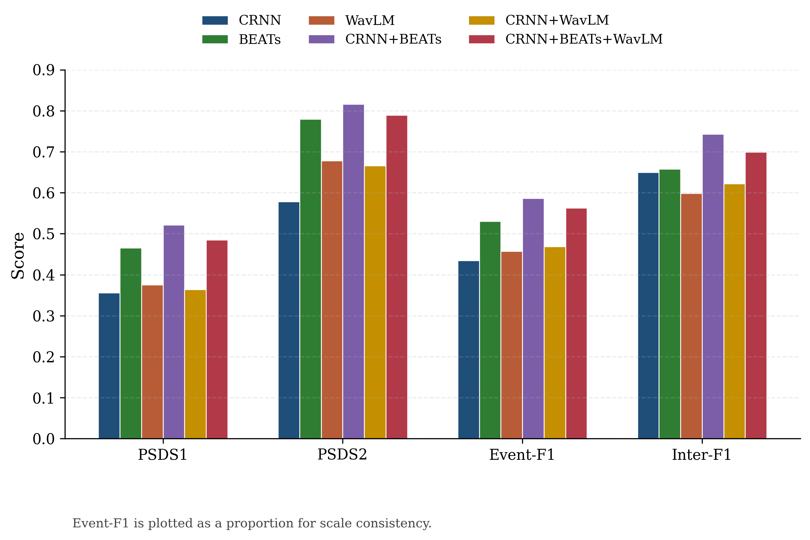
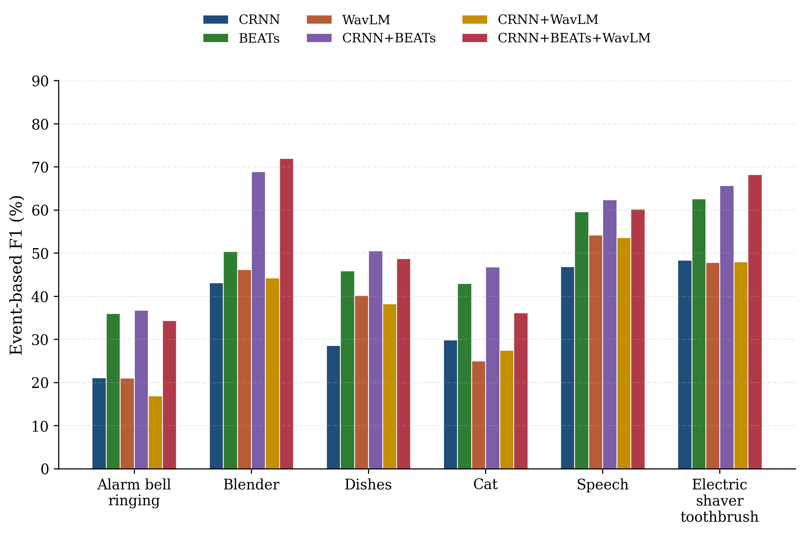
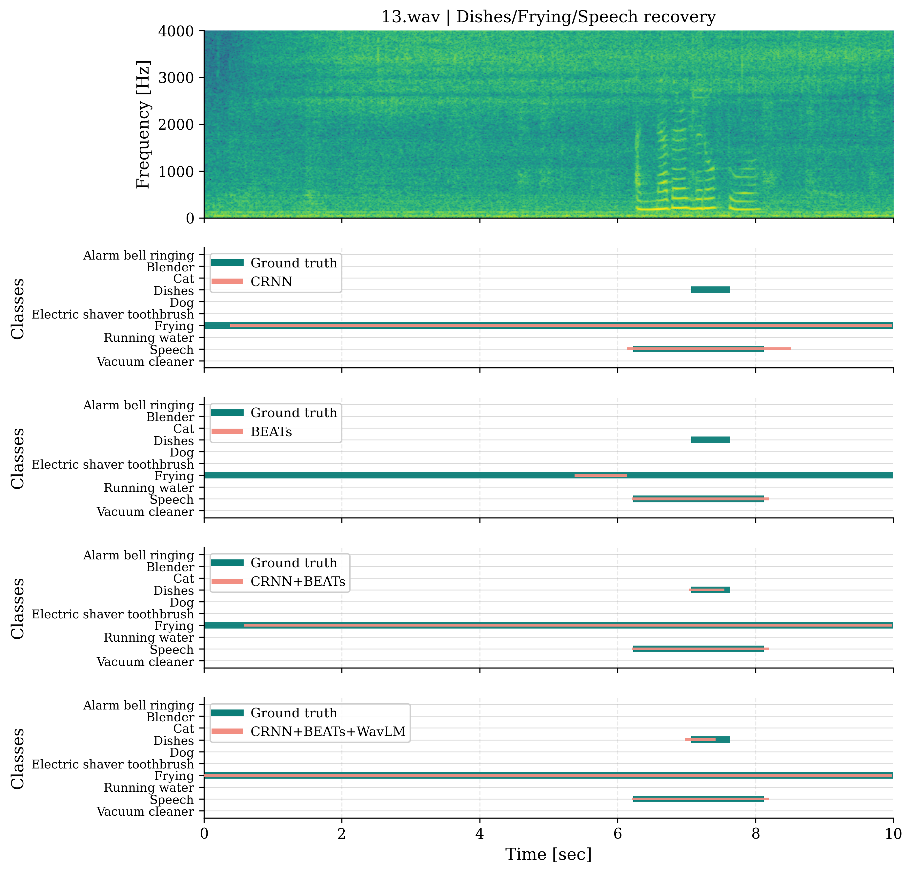
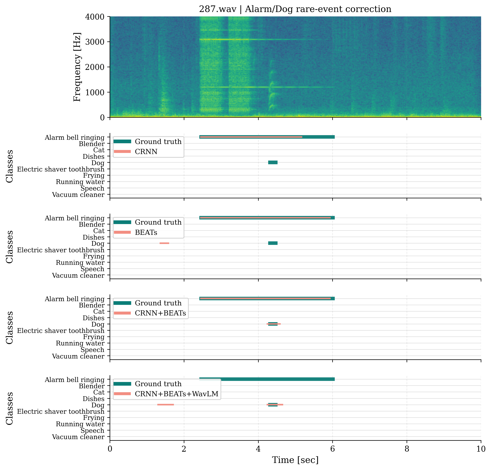
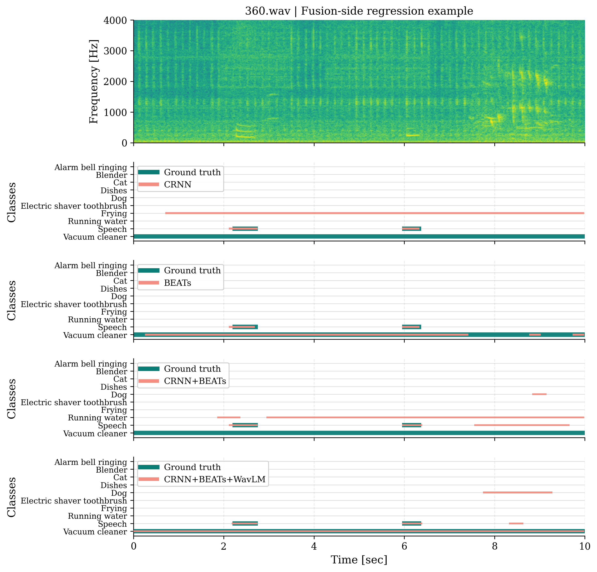
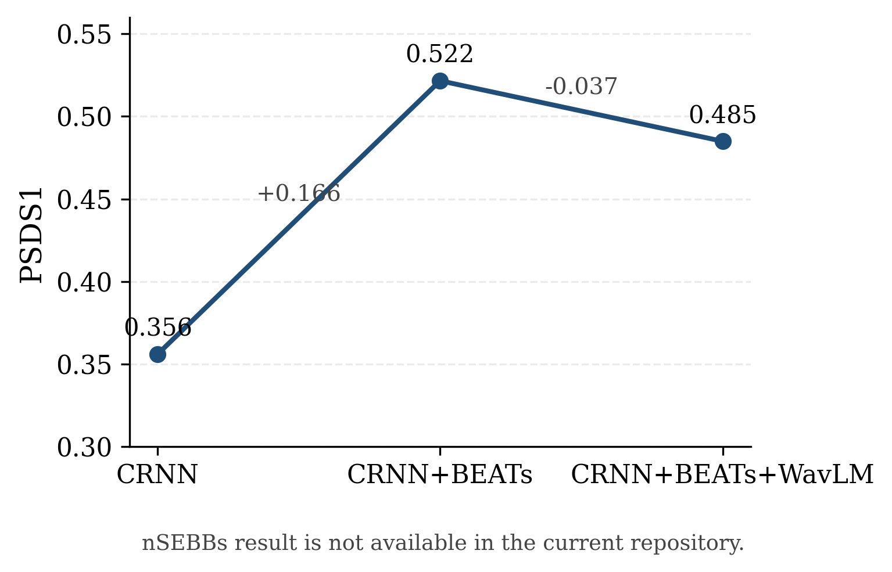

# DCASE 2022 Task4 论文风格实验分析报告

## 1. 实验结果读取与映射

本报告以服务器仓库 `~/autodl-tmp/github/dcase-2022-task4` 的当前快照为准。对于仍保留 `exp/.../metrics_test` 的 5 个模型，本文直接基于保存下来的多阈值预测 TSV、`event_f1.txt`、`segment_f1.txt` 以及官方 GT/duration 文件重新统一评估。CRNN baseline 是唯一例外：当前服务器仓库未保留其对应的原始预测 TSV，因此其最终对比结果只能从现有 baseline 报告中提取。

| 模型                   | 采用来源   | 实验目录或报告                                           | 最终 checkpoint                                                                    | 关键文件位置                                                             |
| -------------------- | ------ | ------------------------------------------------- | -------------------------------------------------------------------------------- | ------------------------------------------------------------------ |
| CRNN                 | report | baselines/CRNN-baseline/training_result_report.md | exp/2022_baseline/version_4/epoch=133-step=111756.ckpt                           | baselines/CRNN-baseline/training_result_report.md                  |
| BEATs                | exp    | exp/unified_beats_synth_only_a800_finetune        | exp/unified_beats_synth_only_a800_finetune/version_5/epoch=55-step=8791.ckpt     | exp/unified_beats_synth_only_a800_finetune/metrics_test/student    |
| WavLM                | exp    | exp/WavLM_only                                    | exp/WavLM_only/version_0/epoch=49-step=31249.ckpt                                | exp/WavLM_only/metrics_test/student                                |
| CRNN + BEATs         | exp    | exp/crnn_beats_final                              | exp/crnn_beats_final/version_0/epoch=30-step=19374.ckpt                          | exp/crnn_beats_final/metrics_test/student                          |
| CRNN + WavLM         | exp    | exp/crnn_wavlm_late_fusion_synth_only_fullft      | exp/crnn_wavlm_late_fusion_synth_only_fullft/version_0/epoch=54-step=34374.ckpt  | exp/crnn_wavlm_late_fusion_synth_only_fullft/metrics_test/student  |
| CRNN + BEATs + WavLM | exp    | exp/cnn_beats_wavlm_full_unfreeze_late_fusion     | exp/cnn_beats_wavlm_full_unfreeze_late_fusion/version_2/epoch=20-step=26249.ckpt | exp/cnn_beats_wavlm_full_unfreeze_late_fusion/metrics_test/student |

进一步核对后可以发现，若干旧版 Markdown 报告与当前服务器 `exp/` 目录中的新版实验结果在数值上已经不再一致，尤其体现在 WavLM 与部分融合实验上。因此，旧报告仅作为历史背景使用，正式对比时不再作为最终定量来源。

## 2. 实验结果总表

| 模型                   | PSDS1 | PSDS2 | Inter-F1 | Event-F1 | Segment-F1 |
| -------------------- | ----- | ----- | -------- | -------- | ---------- |
| CRNN                 | 0.356 | 0.578 | 0.650    | 43.42%   | 71.25%     |
| BEATs                | 0.465 | 0.780 | 0.658    | 53.03%   | 81.95%     |
| WavLM                | 0.375 | 0.678 | 0.598    | 45.75%   | 71.67%     |
| CRNN + BEATs         | 0.522 | 0.816 | 0.743    | 58.62%   | 83.79%     |
| CRNN + WavLM         | 0.364 | 0.666 | 0.622    | 46.85%   | 71.03%     |
| CRNN + BEATs + WavLM | 0.485 | 0.790 | 0.699    | 56.27%   | 81.95%     |

整体对比表明，`CRNN + BEATs` 在本次论文要求的四项核心指标上均取得最优结果。`CRNN + BEATs + WavLM` 仍显著优于各单模型基线，也优于原始 CRNN baseline，但尚未超越最优双路融合结果。

## 3. 关键类别结果表

下表选取了若干最具代表性的类别。这些类别既包含差异显著的稀有报警类、厨房类和动物类事件，也覆盖了占比最高的 `Speech` 以及较稳定的设备类事件，能够更直观地体现不同模型的类别收益与短板。

| 类别                         | CRNN   | BEATs  | WavLM  | CRNN + BEATs | CRNN + WavLM | CRNN + BEATs + WavLM |
| -------------------------- | ------ | ------ | ------ | ------------ | ------------ | -------------------- |
| Alarm_bell_ringing         | 21.07% | 36.01% | 21.03% | 36.75%       | 16.89%       | 34.33%               |
| Blender                    | 43.10% | 50.38% | 46.18% | 68.89%       | 44.24%       | 71.99%               |
| Dishes                     | 28.57% | 45.91% | 40.24% | 50.53%       | 38.30%       | 48.74%               |
| Cat                        | 29.86% | 42.97% | 24.98% | 46.79%       | 27.47%       | 36.18%               |
| Speech                     | 46.86% | 59.62% | 54.22% | 62.38%       | 53.63%       | 60.19%               |
| Electric_shaver_toothbrush | 48.35% | 62.58% | 47.88% | 65.67%       | 48.03%       | 68.20%               |

## 4. 文字实验分析

### 4.1 整体性能比较

在统一口径重算后，CRNN + BEATs 是当前 synthetic validation 条件下整体性能最强的模型。其 PSDS1 达到 0.522，不仅明显高于 CRNN 的 0.356，也高于 BEATs 的 0.465、WavLM 的 0.375 以及其余融合变体。在 Event-F1 上，该模型达到 58.62%，较 CRNN baseline 提升 15.20 个百分点，说明在当前实验设置下，CRNN 主干与 BEATs 表征之间已经形成了较稳定的互补关系。

从融合角度看，双路 CRNN+BEATs 的增益最为明确，这表明 BEATs 分支在与 CRNN 时频表征结合后，能够有效提升难类检测和整体排序稳定性。三路 CRNN+BEATs+WavLM 虽然仍然优于所有单编码器基线，也优于原始 CRNN baseline，但其整体结果并未超过双路融合最优值。这意味着 WavLM 分支确实带来了额外信息，但当前三路 late-fusion 机制尚未把这些新增表征稳定转化为全局收益。

WavLM-only 与 CRNN+WavLM 的结果呈现出“局部有效、整体一般”的特征。相较于 CRNN baseline，这两类模型的 Event-F1 有一定提升，但其 Intersection-F1 与 PSDS 仍明显落后于 CRNN+BEATs。因此可以认为，WavLM 分支已经能够提供有用的语义补充，但在当前实现下，其融合效率仍弱于 BEATs 路线。

### 4.2 单模型与融合模型差异

从单模型结果看，BEATs 全量微调已经显著超过 CRNN baseline，说明在当前数据划分与训练设定下，预训练声学表征本身能够带来稳定收益。相比之下，WavLM-only 的表现虽然优于原始 CRNN 的部分指标，但整体仍未达到 BEATs 路线的水平。

从融合模型结果看，双路 CRNN+BEATs 的整体优势最为稳定，说明在当前实验条件下，最有效的提升路径并不是简单堆叠分支数量，而是让互补性最强的两类表征形成更稳的协同。三路融合模型虽然仍保持较高水准，但其最终结果低于双路最优值，说明新增的 WavLM 分支尚未被完全吸收。

### 4.3 Event-level 与 Segment-level 差异

| 模型                   | Event-F1 | Segment-F1 | 差值     |
| -------------------- | -------- | ---------- | ------ |
| CRNN                 | 43.42%   | 71.25%     | 27.83% |
| BEATs                | 53.03%   | 81.95%     | 28.92% |
| WavLM                | 45.75%   | 71.67%     | 25.92% |
| CRNN + BEATs         | 58.62%   | 83.79%     | 25.17% |
| CRNN + WavLM         | 46.85%   | 71.03%     | 24.18% |
| CRNN + BEATs + WavLM | 56.27%   | 81.95%     | 25.68% |

所有模型都存在明显的 Event-F1 与 Segment-F1 差距，这说明当前误差并不主要来自“完全不会识别某个类别”，而更多来自事件边界偏移、事件片段被切碎以及长事件连续性不足。即便是性能最优的模型，Segment-F1 相对 Event-F1 仍高出 20 个百分点以上，因此后续优化的重点仍应放在事件级边界建模与后处理稳定性上。

### 4.4 逐类性能变化分析

从逐类结果看，CRNN+BEATs 相对 CRNN baseline 提升最明显的类别主要是 Blender（+25.79 pp）、Dishes（+21.96 pp）以及 Electric_shaver_toothbrush（+17.32 pp）。这说明双路融合对于设备类、厨房类以及持续性较强的事件具有较好的增强作用。然而，在 CRNN+BEATs 的基础上继续加入 WavLM 后，下降最明显的类别变为 Cat（-10.61 pp）、Running_water（-8.21 pp）和 Dog（-5.20 pp）。这表明三路融合虽然能继续强化部分相对平稳的类别，但在若干瞬态类或边界敏感类上仍然牺牲了稳定性。

从代表性类别可以进一步看出，`Blender`、`Dishes` 与 `Electric_shaver_toothbrush` 是最能从融合中受益的类别；相对地，`Cat` 在不同融合模型之间仍然波动较大，三路融合在该类上的退化尤为明显。`Speech` 在较强模型中始终保持较高水平，这说明当前系统的主要困难并不在于高频、持续类事件，而仍集中在瞬态类、稀有类以及边界敏感类上。

### 4.5 典型样本时间轴分析

新版时间轴图按照论文插图方式重构为“一个文件一张图”。每张图顶部放置频谱图，用于展示该音频的整体声学结构；下方则按模型逐行排列子图，并在每个子图内部直接叠加 `Ground Truth + 单个模型预测`。同时，所有子图都保留完整类别集合，从而保证不同模型之间纵轴完全一致。

本次每张图中统一放入 4 个模型：`CRNN`、`BEATs`、`CRNN + BEATs` 以及 `CRNN + BEATs + WavLM`。其中 `CRNN` 作为传统 baseline，`BEATs` 代表强单模型，`CRNN + BEATs` 代表当前整体最强的融合模型，三路融合则作为进一步扩展的对照模型。样本 `13.wav` 体现了典型的融合收益，样本 `287.wav` 体现了稀有类校正能力，样本 `360.wav` 则保留为融合退化反例，用于提醒读者当前模型仍存在失配与错分问题。

### 4.6 消融路径分析

按照任务要求，消融路径优先采用 PSDS1 指标。由于当前仓库中未找到 `nSEBBs` 结果，因此该图退化为 `CRNN -> CRNN + BEATs -> CRNN + BEATs + WavLM` 三阶段路径。

该路径图清楚地说明了两点。其一，从 CRNN 到 CRNN+BEATs 存在显著跃升，说明 BEATs 分支是当前整体性能提升的主要来源。其二，在 CRNN+BEATs 基础上继续加入 WavLM 后，PSDS1 从 0.522 回落到 0.485，表明现阶段三路融合尚未形成进一步增益，仍需在融合结构、训练控制或后处理策略上继续优化。

## 5. 图表和图片中使用的数据说明

- `BEATs`、`WavLM`、`CRNN + BEATs`、`CRNN + WavLM`、`CRNN + BEATs + WavLM` 的 `PSDS1/PSDS2/Intersection-F1`，均由各自 `exp/.../metrics_test/student/scenario1/predictions_dtc0.7_gtc0.7_cttc0.3/` 下保存的全阈值预测 TSV 重新统一计算得到。
- 上述 5 个 `exp` 模型的 `Event-F1` 与 `Segment-F1` 则基于 `predictions_th_0.49.tsv` 与官方 GT 文件重算，并与原始 `event_f1.txt`、`segment_f1.txt` 做了一致性核对。
- `CRNN` baseline 使用 `baselines/CRNN-baseline/training_result_report.md` 作为唯一最终来源，因为当前服务器仓库中没有保留它在 `exp/` 下对应的原始预测结果。
- 新版时间轴图使用 `CRNN`、`BEATs`、`CRNN + BEATs` 与 `CRNN + BEATs + WavLM` 四个模型。其中 `CRNN` 的预测来自当前本地仓库 `exp/2022_baseline/metrics_test/.../predictions_th_0.49.tsv`，其余 3 个模型来自服务器同步下来的 `source_data/remote_repo/exp/.../metrics_test/.../predictions_th_0.49.tsv`。
- 当前仓库未检索到 `nSEBBs` 结果，因此无法绘制包含 `nSEBBs` 的最终消融路径。
- 当前绘图环境中未安装 `SimSun` 与 `Times New Roman`，因此图片使用回退衬线字体 `DejaVu Serif` 输出，但仍按论文排版需求控制了字号、线宽、图幅和 300 dpi 导出。

## 6. 还缺什么信息

- `CRNN` 的时间轴图虽然已经可以根据当前本地仓库中的 prediction TSV 重建，但其 PSDS 仍然只能沿用既有报告结果，因为服务器同步目录中没有对应的完整多阈值 operating points。
- 缺少 `nSEBBs` 结果，因此论文中若需要完整的 `CRNN -> CRNN + BEATs -> CRNN + BEATs + WavLM -> ...` 最终链路，目前只能先停在三路融合阶段。
- 缺少宋体和 Times New Roman 字体文件，因此图片已尽量贴近论文风格，但未能严格满足指定字体要求。

## 7. 已生成的文件

- `report_assets/overall_metrics_grouped_bar.(png|pdf)`：总体指标分组柱状图，用于比较六种模型在 PSDS1、PSDS2、Event-F1、Inter-F1 上的整体差异。
- `report_assets/representative_class_event_f1_bar.(png|pdf)`：关键类别 Event-F1 分组柱状图，用于分析类别层面的收益与退化。
- `report_assets/paper_timeline_13.(png|pdf)`、`paper_timeline_287.(png|pdf)`、`paper_timeline_360.(png|pdf)`：新版论文风格时间轴图，每张图只对应一个音频文件，顶部为频谱图，下方为多个 `GT + 单模型预测` 子图。
- `report_assets/ablation_path_psds1.(png|pdf)`：PSDS1 消融路径图，用于说明从 CRNN 到双路融合、再到三路融合的变化趋势。
- `report_assets/overall_results_table.csv`：总体结果表。
- `report_assets/full_per_class_event_f1.csv` 与 `report_assets/full_per_class_segment_f1.csv`：10 个类别的完整逐类结果导出。
- `report_assets/selected_class_event_f1.csv`：适合正文引用的关键类别结果表。
- `report_assets/experiment_mapping_table.csv` 与 `report_assets/analysis_summary.json`：实验映射信息与数据来源清单。

